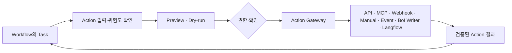
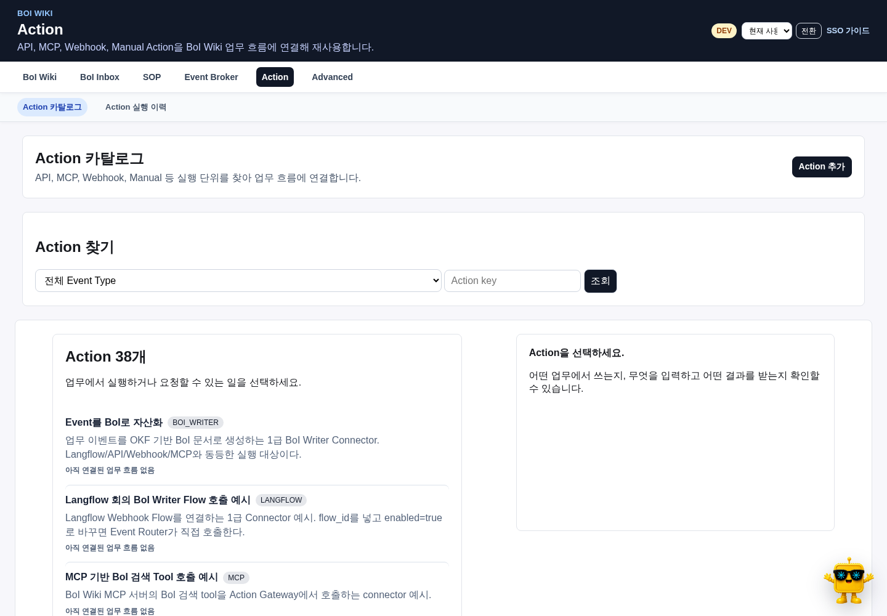

# Action이란

Action은 Task에서 호출할 수 있는 실행 요청이다. API, MCP, Webhook, Manual, Event Broker, BoI Writer와 Langflow는 Action Gateway 아래에서 같은 catalog와 정책을 사용한다. Action은 SOP 자체가 아니며, 모든 Action에 별도의 `SOP 연결`을 강제하지 않는다.



# 카탈로그 사용하기



Action 화면은 목록과 상세 panel로 구성한다.

1. 목적, 위험도와 연결 상태로 Action을 찾는다.
2. 상세 panel에서 실제 Workflow/Task 사용처를 확인한다.
3. 입력 schema가 만든 업무 입력 form을 채운다.
4. preview 또는 dry-run으로 요청과 예상 결과를 확인한다.
5. 외부 부작용이 있으면 명시적으로 확인한 뒤 실행한다.
6. 결과 계약과 Evidence Ledger 기록을 확인한다.

연결 Workflow가 없는 Action은 재사용 후보일 수 있지만 사용처가 있는 것처럼 표시하지 않는다.

# Connector 종류

| 종류 | 사용 예 | 핵심 계약 |
|---|---|---|
| API | 사내 REST API 호출 | method, endpoint, auth policy, request·response schema |
| MCP | 외부 도구 호출 | server ref, tool, input·output schema |
| Webhook | 외부 알림 또는 callback | direction, payload mapping, auth, retry |
| Manual | 사람 판단과 작업 | 담당 role, checklist, 완료 항목 |
| Event Broker | 후속 업무 이벤트 발행 | Event Type, payload, trace와 idempotency |
| BoI Writer | Event/Action 결과를 BoI로 자산화 | 대상 type, metadata와 enrichment |
| Langflow | 선택형 visual flow 또는 connector | flow ref, input, result policy |

Langflow는 Agent runtime의 필수 경로가 아니라 connector 중 하나다.

# 공통 필드

모든 Action은 다음을 가진다.

- 사용자용 이름과 업무 목적
- `action_key`와 connector kind
- 입력과 결과 schema
- risk level과 approval policy
- dry-run 기본값
- owner와 현재 연결 상태
- 실제 사용하는 Event, Workflow 또는 Task reference
- 검증 방법과 실패 시 fallback owner

secret, token과 실제 credential은 catalog 문서나 curl 예시에 넣지 않는다.

# 위험도와 실행

| 위험도 | 기본 처리 |
|---|---|
| low | preview 후 allowlist 정책 안에서 실행 가능 |
| medium | 사용자 확인과 결과 검증 필요 |
| high | 승인자와 별도 manual approval 필요, 자동 실행 금지 |

`user_confirmed`는 사용자가 요청을 확인했다는 뜻이고 `approved_by`는 고위험 실행 승인자다. 둘을 같은 값으로 취급하지 않는다. Action Gateway와 실제 endpoint 양쪽에서 권한과 승인 상태를 검증한다.

# 예시 표기

사용자 문서의 API 예시는 고정 localhost와 사번 query를 사용하지 않는다.

```bash
curl -X POST "<BOI_BASE_URL>/api/actions/catalog/<ACTION_KEY>/preview" \
  -H "Authorization: Bearer <BOI_PAT>" \
  -H "Content-Type: application/json" \
  -d '{"input": {"business_field": "value"}}'
```

로컬 개발용 `employee_id` query는 인증을 대신하지 않는 호환 예시로 별도 운영 Runbook에만 둔다.

# Action 초안 만들기

BoI Agent 또는 SOP Builder에서 새 Action을 요청하면 바로 catalog에 반영하지 않는다.

1. 기존 Action과 중복 여부를 확인한다.
2. 필요한 입력, 결과 계약과 실제 사용 Task를 정한다.
3. connector 설정과 위험도를 검증한다.
4. preview/dry-run과 schema test를 수행한다.
5. 권한 있는 사용자가 게시를 확인한다.

# 관련 문서

- [Action Authoring Harness](/docs/boi:public:harness:action-authoring-harness)
- [업무 이벤트 정의 가이드](/docs/boi:public:boi-wiki-manual:workflows:business-event-definition-guide)
- [Workflow/Task Builder 따라하기](/docs/boi:public:boi-wiki-manual:sop-workflows:workflow-task-builder-step-by-step)
- [BoI Agent 사용 가이드](/docs/boi:public:boi-wiki-manual:agent:using-boi-agent)
