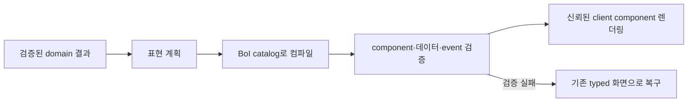

# A2UI는 무엇인가

A2UI는 Agent가 만든 결과의 **선언적인 화면 구조와 데이터**를 신뢰된 client component가 렌더링하도록 전달하는 표현 계약이다. 모델이 임의 HTML이나 실행 코드를 만드는 방식이 아니다. BoI Wiki에서는 서버가 domain result를 검증한 뒤 허용된 component로 컴파일하고, Web client가 같은 catalog를 사용해 표·시간 흐름·관계 탐색·업무 입력 화면으로 보여준다.

`boi-a2ui/v1`은 A2UI 자체의 뜻이 아니라 BoI Wiki가 허용한 component와 입력 규칙을 모은 내부 catalog다. Task, Ontology, Event, Action은 업무 domain 결과이고 A2UI는 그 결과를 사용자에게 알맞은 화면으로 표현하는 계층이다.

# 현재 등록된 결과 화면

현재 runtime registry는 다음 component를 허용한다.

| 사용자에게 보이는 결과 | 등록 component | 쓰임 |
|---|---|---|
| 답변과 근거 | `Answer`, `CitationList` | 검증된 claim과 이동 가능한 citation |
| 관련 질문 | `RelatedQuestions` | 같은 근거에서 이어지는 질문 |
| 표와 시간 흐름 | `DataTable`, `Timeline` | 비교 결과와 상태 변화 |
| 흐름 그림과 관계 탐색 | `MermaidArtifact`, `OntologyExplorer` | 짧은 순서와 확장 가능한 관계 |
| Task 상태와 업무 기록 | `TaskStatus`, `WorkRecordForm`, `EvidencePicker`, `DecisionSummary` | 확인·조치·판단·근거 기록 |
| 실행 전 검토 | `ActionPreview`, `Confirmation` | preview와 명시적 확인 |

실제 등록 목록과 현재 WorkSession에서 관측된 사용 횟수는 `GET /api/v2/a2ui/catalogs/boi/v1`에서 조회한다. 문서에 적힌 목록보다 runtime registry가 우선한다.

BoI Agent에 “실제로 사용된 부분 보여줄래”라고 후속 질문하면 stale 문서 목록을 다시 읽지 않는다. 현재 사용자에게 보이는 WorkSession surface와 실제 registry에서 `A2UICapabilityCatalog`를 구성해 등록 component와 관측된 사용 현황을 답한다.

# 답변 근거 범위

이 문서는 BoI Wiki 내부 구현의 canonical 정의다. Agent는 A2UI를 설명할 때 이 문서와 현재 runtime catalog만 사용하며 외부 검색, 외부 공식 문서나 모델 사전 지식을 근거로 쓰지 않는다. Validation 보고서는 A2UI의 뜻을 정의하는 문서가 아니므로 일반 질문 검색 범위에서 제외한다.

정의 claim은 실제 문서 chunk가 직접 지지해야 한다. “A2UI는 Acceptance 2UI다”처럼 source에 없는 확장은 답변하지 않으며, 현재 registry에 없는 component도 사용 중이라고 말하지 않는다.

# 안전 경계

- LLM이 A2UI JSON이나 HTML을 직접 실행하지 않는다.
- 서버가 domain result를 deterministic compiler로 component와 data model에 연결한다.
- 임의 HTML, script, 외부 URL과 미등록 event는 거부한다.
- WorkRecord, 배정, Action과 확인은 기존 preview, Harness와 confirmation API를 우회하지 않는다.
- client가 지원하지 않거나 surface 검증이 실패하면 기존 typed 결과 하나로 복구한다.

`Acceptance 2UI`, 재검증 framework 또는 Task·Ontology 사이의 계약이라는 설명은 A2UI의 정의가 아니다. Validation 문서는 제품 검증 결과일 뿐 일반 개념의 근거로 사용하지 않는다.

# 함께 보기

- [BoI Agent 사용 가이드](/docs/boi:public:boi-wiki-manual:agent:using-boi-agent)
- [업무 관계와 동적 결과 활용 가이드](/docs/boi:public:boi-wiki-manual:agent:work-relations-and-dynamic-results)
