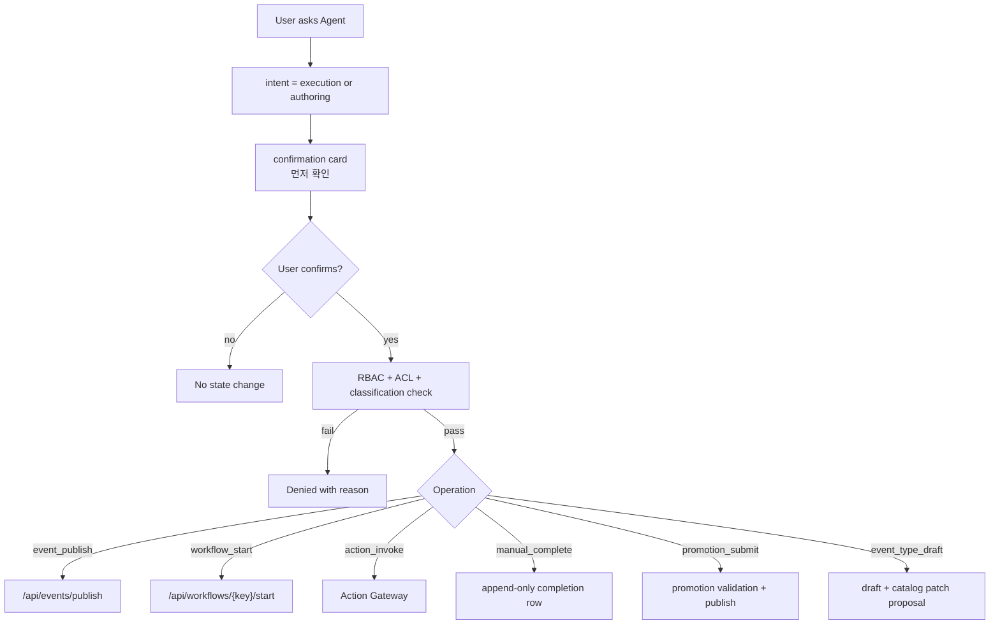
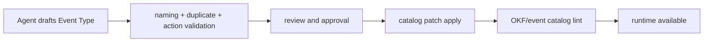

# Summary

BoI Agent는 사용자가 승인하면 Event 발행, Workflow 시작, Action 호출, Manual Handoff 완료, Team/Public promotion submit, 신규 Event Type draft 생성을 도와줄 수 있다. 그러나 Agent가 임의로 상태를 바꾸지는 않는다. 모든 변경은 confirmation card와 `/api/agents/boi-wiki/approve`를 거친다.

# Execution Confirmation Flow

# User-facing Wording

개발자 용어를 사용자 화면에 그대로 노출하지 않는다.

| Developer term | User-facing wording |
|---|---|
| simulation / preview-only run | 먼저 확인 |
| invoke | 요청 실행 |
| approval_required | 승인 필요 |
| manual_required | 조치 내용 입력 필요 |
| catalog apply | 검토 후 반영 |

# Event Type Draft Lifecycle

신규 Event Type은 즉시 runtime catalog에 들어가지 않는다.

# Public APIs

| API | Purpose |
|---|---|
| `POST /api/agents/boi-wiki/approve` | confirmed execution gateway |
| `POST /api/promotions/submit` | user-confirmed Team/Public promotion validation and publish path |
| `POST /api/event-types/drafts` | create Event Type draft |
| `GET /api/event-types/drafts` | list visible drafts |
| `POST /api/event-types/drafts/{draft_id}/validate` | revalidate draft |

# Related Documents

- [Agent Guardrail and ACL](/public/boi-wiki-manual/agent/agent-guardrail-and-acl.md)
- [Team RBAC Management](/public/boi-wiki-manual/security/team-rbac-management.md)
