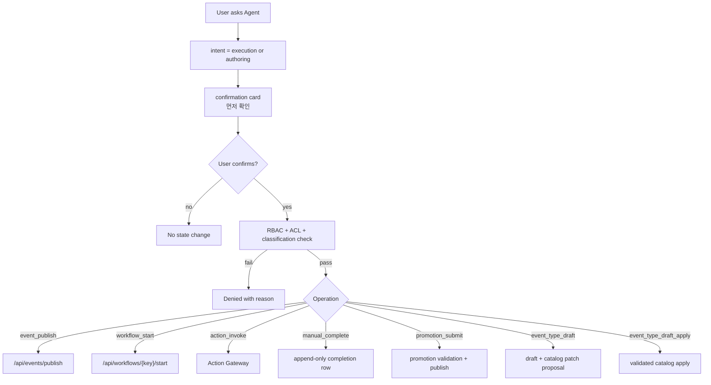
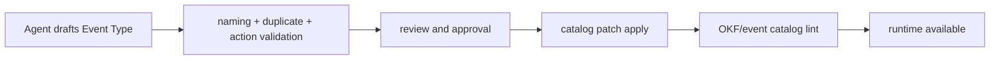

# Summary

BoI Agent는 사용자가 승인하면 Event 발행, Workflow 시작, Action 호출, Manual Handoff 완료, Team/Public promotion submit, 신규 Event Type draft 생성을 도와줄 수 있다. 그러나 Agent가 임의로 상태를 바꾸지는 않는다. 모든 변경은 confirmation card와 `/api/agents/boi-wiki/approve`를 거친다.

# Execution Confirmation Flow

# API / MCP Contract

BoI Agent의 기준 인터페이스는 Web Pet UI가 아니라 `/api/agents/boi-wiki/chat` 응답 계약이다. Pet Agent, `boi-wiki-mcp`의 `boi_agent_chat`, 외부 자동화는 같은 `boi-agent.response.v1` 계약을 소비한다.

응답은 사람이 읽는 `answer_markdown`과 기계가 해석하는 구조화 필드를 함께 가진다.

| Field | Purpose |
|---|---|
| `answer_markdown` | 사용자에게 보여줄 Markdown 답변 |
| `links`, `citations` | 클릭 가능한 BoI/Event/Action/Trace reference |
| `artifacts` | Mermaid, table, task card, confirmation card 같은 구조화 산출물 |
| `execution_cards` | 상태 변경이 필요한 요청의 승인 UI/API contract |
| `guardrails_applied` | 적용된 ACL/RBAC/safety guardrail |
| `agent_contract_version` | 현재 응답 계약 버전 |

`execution_cards`는 Web UI 전용 데이터가 아니다. MCP client나 외부 시스템도 이 카드의 `approve_url`, `operation`, `payload`, `user_confirmed_required`, `display`, `technical_details`를 사용해 같은 승인 UX를 만들 수 있다. 실제 실행은 카드 표시 시점이 아니라 `/api/agents/boi-wiki/approve` 호출 시점에 다시 RBAC/ACL/classification 검증을 거친다.

# User-facing Wording

개발자 용어를 사용자 화면에 그대로 노출하지 않는다.

| Developer term | User-facing wording |
|---|---|
| simulation / preview-only run | 먼저 확인 |
| invoke | 요청 실행 |
| approval_required | 승인 필요 |
| manual_required | 조치 내용 입력 필요 |
| catalog apply | 검토 후 반영 |

# Execution Card Inputs

Agent는 실행 대상을 임의로 추정하지 않는다. 아래처럼 필수 식별자가 명확할 때만 confirmation card를 만든다. 정보가 부족하면 실행 카드 대신 “필수 정보를 추가해 다시 요청” 안내를 반환한다.

| Operation | Required identifier | Example request | Result |
|---|---|---|---|
| `event_publish` | versioned Event Type | `equipment.alarm.raised.v1 이벤트를 발행해줘` | Event Broker 발행 확인 카드 |
| `workflow_start` | `workflow_key` 또는 현재 SOP의 workflow metadata | `equipment-anomaly workflow 시작해줘` | SOP entry event 발행 확인 카드 |
| `action_invoke` | catalog `action_key` | `sop.equipment.request_raw_data action 실행해줘` | Action Gateway 요청 실행 확인 카드 |
| `manual_handoff_complete` | Inbox task + 조치 내용 | Inbox 카드에서 조치 내용을 입력 | append-only completion row |
| `event_type_draft` | versioned Event Type | `maintenance.inspection.completed.v1 이벤트 타입 초안 만들어줘` | Draft + catalog patch proposal |
| `event_type_draft_apply` | validated `draft_id` | 검토된 Event Type 초안을 catalog에 반영 | validated source edit + commit |

확인 카드가 반환되어도 실제 상태 변경은 아직 일어나지 않는다. 사용자가 카드의 primary action을 눌러 `/api/agents/boi-wiki/approve`가 호출되고, RBAC/ACL/classification 검증을 다시 통과해야만 Event, Action, Workflow, draft 생성, 검증된 Event Type catalog 반영이 실행된다.

직접 API를 호출하는 자동화도 같은 경계를 따른다. `/api/workflows/{workflow_key}/start`와 demo workflow start는 entry event를 발행하므로 요청 body에 `user_confirmed: true`가 없으면 400으로 차단된다. PoC 스크립트와 curl 예시는 이 값을 명시해야 하며, 이 control field는 실제 Event payload에는 포함하지 않는다.

Inbox의 `snooze`와 `dismiss`도 단순 화면 상태가 아니라 append-only action log row를 남기는 변경이다. 따라서 이 두 endpoint도 `boi.workflow_runner` 권한과 `user_confirmed: true`를 요구한다. 사용자는 UI에서 “잠시 미루기” 또는 “내 업무 아님”처럼 이해하면 되지만, 내부 기록에는 누가 어떤 task를 어떤 사유로 숨겼는지 audit 가능한 row가 남아야 한다.

# Identity and Actor Rules

사용자가 보는 확인 카드와 API payload에 사번이 들어갈 수 있지만, 실행 주체는 항상 인증 사번을 기준으로 결정한다. 이는 SSO가 들어왔을 때 특히 중요하다.

| Case | Rule |
|---|---|
| Event 발행 | `actor_employee_id`가 인증 사번과 다르면 거부한다. |
| Workflow 시작 | workflow 담당자/owner는 payload로 남길 수 있지만, 실제 Event actor는 인증 사번이다. |
| Action 호출 | Action Gateway에 전달되는 `employee_id`는 인증 사번이다. 요청 body가 다른 사번을 넣으면 거부한다. |
| Admin override | 예외적으로 허용될 수 있지만, `admin_override_reason`, 별도 role, audit가 필요하다. |

따라서 Agent가 “누구 대신 실행”하는 방식으로 쓰이면 안 된다. 대리 실행이 필요하면 팀 RBAC, manual handoff, approval flow로 남겨야 한다.

# Event Type Draft Lifecycle

신규 Event Type은 즉시 runtime catalog에 들어가지 않는다.

# Agent-assisted Draft Filling

Agent는 사용자의 문장을 그대로 빈 template에 넣지 않는다. `event_type` 이름을 기준으로 draft를 만들되, 현재 페이지와 ontology search 결과를 함께 사용해 초안 품질을 높인다.

| Draft field | How Agent fills it |
|---|---|
| `event_type` | `domain.event.name.v1` 형태의 versioned 이름을 질문에서 추출한다. |
| `name_ko` | `event_type` 앞의 한국어 업무 표현을 짧은 사용자 표시명으로 정리한다. |
| `sop_ref` | 현재 SOP 페이지, search knowledge panel의 top SOP, 또는 SOP group 결과에서 우선 선택한다. |
| `workflow_stage` | 질문 안의 stage 표현을 우선하고, 없으면 관련 Event Type stage 또는 완료/요청 같은 업무 표현으로 보조 추정한다. |
| `sop_stage_id` | SOP workflow metadata의 stage id가 확인되면 함께 보존해 status/timeline과 맞춘다. |
| `topic` | 관련 Event Type topic이 있으면 재사용하고, 없으면 event_type 앞 두 segment를 사용한다. |
| `payload_schema` | `사번`, `담당`, `설비`, `장비` 같은 표현을 보고 최소 payload field를 제안한다. |
| `recommended_actions` | ontology search에서 연결된 Action 후보를 최대 3개까지 제안한다. |
| `recommended_manual_actions` | 사람 확인/승인/조치가 필요한 manual action 후보를 action catalog 기준으로 제안한다. |

예를 들어 “장비 점검 완료 이벤트 타입 `maintenance.inspection.completed.v1` 초안을 만들어줘. 작업자는 7자리 사번이고 SOP는 설비 이상 감지 SOP와 연결해줘.”라고 요청하면 Agent는 `name_ko`, `sop_ref`, `topic`, `owner_employee_id` schema 후보까지 confirmation card에 채운다. 사용자가 카드에서 확인하기 전에는 draft 파일도 catalog도 변경되지 않는다.

생성된 초안은 `/event-types` 화면 상단의 `신규 Event Type 초안` 섹션에서도 확인한다. 이 섹션은 현재 사번이 만든 draft와 admin이 볼 수 있는 draft만 보여주며, `validation ok`, warnings, errors, 연결 SOP/stage/action 후보를 함께 표시한다. 화면에 보인다고 해서 catalog에 적용된 것은 아니다. 실제 반영은 `boi.promoter` 권한자가 validation을 통과한 draft에 대해 `/api/event-types/drafts/{draft_id}/apply` 또는 `/api/agents/boi-wiki/approve`의 `event_type_draft_apply` operation을 명시 승인할 때만 진행된다. 이 경로는 기존 validated source edit과 같은 validation, rollback, commit 정책을 사용한다.

# Public APIs

| API | Purpose |
|---|---|
| `POST /api/agents/boi-wiki/approve` | confirmed execution gateway |
| `POST /api/agents/boi-wiki/inbox/{task_id}/snooze` | user-confirmed append-only inbox snooze row |
| `POST /api/agents/boi-wiki/inbox/{task_id}/dismiss` | user-confirmed append-only inbox dismiss row |
| `POST /api/promotions/submit` | user-confirmed Team/Public promotion validation and publish path |
| `POST /api/event-types/drafts` | create Event Type draft |
| `GET /api/event-types/drafts` | list visible drafts |
| `POST /api/event-types/drafts/{draft_id}/validate` | revalidate draft |
| `POST /api/event-types/drafts/{draft_id}/apply` | apply validated draft to event catalog |

# Related Documents

- [Agent Guardrail and ACL](/public/boi-wiki-manual/agent/agent-guardrail-and-acl.md)
- [Team RBAC Management](/public/boi-wiki-manual/security/team-rbac-management.md)
