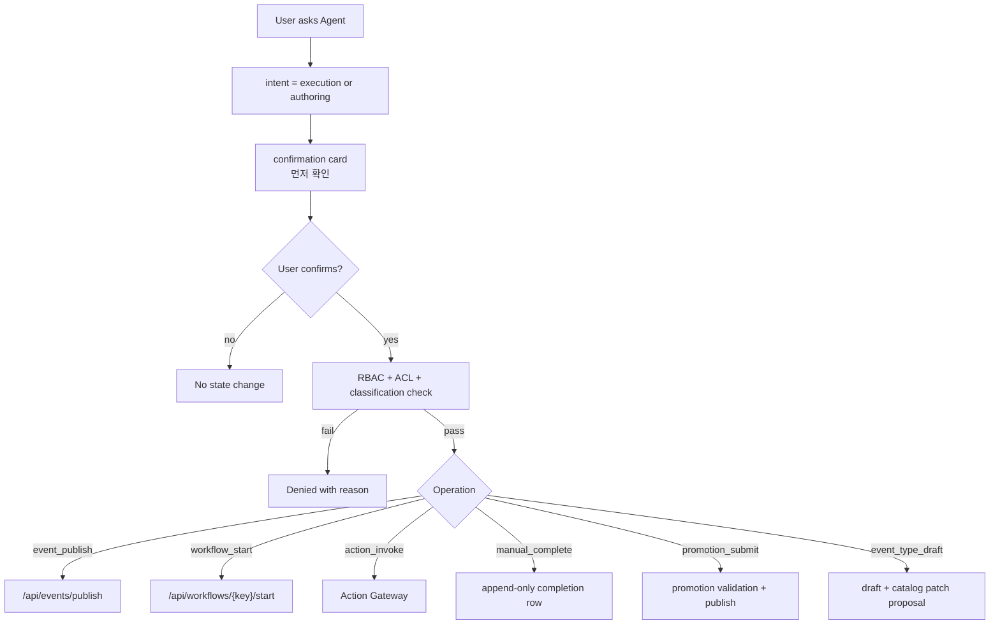
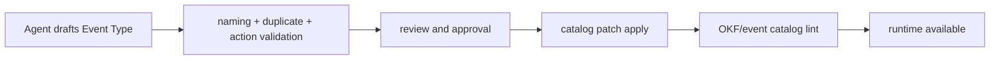

# Summary

BoI Agent는 사용자가 승인하면 Event 발행, Workflow 시작, Action 호출, Manual Handoff 완료, Team/Public promotion submit, 신규 Event Type draft 생성을 도와줄 수 있다. 그러나 Agent가 임의로 상태를 바꾸지는 않는다. 모든 변경은 confirmation card와 `/api/agents/boi-wiki/approve`를 거친다.

# Execution Confirmation Flow

# User-facing Wording

개발자 용어를 사용자 화면에 그대로 노출하지 않는다.

| Developer term | User-facing wording |
|---|---|
| simulation / preview-only run | 먼저 확인 |
| invoke | 요청 실행 |
| approval_required | 승인 필요 |
| manual_required | 조치 내용 입력 필요 |
| catalog apply | 검토 후 반영 |

# Execution Card Inputs

Agent는 실행 대상을 임의로 추정하지 않는다. 아래처럼 필수 식별자가 명확할 때만 confirmation card를 만든다. 정보가 부족하면 실행 카드 대신 “필수 정보를 추가해 다시 요청” 안내를 반환한다.

| Operation | Required identifier | Example request | Result |
|---|---|---|---|
| `event_publish` | versioned Event Type | `equipment.alarm.raised.v1 이벤트를 발행해줘` | Event Broker 발행 확인 카드 |
| `workflow_start` | `workflow_key` 또는 현재 SOP의 workflow metadata | `equipment-anomaly workflow 시작해줘` | SOP entry event 발행 확인 카드 |
| `action_invoke` | catalog `action_key` | `sop.equipment.request_raw_data action 실행해줘` | Action Gateway 요청 실행 확인 카드 |
| `manual_handoff_complete` | Inbox task + 조치 내용 | Inbox 카드에서 조치 내용을 입력 | append-only completion row |
| `event_type_draft` | versioned Event Type | `maintenance.inspection.completed.v1 이벤트 타입 초안 만들어줘` | Draft + catalog patch proposal |

확인 카드가 반환되어도 실제 상태 변경은 아직 일어나지 않는다. 사용자가 카드의 primary action을 눌러 `/api/agents/boi-wiki/approve`가 호출되고, RBAC/ACL/classification 검증을 다시 통과해야만 Event, Action, Workflow, draft 생성이 실행된다.

# Event Type Draft Lifecycle

신규 Event Type은 즉시 runtime catalog에 들어가지 않는다.

# Agent-assisted Draft Filling

Agent는 사용자의 문장을 그대로 빈 template에 넣지 않는다. `event_type` 이름을 기준으로 draft를 만들되, 현재 페이지와 ontology search 결과를 함께 사용해 초안 품질을 높인다.

| Draft field | How Agent fills it |
|---|---|
| `event_type` | `domain.event.name.v1` 형태의 versioned 이름을 질문에서 추출한다. |
| `name_ko` | `event_type` 앞의 한국어 업무 표현을 짧은 사용자 표시명으로 정리한다. |
| `sop_ref` | 현재 SOP 페이지, search knowledge panel의 top SOP, 또는 SOP group 결과에서 우선 선택한다. |
| `workflow_stage` | 질문 안의 stage 표현을 우선하고, 없으면 관련 Event Type stage 또는 완료/요청 같은 업무 표현으로 보조 추정한다. |
| `topic` | 관련 Event Type topic이 있으면 재사용하고, 없으면 event_type 앞 두 segment를 사용한다. |
| `payload_schema` | `사번`, `담당`, `설비`, `장비` 같은 표현을 보고 최소 payload field를 제안한다. |
| `recommended_actions` | ontology search에서 연결된 Action 후보를 최대 3개까지 제안한다. |

예를 들어 “장비 점검 완료 이벤트 타입 `maintenance.inspection.completed.v1` 초안을 만들어줘. 작업자는 7자리 사번이고 SOP는 설비 이상 감지 SOP와 연결해줘.”라고 요청하면 Agent는 `name_ko`, `sop_ref`, `topic`, `owner_employee_id` schema 후보까지 confirmation card에 채운다. 사용자가 카드에서 확인하기 전에는 draft 파일도 catalog도 변경되지 않는다.

# Public APIs

| API | Purpose |
|---|---|
| `POST /api/agents/boi-wiki/approve` | confirmed execution gateway |
| `POST /api/promotions/submit` | user-confirmed Team/Public promotion validation and publish path |
| `POST /api/event-types/drafts` | create Event Type draft |
| `GET /api/event-types/drafts` | list visible drafts |
| `POST /api/event-types/drafts/{draft_id}/validate` | revalidate draft |

# Related Documents

- [Agent Guardrail and ACL](/public/boi-wiki-manual/agent/agent-guardrail-and-acl.md)
- [Team RBAC Management](/public/boi-wiki-manual/security/team-rbac-management.md)
