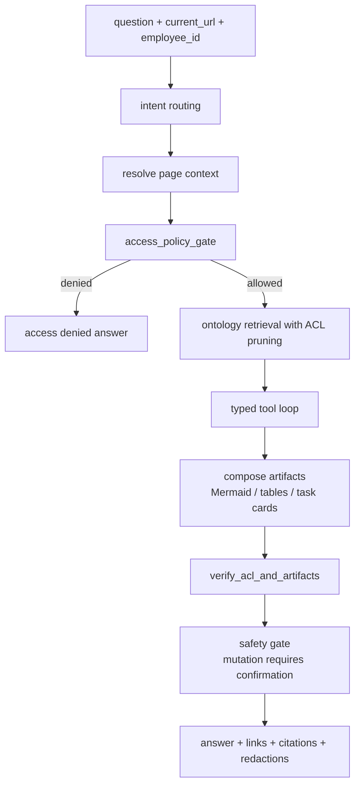
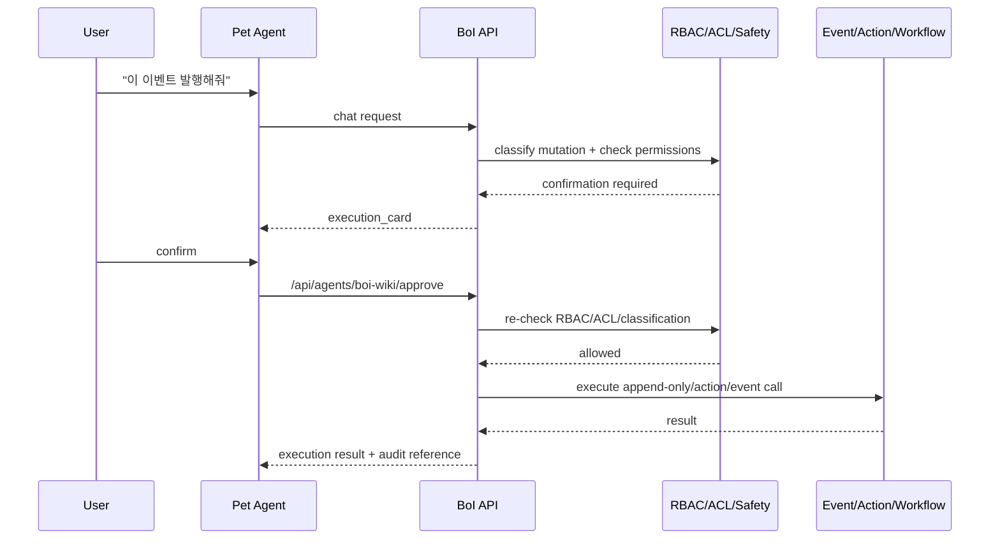

# Summary

BoI Agent는 검색 결과를 모아 답하는 챗봇이 아니라 업무 시스템의 보안 경계를 통과하는 Agent다. Web Pet Agent, MCP `boi_agent_chat`, Native Agent, Ontology Search, Inbox, Manual Handoff completion은 모두 같은 ACL decision을 사용한다.

# Native Agent Guardrail State Graph

# What Must Be Filtered

| Surface | ACL rule |
|---|---|
| Search result | 접근 불가 문서, restricted 원문 제거 |
| Agent context | `can_use_in_agent_context=false`이면 원문 body 제외 |
| Citation/link | `can_cite=false`이면 link/citation 제거 |
| Mermaid/table/task card | 포함된 BoI/Event/Action reference를 다시 검증 |
| Memory | restricted/confidential 원문 자동 저장 금지 |
| External action payload | `can_export=false`이면 원문 payload 포함 금지 |
| MCP | Web Agent와 동일한 access policy 사용 |

# Full Search vs Agent Context

`/api/search/ontology`의 full view는 사용자가 읽을 수 있는 문서를 업무 검색 결과로 보여줄 수 있다. 하지만 Native Agent가 prompt/tool context로 쓰는 compact view는 더 엄격하다.

| View | 기준 | restricted 처리 |
|---|---|---|
| Full ontology search | `can_read` | 사용자가 볼 수 있는 범위 안에서 최소 metadata만 표시 |
| Agent compact context | `can_use_in_agent_context` | context, best match, citation, graph rank에서 제외 |
| Direct `boi_get` tool | `can_use_in_agent_context` + `can_cite` | body/workflow metadata/link를 redaction |

이 구분은 사용자가 문서를 열람할 수 있는 권한과 Agent가 그 내용을 요약, 도식화, 외부 action payload, memory에 사용할 권한이 다르기 때문이다. restricted 문서는 Agent가 제목 정도의 존재 신호를 볼 수 있더라도 원문, workflow metadata, 본문 링크, citation으로 사용하지 않는다.

# Mutation Boundary

Agent가 할 수 있는 상태 변경은 모두 confirmation card를 거친다.

## Authenticated Employee Binding

Mutation payload 안의 사번 필드는 인증 사번을 우회할 수 없다. SSO 또는 dev auth가 결정한 `employee_id`가 authoritative identity이며, Agent/API/MCP는 사용자가 보낸 payload의 `employee_id`나 `actor_employee_id`를 그대로 신뢰하지 않는다.

| Operation | Binding rule |
|---|---|
| Event publish | `actor_employee_id`는 인증 사번과 같아야 한다. Admin override는 `admin_override_reason`과 audit이 필요하다. |
| Workflow start | Event actor는 인증 사번이다. 담당자/owner는 payload field로 남길 수 있지만 actor로 spoof하지 않는다. |
| Action invoke | Action Gateway로 전달하는 `employee_id`는 인증 사번이다. Admin override는 `admin_override_reason`과 audit이 필요하다. |
| Manual handoff completion | 완료자는 인증 사번이며 append-only completion row에 남긴다. |

이 규칙은 “사용자가 볼 수 있는가”와 별개로 “누가 실행했는가”를 보호한다. Agent가 생성한 confirmation card도 최종 `/api/agents/boi-wiki/approve` 단계에서 같은 binding을 다시 검사한다. Admin override가 필요한 경우에는 `admin_event_publish_employee_override` 또는 `admin_action_invoke_employee_override` audit row가 남아야 한다.

# Required Response Metadata

Agent response should include:

- `access_summary`
- `guardrails_applied`
- `redacted_count`
- `tool_trace`
- `coverage_report`
- `links`
- `citations`
- `artifacts`

# Related Documents

- [Native BoI Agent Architecture](/public/boi-wiki-manual/agent/native-boi-agent-architecture.md)
- [BoI Profile ACL Policy](/public/boi-wiki-manual/security/boi-profile-acl-policy.md)
- [Pet Agent UX and Artifacts](/public/boi-wiki-manual/agent/pet-agent-ux-and-artifacts.md)
