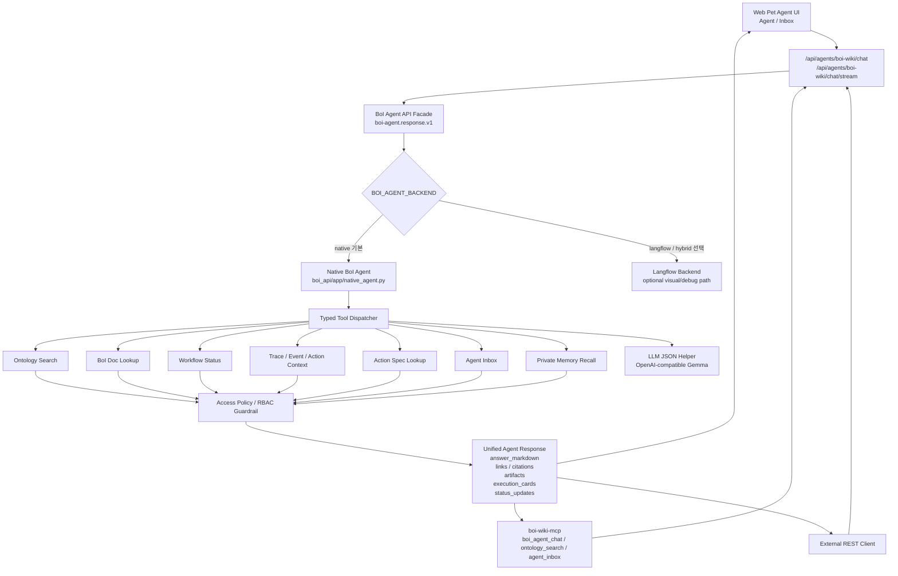
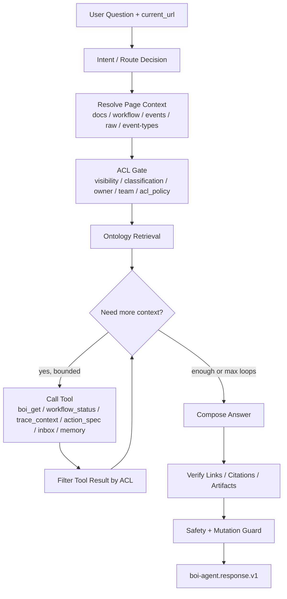
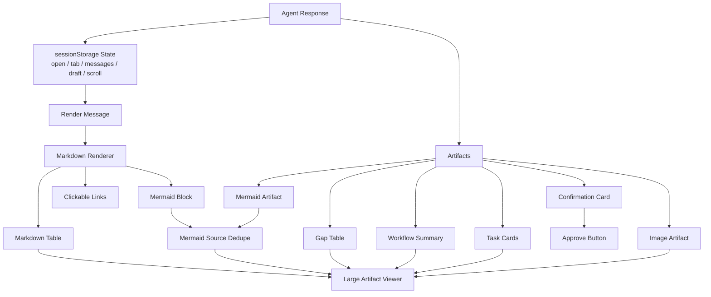
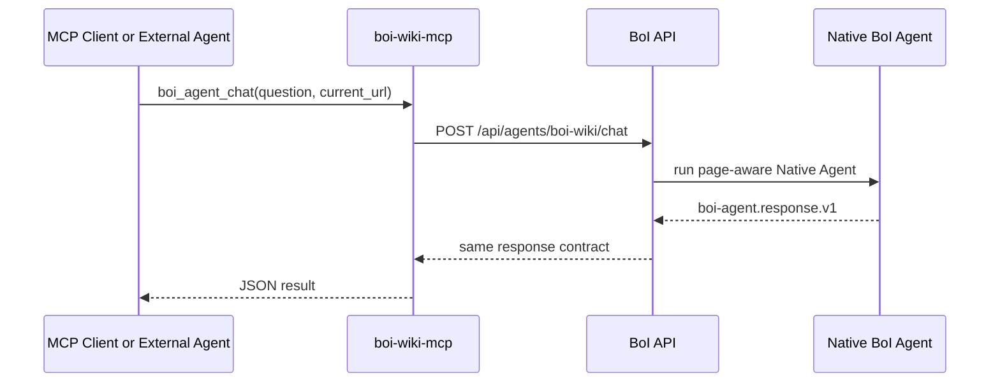
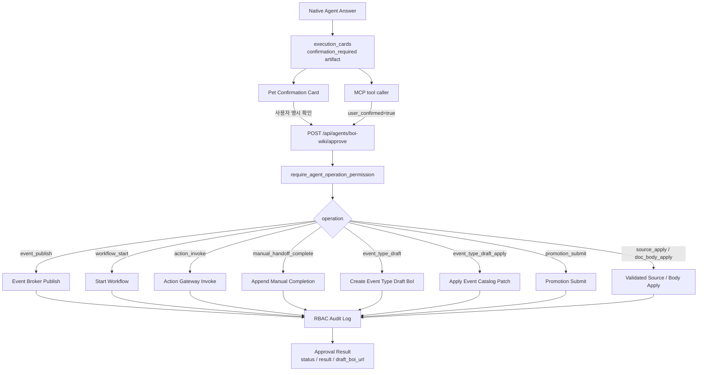
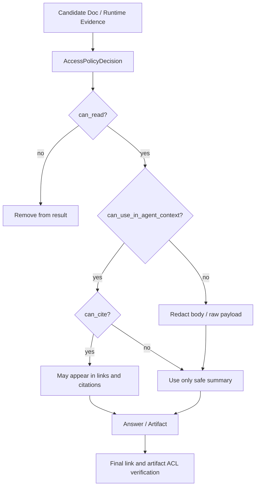

# Summary

이 문서는 현재 구현된 BoI Agent의 실제 연결 구조를 설명한다. 기준은 “Pet UI가 특별한 별도 Agent가 아니라, BoI API의 Native Agent response contract를 소비하는 client 중 하나”라는 점이다. 같은 Agent 기능은 Web Pet UI, `boi-wiki-mcp`, REST API client가 모두 `/api/agents/boi-wiki/chat` 계열 API와 `boi-agent.response.v1` contract를 통해 사용한다.

Langflow는 visual workflow, demo, debug backend로 남아 있지만, 운영 기본 경로는 `boi-api` 내부 Native Agent다. Agent가 반환하는 Mermaid, table, task card, confirmation card 같은 산출물은 UI 전용 HTML이 아니라 `artifacts`와 `execution_cards`의 typed JSON으로 내려간다.

# Top-Level Serving Structure

# Native Agent State Flow

Native Agent는 빠른 답변을 위해 context 없이 문장만 만드는 챗봇이 아니다. 현재 URL을 서버에서 다시 해석하고, 접근 권한을 적용한 뒤, ontology retrieval과 typed tool loop를 수행한다.

`fast`와 `deep`은 사용자에게 노출되는 제품명이 아니라 Agent 내부의 처리 강도다. 단순 검색, 현재 페이지 질의응답, 요약은 빠른 path를 사용할 수 있지만, 이때도 page context, ontology search, ACL guardrail은 유지된다. Mermaid diagram, gap check, trace reasoning, workflow explanation은 더 많은 tool loop와 artifact 생성을 사용한다.

# Response Contract

`boi-agent.response.v1`은 Web UI, MCP, REST API가 공유하는 canonical contract다.

| Field | Meaning |
|---|---|
| `agent_contract_version` | Agent response contract version |
| `answer_markdown` | 사람이 읽는 기본 답변 Markdown |
| `links` | 클릭 가능한 BoI, Event, Trace, Action, Dictionary reference |
| `citations` | 답변에 사용한 근거 문서 또는 runtime evidence |
| `artifacts` | Mermaid, workflow table, gap table, task card, image 같은 typed artifact |
| `execution_cards` | 사용자의 명시 확인이 필요한 실행 카드 |
| `status_updates` | streaming 또는 non-streaming client가 표시할 진행 상태 |
| `tool_trace` | Agent가 사용한 tool과 조회 근거 요약 |
| `access_summary` | ACL/RBAC 적용 결과 요약 |
| `guardrails_applied` | 적용된 safety, ACL, mutation guardrail |

Web Pet UI는 이 contract를 예쁘게 렌더링하는 client다. MCP client도 같은 JSON을 받아 자기 UI나 CLI에서 렌더링할 수 있어야 한다.

# Web Pet UI Rendering

Pet UI는 `Agent`, `Inbox` 탭만 노출한다. Memory와 Dictionary는 Pet 메뉴가 아니라 일반 BoI 문서, MCP, harness 기능으로 다룬다.

Mermaid는 Markdown fenced block과 `artifacts[].type == "mermaid"` 양쪽에서 올 수 있다. Pet UI는 같은 source를 중복 렌더링하지 않고, 실패 시 원문 source fallback을 보여준다. Table, Mermaid, image, task card는 큰 viewer에서 다시 볼 수 있어야 한다.

# MCP and API Compatibility

MCP는 Agent 기능을 복제하지 않는다. `boi-wiki-mcp`는 thin adapter로 동작하며, 공식 Agent runtime은 BoI API다.

이 구조 때문에 MCP에는 별도의 Agent memory, 별도 ACL, 별도 검색 ranking을 두지 않는다. `boi_search`는 문서 검색 의미를 유지하고, `ontology_search`는 SOP, Event, Action, Dictionary, runtime evidence를 포함하는 graph-style search로 구분한다.

# Execution and Confirmation Boundary

Agent는 상태 변경을 직접 실행하지 않는다. 실행이 필요한 경우 `execution_cards` 또는 `confirmation_required` artifact를 반환한다. 실제 변경은 `/api/agents/boi-wiki/approve`에서 다시 RBAC/ACL/classification 검증을 통과해야 한다.

Event Type draft는 catalog에 바로 반영되지 않는다. 먼저 private draft BoI와 catalog patch proposal을 만들고, 검증과 promoter 승인을 거친 뒤 적용한다. Pet UI는 `draft_boi_url` 또는 `draft_boi_id`를 이용해 생성된 draft BoI로 바로 이동할 수 있어야 한다.

# ACL and Guardrail Placement

ACL은 UI 표시 편의 기능이 아니라 Agent/API/MCP의 보안 경계다.

Private 문서는 path, owner, `acl_policy`, 요청 사번이 모두 맞아야 한다. Team 문서는 BoI Wiki 내부 팀 멤버십과 `team_id`, `acl_policy`가 맞아야 한다. `classification: confidential` 또는 `restricted`는 접근을 넓히지 않고 export, external action payload, memory 저장, raw body 사용을 더 제한한다.

# Practical Reading Guide

| 알고 싶은 것 | 먼저 볼 문서 |
|---|---|
| 전체 운영 구조 | [Native BoI Agent Architecture](/public/boi-wiki-manual/agent/native-boi-agent-architecture.md) |
| 현재 구현 연결도 | 이 문서 |
| tool loop와 state graph | [Native BoI Agent Tool Loop](/public/boi-wiki-manual/agent/native-boi-agent-tool-loop.md) |
| 검색과 ontology ranking | [Ontology Retrieval and Search](/public/boi-wiki-manual/agent/ontology-retrieval-and-search.md) |
| ACL, RBAC, guardrail | [Agent Guardrail and ACL](/public/boi-wiki-manual/agent/agent-guardrail-and-acl.md) |
| Pet UI와 artifact | [Pet Agent UX and Artifacts](/public/boi-wiki-manual/agent/pet-agent-ux-and-artifacts.md) |
| 실행 카드와 Event Type draft | [Agent Execution and Event Authoring](/public/boi-wiki-manual/agent/agent-execution-and-event-authoring.md) |
| 배포 검증 | [Native BoI Agent Deployment and Verification](/public/boi-wiki-manual/agent/deployment-and-verification.md) |
