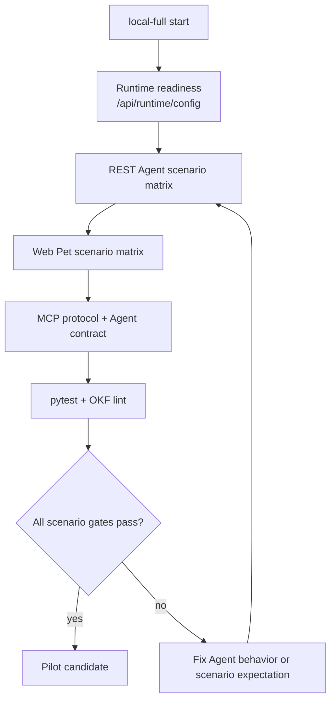

# Summary

BoI Agent의 Pilot 완료 기준은 단일 SOP 질문이 아니라 시나리오 매트릭스 통과다. REST API, Web Pet Agent, MCP bridge가 같은 `boi-agent.response.v1` 계약을 반환하고, Event/Capability/Action/Manual Handoff/ACL/RBAC를 같은 의미로 해석해야 한다.

검증 기준 URL은 local-full `http://localhost:28000`이다. NAS는 Pilot acceptance 기준이 아니다.

# Validation Flow



# Scenario Gates

| Scenario | Required Evidence |
|---|---|
| SOP relationship summary | `workflow_summary` artifact, citations, answer-scoped follow-up |
| SOP Mermaid diagram | `mermaid` artifact, source mapping, no duplicate rendering in Pet UI |
| Action Spec gap check | `gap_table`, missing/weak spec explanation, draft/check affordance |
| Event-to-Action | Event → Capability → SOP Stage → Action → Manual Handoff → Next Event |
| Action/Event mutation request | confirmation card only, no execution before explicit approval |
| Unknown capability | no hallucinated execution; suggest registration/connection path |
| Inbox | user-facing task card; technical IDs hidden in details |
| ACL/RBAC negative case | inaccessible private/team/restricted evidence excluded or redacted |

Every Agent response must include `answer_markdown`, `evidence_ledger`, `affordances`, `suggested_questions`, `access_summary`, and `guardrails_applied`. Follow-up questions must be based on the just-produced answer, artifact, link, or affordance. They must not recommend an execution, publish, draft, or completion action unless the response includes the matching affordance or confirmation card.

# Commands

```bash
./scripts/start_local_full.sh
python scripts/check_local_full_readiness.py --base-url http://localhost:28000
python scripts/check_boi_agent_scenarios.py --base-url http://localhost:28000 --strict --summary
node scripts/check_pet_agent_ui.mjs --scenario-file tests/fixtures/boi_agent_ui_scenarios.yaml --strict
python scripts/check_boi_wiki_mcp.py \
  --base-url http://localhost:8200 \
  --mcp-url http://localhost:8200/mcp \
  --boi-api-url http://localhost:28000 \
  --agent-contract \
  --agent-artifact-smoke \
  --agent-scenario-file tests/fixtures/boi_agent_scenarios.json \
  --summary
pytest tests -q -s
python scripts/okf_lint.py --root data --include-logs --strict-media --strict-links
```

# Scenario Files

REST scenario definitions live in `tests/fixtures/boi_agent_scenarios.json`. Web Pet scenario definitions live in `tests/fixtures/boi_agent_ui_scenarios.yaml`; the file is YAML 1.2 compatible JSON so it can be parsed without extra runtime dependencies.

Mutation scenarios are confirmation-only by default. Actual Event publish, Action invoke, catalog apply, or manual handoff completion smoke should be enabled only in a separate controlled run that explicitly allows mutation.

# Related Documents

- [Native BoI Agent Architecture](/public/boi-wiki-manual/agent/native-boi-agent-architecture.md)
- [Pet Agent UX and Artifacts](/public/boi-wiki-manual/agent/pet-agent-ux-and-artifacts.md)
- [Agent Guardrail and ACL](/public/boi-wiki-manual/agent/agent-guardrail-and-acl.md)
- [Event-Native Workflow Guide](/public/boi-wiki-manual/capabilities/event-native-workflow-guide.md)
- [Deployment and Verification](/public/boi-wiki-manual/agent/deployment-and-verification.md)
