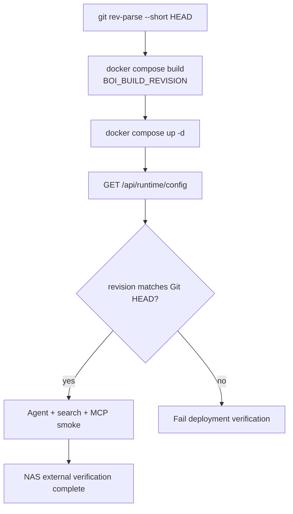

# Summary

Native BoI Agent 배포는 “현재 실행 중인 컨테이너가 어떤 Git revision인지” 확인할 수 있어야 한다. Docker build에는 `BOI_BUILD_REVISION`을 넣고, `/api/runtime/config`와 `/api/agents/boi-wiki/capabilities`에서 revision을 확인한다.

# Verification Flow



# Required Checks

```bash
pytest tests -q -s
python scripts/okf_lint.py --root data --include-logs --strict-media --strict-links
python scripts/check_boi_wiki_mcp.py --summary
```

NAS 배포 후에는 외부 URL에서 다음을 확인한다.

| Check | Expected |
|---|---|
| `/api/agents/boi-wiki/capabilities` | `boi_agent_backend=native`, `build_revision` present |
| `/api/search/ontology?q=SOP&view=compact` | grouped compact result |
| Pet Agent diagram question | Mermaid artifact returned by native backend |
| Inbox tab | 업무 카드가 일반 구성원 문구로 표시 |
| MCP `boi_agent_chat` | same Native Agent API path |

# Environment

| Env | Default | Meaning |
|---|---|---|
| `BOI_AGENT_BACKEND` | `native` | `native`, `hybrid`, `langflow` |
| `BOI_AGENT_NATIVE_MAX_TOOL_LOOPS` | `5` | per-run bounded tool loop |
| `BOI_AGENT_NATIVE_TOOL_TIMEOUT_SECONDS` | `8` | per-tool timeout target |
| `BOI_BUILD_REVISION` | `unknown` | image/runtime revision |
| `BOI_AGENT_ROUTER_MODEL` | deployment-specific | OpenAI-compatible Router model |

Tracked 문서에는 사설 NAS 주소를 고정하지 않는다. 외부 URL과 LLM endpoint는 `.env`에만 둔다.

# Related Documents

- [NAS Git Auto Pull Deployment](/public/boi-wiki-manual/operations/nas-git-auto-pull.md)
- [Native BoI Agent Architecture](/public/boi-wiki-manual/agent/native-boi-agent-architecture.md)
