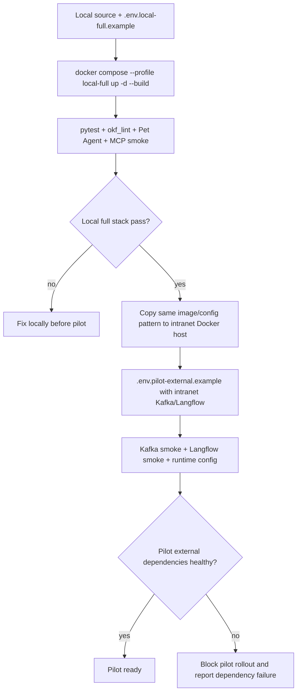
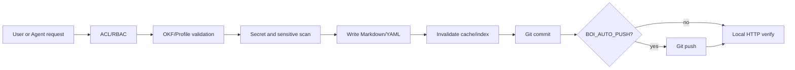

# Summary

Pilot 배포 기준은 NAS가 아니라 `local-full` 검증 후 사내 Linux Docker 서버에서 `pilot-external` profile을 검증하는 것이다. Native BoI Agent는 BoI API 내부 production path이고, Langflow는 action workflow와 visual/debug backend로 사용한다.

# Verification Flow



# Compose Profiles

| Profile | Services | Purpose |
|---|---|---|
| `local-full` | BoI API, Action Gateway, Event Router, MCP, local Kafka, Kafka UI, local Langflow | 전체 기능을 내 Docker에서 재현 |
| `pilot-external` | BoI API, Action Gateway, Event Router, MCP | 사내 Kafka/Langflow 기존 서비스 연계 |
| `core` | BoI API | 단일 컨테이너 가능 범위 확인용 |

Pilot 공식 런타임은 Docker Compose다. 단일 Docker는 문서/검색/Native Agent/RBAC 중심의 Core Wiki에만 적합하며, Event Router와 Action Gateway, MCP까지 포함한 업무 런타임에는 사용하지 않는다.

# Required Checks

Local full stack:

```bash
cp .env.local-full.example .env
./scripts/start_local_full.sh
python scripts/check_local_full_readiness.py --base-url http://localhost:28000
pytest tests -q -s
python scripts/okf_lint.py --root data --include-logs --strict-media --strict-links
python scripts/check_boi_wiki_mcp.py --base-url http://localhost:8200 --mcp-url http://localhost:8200/mcp --boi-api-url http://localhost:28000 --agent-contract --agent-artifact-smoke --summary
node scripts/check_pet_agent_ui.mjs --url "http://localhost:28000/docs/boi:public:sop:equipment-abnormal-response?employee_id=100001" --question "이 SOP의 Event, Action, Manual Handoff 관계를 표로 요약해줘." --expect-artifact workflow_summary --strict
```

기본 Web 포트는 `28000`이다. 다른 포트를 써야 하면 `.env`의 `BOI_API_PORT`와 `BOI_EXTERNAL_URL`을 함께 바꾼다. `scripts/start_local_full.sh`는 같은 Compose 프로젝트가 떠 있으면 내리고 다시 올리며, 28000을 다른 Docker 컨테이너가 점유 중이면 안전하게 중단한다.

`local-full`은 repo 전체를 컨테이너 `/workspace`에 마운트하고 `BOI_CONTENT_ROOT=/workspace/data/boi`, `BOI_CONTENT_SAFE_DIRECTORY=/workspace`를 사용한다. content root만 단독 마운트하면 `.git`이 보이지 않아 `BOI_AUTO_COMMIT=true`여도 `git.available=false`가 되므로 Pilot 기준 실패다.

Pilot external dependency smoke:

```bash
cp .env.pilot-external.example .env
docker compose --profile pilot-external up -d --build
python scripts/check_pilot_external_services.py --kafka --consume --timeout 30
python scripts/check_pilot_external_services.py --langflow --run-langflow-endpoint "$LANGFLOW_BOI_AGENT_ENDPOINT" --timeout 30
```

`pilot-external`은 Kafka topic이나 Langflow flow를 생성하지 않는다. 사내 운영 정책에 따라 미리 provision된 endpoint에 접근 가능한지만 확인한다.

# Runtime Config

`/api/runtime/config`는 다음 상태를 보여야 한다.

| Field | Expected |
|---|---|
| `deployment.profile` | `local-full` 또는 `pilot-external` |
| `deployment.content_root` | Git-backed BoI content root |
| `deployment.runtime_root` | events/actions/activity/audit runtime root |
| `event_broker.mode` | `local`, `external`, `disabled` |
| `connectors.langflow_mode` | `local`, `external`, `disabled` |
| `git.auto_commit` | Pilot 기본 `true` |
| `git.auto_push` | Pilot external 기본 `true` |
| `index.persisted_enabled` | Pilot 기본 `true` |
| `build.revision` | 실행 중인 image revision |
| `readiness.ok` | Pilot 검증 통과 여부 |
| `boi_agent.llm_concurrency.max_concurrency` | local-full 기본 `1` |

secret, token, Kafka password, LLM API key는 runtime config에 노출하지 않는다.

local-full의 Agent LLM 호출은 기본적으로 한 번에 하나만 외부 Gemma gateway를 사용한다. `BOI_AGENT_LLM_MAX_CONCURRENCY=1`은 fallback이 아니라 작은 OpenAI-compatible runtime을 안정적으로 쓰기 위한 backpressure 설정이다. 더 큰 LLM gateway를 쓸 때만 운영자가 부하 테스트 후 값을 올린다. 큐 대기 시간이 `BOI_AGENT_LLM_QUEUE_TIMEOUT_SECONDS`를 넘으면 Agent는 짧은 규칙 답변을 만들지 않고 장애 상태를 반환한다. composer와 suggestion writer의 `MAX_ATTEMPTS=2`는 같은 LLM에 JSON contract를 재작성시키는 repair 시도이며, canned fallback을 만들지 않는다.

# Content Publishing

Public/Team/Private 문서 변경은 공통 pipeline을 통과한다.



문서 저장소와 런타임 로그는 분리한다.

```bash
BOI_CONTENT_HOST_PATH=/srv/boi-wiki/content
BOI_CONTENT_MOUNT_PATH=/content
BOI_CONTENT_ROOT=/content/boi
BOI_CONTENT_SAFE_DIRECTORY=/content
BOI_RUNTIME_ROOT=/runtime
```

`pilot-external`의 `BOI_CONTENT_HOST_PATH`는 git checkout이어야 한다. 일반 사용자는 Git을 직접 몰라도 된다. 검증, commit, push, cache 반영은 BoI API/Agent가 수행하고 실패 시 사용자에게 원인을 표시한다.

# Environment

| Env | Meaning |
|---|---|
| `DEPLOY_PROFILE` | `local-full`, `pilot-external`, `core` |
| `KAFKA_MODE` | `local`, `external`, `disabled` |
| `LANGFLOW_MODE` | `local`, `external`, `disabled` |
| `BOI_CONTENT_ROOT` | BoI Markdown content root |
| `BOI_CONTENT_HOST_PATH` | host-side git checkout or content mount |
| `BOI_CONTENT_MOUNT_PATH` | container mount point that contains the git checkout |
| `BOI_CONTENT_SAFE_DIRECTORY` | Git safe.directory value inside the container |
| `BOI_RUNTIME_ROOT` | event/action/activity/audit runtime root |
| `BOI_AUTO_COMMIT` | validated edit after write commit |
| `BOI_AUTO_PUSH` | validated commit after push |
| `BOI_CONTENT_GIT_REMOTE` | content Git remote |
| `BOI_CONTENT_GIT_BRANCH` | push branch |
| `KAFKA_SECURITY_PROTOCOL` | `PLAINTEXT`, `SSL`, `SASL_PLAINTEXT`, `SASL_SSL` |
| `LANGFLOW_URL` | internal/action runtime Langflow URL |

# Related Documents

- [Native BoI Agent Architecture](/public/boi-wiki-manual/agent/native-boi-agent-architecture.md)
- [Ontology Retrieval and Search](/public/boi-wiki-manual/agent/ontology-retrieval-and-search.md)
- [BoI Profile ACL Policy](/public/boi-wiki-manual/security/boi-profile-acl-policy.md)
- [Team RBAC Management](/public/boi-wiki-manual/security/team-rbac-management.md)
