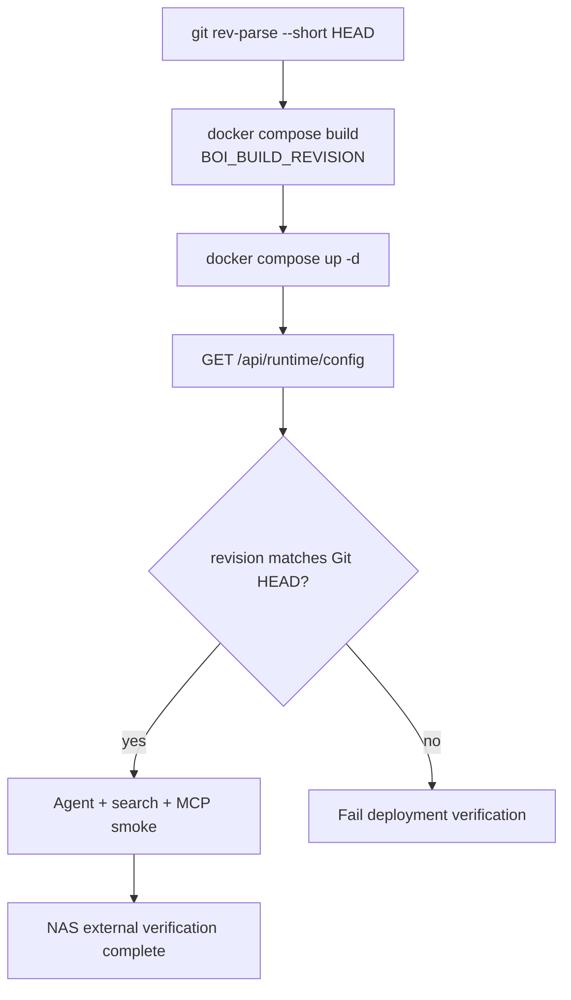

# Summary

Native BoI Agent 배포는 “현재 실행 중인 컨테이너가 어떤 Git revision인지” 확인할 수 있어야 한다. Docker build에는 `BOI_BUILD_REVISION`을 넣고, `/api/runtime/config`와 `/api/agents/boi-wiki/capabilities`에서 revision을 확인한다.

# Verification Flow



# Required Checks

```bash
pytest tests -q -s
python scripts/okf_lint.py --root data --include-logs --strict-media --strict-links
python scripts/check_boi_wiki_mcp.py --summary
python scripts/check_boi_wiki_mcp.py --base-url http://localhost:8200 --mcp-url http://localhost:8200/mcp --boi-api-url http://localhost:8000 --agent-contract --summary
```

protected MCP endpoint를 외부에 열어 둔 배포에서는 service token을 환경 변수로만 넘겨 `/mcp` protocol, bridge, REST/MCP AgentResponse contract를 모두 확인한다.

```bash
python scripts/check_boi_wiki_mcp.py \
  --base-url "$BOI_WIKI_MCP_EXTERNAL_URL" \
  --mcp-url "$BOI_WIKI_MCP_EXTERNAL_URL/mcp" \
  --boi-api-url "$BOI_EXTERNAL_URL" \
  --service-token "$SERVICE_TOKEN" \
  --require-bridge \
  --agent-contract \
  --summary
```

NAS host Python에 `httpx`나 MCP client library가 없는 경우에는 protocol count 대신 AgentResponse contract만 stdlib 기반으로 확인한다.

```bash
python3 scripts/check_boi_wiki_mcp.py \
  --base-url http://127.0.0.1:28200 \
  --boi-api-url http://127.0.0.1:28000 \
  --service-token "$SERVICE_TOKEN" \
  --agent-contract-only
```

NAS 배포 후에는 외부 URL에서 다음을 확인한다.

| Check | Expected |
|---|---|
| `/api/agents/boi-wiki/capabilities` | `boi_agent_backend=native`, `build_revision` present |
| `/api/agents/boi-wiki/chat/stream` | first SSE `status` event arrives quickly and includes one-line progress |
| `/api/search/ontology?q=SOP&view=compact` | grouped compact result |
| Pet Agent diagram question | Mermaid artifact returned by native backend |
| Pet Agent workflow summary question | Markdown answer and workflow artifact render as HTML tables |
| Inbox tab | 업무 카드가 일반 구성원 문구로 표시 |
| MCP `boi_agent_chat` | same Native Agent API path |
| MCP `/health` | `mcp_auth.required=true` when `/mcp` is externally reachable |
| MCP `/mcp` without token | `401 MCP service token is required` when protected |
| MCP `/mcp` with token | protocol initialize and tool list succeed |

# Environment

| Env | Default | Meaning |
|---|---|---|
| `BOI_AGENT_BACKEND` | `native` | `native`, legacy `hybrid`, debug `langflow`. Unknown values are service errors, not implicit native fallback. |
| `BOI_AGENT_LANGGRAPH_REQUIRED` | `1` | Native Agent orchestration은 LangGraph가 필수다. LangGraph import나 graph 실행이 실패하면 sequential fallback으로 숨기지 않고 `native_agent_runtime_unavailable` 장애로 표시한다. |
| `BOI_AGENT_NATIVE_MAX_TOOL_LOOPS` | `5` | per-run bounded tool loop |
| `BOI_AGENT_NATIVE_TOOL_TIMEOUT_SECONDS` | `8` | per-tool timeout target |
| `BOI_AGENT_CACHE_WARMUP_ON_STARTUP` | `1` | API 시작 직후 문서, catalog, ontology search index를 백그라운드로 예열해 첫 Agent 질문 지연을 줄인다. LLM은 호출하지 않는다. |
| `BOI_BUILD_REVISION` | `unknown` | image/runtime revision |
| `MCP_REQUIRE_SERVICE_TOKEN` | `false` | `true`이면 Streamable HTTP `/mcp`도 `x-service-token` 또는 `Authorization: Bearer`를 요구한다. 외부에서 reachable한 NAS MCP endpoint는 `true`가 권장값이다. |
| `BOI_AGENT_ROUTER_MODE` | `llm_first` | LLM Router first |
| `BOI_AGENT_ROUTER_LLM_ENABLED` | `auto` | real LLM URL이면 Router LLM 사용, placeholder URL이면 LLM 비활성으로 해석한다. |
| `BOI_AGENT_ROUTER_REQUIRED` | `1` | compose 호환용 설정명이다. 운영 런타임 정책은 항상 필수이며, Router LLM 비활성, 미설정, timeout, invalid JSON, invalid route/intent, low confidence를 모두 `boi_agent_router_unavailable` 장애로 표시한다. 자동 대화 경로는 규칙 기반 대체 응답으로 우회하지 않는다. |
| `BOI_AGENT_ROUTER_BASE_URL` | `BOI_LLM_BASE_URL` | OpenAI-compatible Router endpoint |
| `BOI_AGENT_ROUTER_MODEL` | deployment-specific | OpenAI-compatible Router model |
| `BOI_AGENT_ROUTER_TIMEOUT_SECONDS` | `12` | Gemma Router response timeout. 운영 모드에서 timeout은 Agent 장애로 노출된다. |
| `BOI_AGENT_ROUTER_FAILURE_BACKOFF_SECONDS` | `30` | Router timeout/network failure 뒤 같은 worker가 잠시 LLM 호출을 건너뛰고 같은 장애를 빠르게 반환하는 보호 시간 |
| `BOI_AGENT_ROUTER_MAX_TOKENS` | `1536` | reasoning token을 쓰는 Gemma 계열 Router의 final JSON 확보용 |
| `BOI_AGENT_STATUS_REQUIRED` | `1` | Web Pet Agent 진행 상태 한 줄과 SSE route plan은 LLM stream planner가 생성해야 한다. 실패 시 정해진 대체 문구를 쓰지 않고 장애로 표시한다. 이 설정명은 compose 호환용으로 남아 있지만 런타임 정책은 항상 필수이며, 값을 낮춰도 canned status fallback은 생기지 않는다. |
| `BOI_AGENT_STATUS_BASE_URL` | `BOI_AGENT_ROUTER_BASE_URL` | OpenAI-compatible stream planner endpoint. 이름은 호환상 `STATUS`를 유지하지만 SSE에서는 route/status plan을 함께 만든다. |
| `BOI_AGENT_STATUS_MODEL` | `BOI_AGENT_ROUTER_MODEL` | 요청별 진행 상태 문구를 생성할 model |
| `BOI_AGENT_STATUS_TIMEOUT_SECONDS` | `12` | stream plan 생성 timeout. Gemma가 route/status JSON을 만들 시간을 주되, 실패하면 `/chat/stream`은 `status_generation_failed`를 반환한다. 긴 대기 뒤 대체 문구로 숨기지 않고 Agent 장애로 노출한다. |
| `BOI_AGENT_STATUS_MAX_TOKENS` | `1536` | Gemma 계열 모델이 reasoning token을 먼저 쓸 수 있어 너무 낮추면 `finish_reason=length`로 JSON content가 비며 장애가 된다. compact stream planner prompt 기준 1536을 기본값으로 둔다. |
| `BOI_AGENT_SUGGESTIONS_REQUIRED` | `1` | compose 호환용 설정명이다. 운영 런타임 정책은 항상 필수이며, 현재 페이지 추천 질문은 LLM suggestion writer가 생성해야 한다. 실패하면 템플릿 질문으로 대체하지 않고 `boi_agent_suggestions_unavailable`로 표시한다. |
| `BOI_AGENT_SUGGESTIONS_BASE_URL` | `BOI_AGENT_ROUTER_BASE_URL` | OpenAI-compatible suggestion writer endpoint |
| `BOI_AGENT_SUGGESTIONS_MODEL` | `BOI_AGENT_ROUTER_MODEL` | 현재 페이지 추천 질문을 생성할 model |
| `BOI_AGENT_SUGGESTIONS_TIMEOUT_SECONDS` | `12` | 추천 질문 생성 timeout. 실패 시 Pet Agent는 현재 페이지 질문을 숨기거나 장애로 표시해야 하며, 하드코딩 질문을 운영 fallback으로 쓰지 않는다. |
| `BOI_AGENT_COMPOSER_LLM_ENABLED` | `auto` | Native tool loop가 만든 근거와 artifact를 LLM composer가 일반 구성원용 Markdown 답변으로 다듬는다. placeholder URL이면 비활성이다. |
| `BOI_AGENT_COMPOSER_REQUIRED` | `1` | compose 호환용 설정명이다. 운영 런타임 정책은 항상 필수이며, composer 실패는 deterministic answer로 숨기지 않고 `native_agent_runtime_unavailable` 장애로 표시한다. Composer는 `answer_markdown` JSON contract만 인정하며 plain Markdown, 잘린 JSON, prompt echo, 반복 생성은 최종 답변으로 복구하지 않는다. |
| `BOI_AGENT_COMPOSER_TIMEOUT_SECONDS` | `12` | composer 호출 timeout. 작은 answer plan JSON을 만드는 호출이므로 길게 잡지 않는다. |
| `BOI_AGENT_COMPOSER_MAX_TOKENS` | `1536` | 최종 Markdown 답변 확보용 token limit. Gemma가 반복 생성으로 `finish_reason=length`에 빠지지 않게 답변 계약은 1200자 이하를 기준으로 둔다. 런타임은 이 값을 최대 1536으로 cap한다. |
| `BOI_AGENT_COMPOSER_MAX_ATTEMPTS` | `2` | 운영 기본 composer 시도 횟수. 첫 응답 JSON이 깨지면 규칙 기반 fallback 대신 같은 LLM에 1회 repair를 요청한다. |
| `BOI_AGENT_CHAT_TIMEOUT_SECONDS` | `45` | non-stream `/api/agents/boi-wiki/chat` 전체 응답 상한이다. 이 시간을 넘기면 클라이언트가 socket timeout으로 끊기기 전에 `boi_agent_timeout` 503을 반환한다. 대체 답변을 만들지 않으며, MCP/외부 호출자는 Agent 장애로 처리해야 한다. |

Tracked 문서에는 사설 NAS 주소를 고정하지 않는다. 외부 URL과 LLM endpoint는 `.env`에만 둔다.

`/api/runtime/config`는 Router mode, LLM enabled 여부, base URL, model, timeout, backoff, cache warmup 상태를 노출한다. secret은 노출하지 않는다.

# Streaming Smoke

배포 후 Web Pet Agent가 멈춘 것처럼 보이지 않는지 확인하려면 external URL 기준으로 streaming endpoint의 첫 event를 확인한다.

```bash
curl -N \
  -H "Content-Type: application/json" \
  -d '{"question":"현재 페이지 기준으로 설명해줘","current_url":"/"}' \
  "$BOI_EXTERNAL_URL/api/agents/boi-wiki/chat/stream?employee_id=100001" \
  | sed -n '1,4p'
```

기대 결과:

```text
event: status
data: {"stage":"page_context","message":"...","source":"llm_status","elapsed_ms":0}
```

실제 문구는 LLM stream planner가 질문과 현재 페이지에 맞춰 생성한다. 고정 문구가 아니므로 특정 문장과 exact match하지 않는다. 핵심은 첫 `status`에 `source: "llm_status"`가 있고, 긴 작업 중에도 LLM이 만든 한 줄 진행 상태가 반복되는 것이다. stream planner가 route/status JSON plan을 만들지 못하면 SSE가 시작되기 전에 다음처럼 HTTP `503`으로 실패해야 한다.

```text
HTTP/1.1 503 Service Unavailable
{"detail":{"status":"status_generation_failed", ...}}
```

이 오류는 정상 우회가 아니라 Agent streaming 장애로 취급한다.

이 smoke는 최종 답변 품질 검증이 아니라 “장시간 Agent 요청이 진행 상태를 계속 보여주는가”를 확인하는 최소 검증이다. 최종 답변 품질은 Pet UI에서 Markdown table, Mermaid artifact, links, Inbox card가 함께 렌더링되는지 별도로 확인한다.

# Related Documents

- [NAS Git Auto Pull Deployment](/public/boi-wiki-manual/operations/nas-git-auto-pull.md)
- [Native BoI Agent Architecture](/public/boi-wiki-manual/agent/native-boi-agent-architecture.md)
