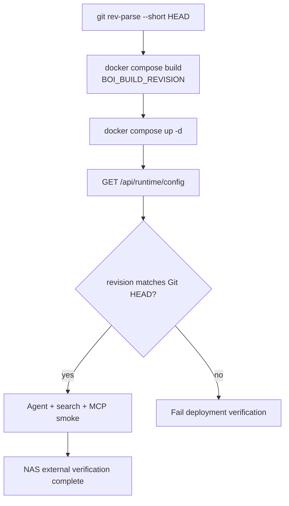

# Summary

Native BoI Agent 배포는 “현재 실행 중인 컨테이너가 어떤 Git revision인지” 확인할 수 있어야 한다. Docker build에는 `BOI_BUILD_REVISION`을 넣고, `/api/runtime/config`와 `/api/agents/boi-wiki/capabilities`에서 revision을 확인한다.

# Verification Flow



# Required Checks

```bash
pytest tests -q -s
python scripts/okf_lint.py --root data --include-logs --strict-media --strict-links
python scripts/check_boi_wiki_mcp.py --summary
```

NAS 배포 후에는 외부 URL에서 다음을 확인한다.

| Check | Expected |
|---|---|
| `/api/agents/boi-wiki/capabilities` | `boi_agent_backend=native`, `build_revision` present |
| `/api/agents/boi-wiki/chat/stream` | first SSE `status` event arrives quickly and includes one-line progress |
| `/api/search/ontology?q=SOP&view=compact` | grouped compact result |
| Pet Agent diagram question | Mermaid artifact returned by native backend |
| Pet Agent workflow summary question | Markdown answer and workflow artifact render as HTML tables |
| Inbox tab | 업무 카드가 일반 구성원 문구로 표시 |
| MCP `boi_agent_chat` | same Native Agent API path |

# Environment

| Env | Default | Meaning |
|---|---|---|
| `BOI_AGENT_BACKEND` | `native` | `native`, `hybrid`, `langflow` |
| `BOI_AGENT_NATIVE_MAX_TOOL_LOOPS` | `5` | per-run bounded tool loop |
| `BOI_AGENT_NATIVE_TOOL_TIMEOUT_SECONDS` | `8` | per-tool timeout target |
| `BOI_BUILD_REVISION` | `unknown` | image/runtime revision |
| `BOI_AGENT_ROUTER_MODE` | `llm_first` | LLM Router first, rules fallback |
| `BOI_AGENT_ROUTER_LLM_ENABLED` | `auto` | real LLM URL이면 Router LLM 사용, placeholder URL이면 rules fallback |
| `BOI_AGENT_ROUTER_BASE_URL` | `BOI_LLM_BASE_URL` | OpenAI-compatible Router endpoint |
| `BOI_AGENT_ROUTER_MODEL` | deployment-specific | OpenAI-compatible Router model |
| `BOI_AGENT_ROUTER_TIMEOUT_SECONDS` | `3` | Gemma Router response timeout. Timeout이면 rules fallback을 사용해 Agent 응답을 계속 진행한다. |
| `BOI_AGENT_ROUTER_FAILURE_BACKOFF_SECONDS` | `30` | Router timeout/network failure 뒤 같은 worker가 잠시 LLM 호출을 건너뛰고 rules fallback을 바로 쓰는 보호 시간 |
| `BOI_AGENT_ROUTER_MAX_TOKENS` | `768` | reasoning token을 쓰는 Gemma 계열 Router의 final JSON 확보용 |

Tracked 문서에는 사설 NAS 주소를 고정하지 않는다. 외부 URL과 LLM endpoint는 `.env`에만 둔다.

`/api/runtime/config`는 Router mode, LLM enabled 여부, base URL, model, timeout, backoff 상태를 노출한다. secret은 노출하지 않는다.

# Streaming Smoke

배포 후 Web Pet Agent가 멈춘 것처럼 보이지 않는지 확인하려면 external URL 기준으로 streaming endpoint의 첫 event를 확인한다.

```bash
curl -N \
  -H "Content-Type: application/json" \
  -d '{"question":"현재 페이지 기준으로 설명해줘","current_url":"/"}' \
  "$BOI_EXTERNAL_URL/api/agents/boi-wiki/chat/stream?employee_id=100001" \
  | sed -n '1,4p'
```

기대 결과:

```text
event: status
data: {"message": "현재 화면 맥락을 확인하고 있습니다.", "elapsed_ms": 0}
```

실제 문구는 현재 페이지 종류에 따라 `현재 BoI 문서와 접근 권한을 확인하고 있습니다.`, `현재 Workflow 상태와 접근 권한을 확인하고 있습니다.`처럼 달라질 수 있다. 핵심은 첫 `status`가 즉시 오고, 긴 작업 중에도 2초 안팎으로 한 줄 진행 상태가 반복되는 것이다.

이 smoke는 최종 답변 품질 검증이 아니라 “장시간 Agent 요청이 진행 상태를 계속 보여주는가”를 확인하는 최소 검증이다. 최종 답변 품질은 Pet UI에서 Markdown table, Mermaid artifact, links, Inbox card가 함께 렌더링되는지 별도로 확인한다.

# Related Documents

- [NAS Git Auto Pull Deployment](/public/boi-wiki-manual/operations/nas-git-auto-pull.md)
- [Native BoI Agent Architecture](/public/boi-wiki-manual/agent/native-boi-agent-architecture.md)
