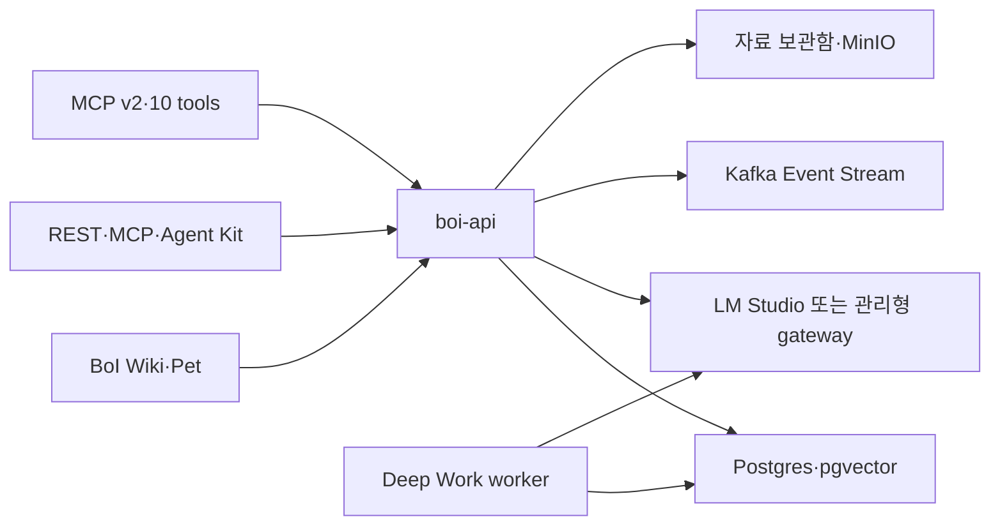

# 배포 구성


```mermaid
flowchart LR
  WEB["BoI Wiki·Pet"] --> API["boi-api"]
  EXT["REST·MCP·Agent Kit"] --> API
  API --> PG["Postgres·pgvector"]
  API --> MODEL["LM Studio 또는 관리형 gateway"]
  API --> KAFKA["Kafka Event Stream"]
  API --> MINIO["자료 보관함·MinIO"]
  WORKER["Deep Work worker"] --> PG
  WORKER --> MODEL
  MCP["MCP v2·10 tools"] --> API
```

Langflow는 선택형 connector와 시각적 실험 도구다. Pet·Quick Agent와 MCP의 필수 runtime이 아니다.

# 설치 모드

| 모드 | content | runtime | 외부 연동 |
|---|---|---|---|
| local dev | repo `data/boi` | `.tmp/boi-runtime` | local service 또는 fixture |
| local-full | `/workspace/data/boi` | compose volume | bundled Kafka·MinIO·Postgres |
| pilot-external | `/content/data/boi` | service volume | 사내 Kafka·Data Lake·model gateway |

실제 명령과 장애 복구는 [운영 Runbook](/docs/boi:public:boi-wiki-manual:operations:operator-runbook)을 기준으로 한다.

# Agent v2 기준값

- `BOI_AGENT_V2_ENABLED=true`
- `BOI_AGENT_V2_DEFAULT=true`
- `BOI_AGENT_V2_REQUIRE_POSTGRES=true`
- `MCP_V2_REQUIRE_PAT=true`
- Deep Work는 Postgres queue와 worker heartbeat를 사용한다.
- 정본은 Markdown/JSONL/catalog이고 pgvector·ontology는 재생성 가능한 read model이다.

# LM Studio

개발 PC에서는 사용자가 미리 띄운 생성 모델과 embedding 모델을 그대로 사용한다. BoI Wiki는 load/unload API를 호출하지 않는다.

예시 기준 모델:

- generation: `google/gemma-4-26b-a4b-qat`
- embedding: `text-embedding-bge-m3`

`BOI_LMSTUDIO_REQUIRE_PRELOADED_MODELS=true`이면 native `GET /api/v1/models`로 수동 상주 상태만 확인한다. 모델이 없을 때 자동 load로 교대시키지 않고 요청을 차단해 원인을 진단에 남긴다. 사내 관리형 gateway에는 이 개발 PC 가드를 적용하지 않는다.

GPT-5.5는 기본 runtime에서 호출하지 않는다. 품질 비교가 필요한 일회성 테스트에서만 `BOI_GPT55_TEST_MODE=true`와 별도 credential을 명시한다.

# Readiness

`GET <BOI_BASE_URL>/api/v2/system/readiness`는 다음을 실제로 확인한다.

- Postgres와 pgvector extension
- generation·embedding model preflight
- search index freshness와 schema/model version
- Deep Work worker heartbeat
- PAT secret과 MCP v2 상태
- Data Lake, Kafka와 Action Gateway의 연결 상태

모델 장애 중에도 문서, lexical·ontology 검색과 현재 업무는 유지한다. draft·Deep Work처럼 모델이 필요한 기능만 unavailable로 표시한다.

# Acceptance

```bash
export BOI_BASE_URL='<BOI_BASE_URL>'
python scripts/check_agent_v2_search_quality.py --base-url "$BOI_BASE_URL"
python scripts/check_agent_v2_learning_cycle.py --base-url "$BOI_BASE_URL"
python scripts/check_agent_v2_interface_parity.py --base-url "$BOI_BASE_URL"
```

필수 기준:

- curated 검색 Recall@8 0.85 이상
- reviewed authoritative Top-3 90% 이상
- citation 실재성 100%
- Web·REST·MCP의 source, citation, artifact와 권한 결과 일치
- no-progress 반복 중단과 무단 mutation 차단
- 일반 탐색·색인 중 LM Studio load/unload 요청 0건

# 관련 문서

- [운영 Runbook](/docs/boi:public:boi-wiki-manual:operations:operator-runbook)
- [BoI Agent 권한과 실행 안전 기준](/docs/boi:public:boi-wiki-manual:agent:agent-guardrail-and-acl)
- [Hybrid Retrieval과 지식 그래프](/docs/boi:public:boi-wiki-manual:agent:ontology-retrieval-and-search)
