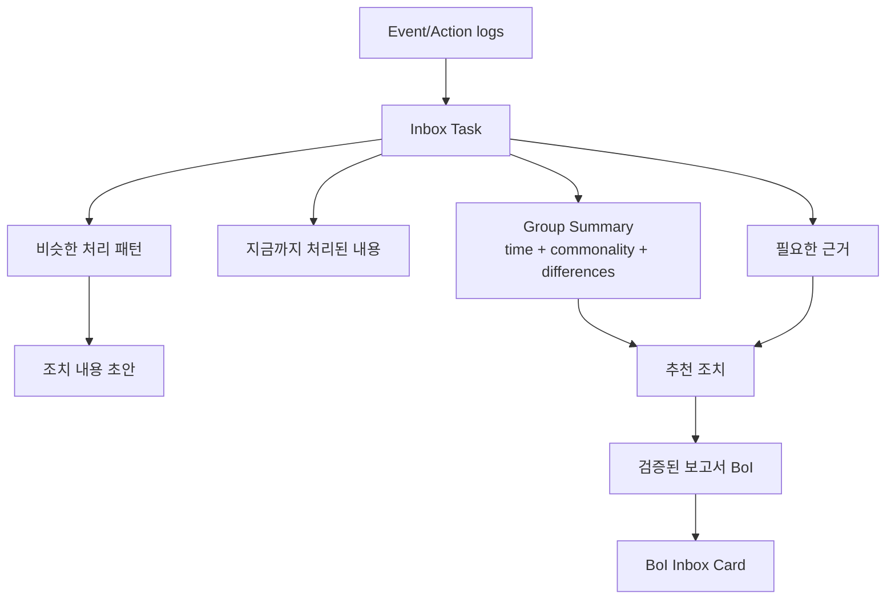

# Summary

BoI Inbox는 단순히 `action_key`와 `trace_id`를 보여주는 기술 목록이 아니다. 일반 구성원이 바로 판단할 수 있도록 QA를 통과한 검토 보고서 BoI가 도착하는 전용 업무함이다. 보고서는 “언제 발생했는지”, “무엇이 같은지”, “무엇이 다른지”, “지금까지 무엇이 처리됐는지”, “비슷한 상황에서 어떻게 처리했는지”, “다음에 무엇을 확인해야 하는지”를 함께 정리한다.

사용자 화면의 자연어 요약은 LLM이 작성하고 QA를 통과한 narrative만 표시한다. `stage_history_summary`, `similar_case_summaries`, `group_context_summary`, `comparison_candidates`는 근거 원장이고, `실행됨`, `라우팅`, `처리 중`, `source_id` 같은 시스템 표현이나 deterministic 차이 필드를 그대로 업무 요약처럼 보여주지 않는다. QA를 통과한 보고서는 기본적으로 `private/{employee_id}/inbox-reports` 아래 BoI 문서로 materialize한다.

`/inbox` 화면과 `GET /api/inbox`는 빠른 slim manifest로 먼저 열린다. WorkContextPack 조립, LLM narrative, 보고서 BoI materialize, Data Lake 조회, report warm-up은 조회 요청을 막거나 조회 중 새로 시작하지 않는다. 검증 보고서는 task 생성/변경, 명시적 refresh, 또는 별도 job에서 생성되고, 준비 전에는 임시 문장으로 채우지 않고 `보고서 준비 중`, `보고서 생성 대기`, `보고서 품질 확인 필요` 같은 상태만 보여준다.

# Display Model



기본 카드에는 업무 문구만 보인다.

| Section | Example |
|---|---|
| 제목 | 조치 내용 입력 필요 |
| 지금까지 처리된 내용 | Trend 확인 요청 완료, 원인 분석 Action 진행 |
| 필요한 근거 | Trend, Raw Data, 이전 조치 이력 |
| 비슷한 처리 패턴 | 과거 2건에서 Trend와 Raw Data 확인 후 현장 담당자에게 공유 |
| 추천 조치 | 확인한 근거를 적고 완료 처리 |
| 조치 내용 초안 | Trend와 Raw Data를 확인했고, 알람 맥락을 현장 담당자에게 공유했습니다. |

`request_id`, `trace_id`, `action_key`, Raw URL은 `기술 세부정보` details 안에 둔다.

같은 유형이 여러 건이면 group 카드가 먼저 나온다. Group 카드는 `group_narrative.summary`로 하나의 업무 요약을 보여주고, `preview_items[].brief`로 상위 개별 건의 시간, 대상/상황, 다음 확인 포인트를 보여준다. `top_business_differences`나 `comparison_candidates`는 LLM과 QA validator가 참고하는 근거이지 그대로 화면에 나열하는 문구가 아니다. 차이는 trace id가 아니라 장비, LOT, Wafer, Alarm 유형, Trend/Raw 확보 상태, 실패 Action, 승인 위험도처럼 담당자가 실제로 판단에 쓰는 업무 맥락이어야 한다.

예:

- `Spec 변경 승인 필요 8건은 최근 장비 이상 조치에서 발생했으며, ETCH 압력 Spike와 CVD 온도 Drift처럼 확인해야 할 근거가 다릅니다.`
- `06-26 22:39 · ETCH-VM-01 / LOT-A · 압력 Spike · Trend는 확보됐고 Raw 대조가 필요합니다.`
- `06-26 22:41 · CVD-ALD-02 / LOT-B · 온도 Drift · Trend 확인 실패로 Raw 재요청 여부를 먼저 봅니다.`

개별 업무를 펼치면 `처리 흐름`, `확인할 근거`, `비슷한 과거 처리`, `참고 링크` 순서로 보여준다. `원본 이력`, `추천 후보`, `source_id` 같은 시스템성 라벨은 기본 화면에 쓰지 않는다.

`work_context_narrative.summary_state` 또는 `group_narrative.state`가 `pending`/`failed`이면 기본 카드에 임시 요약을 만들지 않는다. 이 상태는 일반 사용자용 정상 표시가 아니라 플랫폼 품질 이슈이므로 Advanced health와 runtime diagnostics에 `inbox_context_narrative_failed`로 남긴다.

# Review Report

승인이나 반려가 필요한 Inbox 항목은 바로 원본 화면으로 보내지 않고 `검증된 보고서 BoI`를 먼저 제공한다. 보고서는 `/inbox` 전용 화면에서 미리보고, 필요하면 BoI 문서 상세로 열어 검토한다. Pet Agent는 보고서로 안내하거나 보고서를 근거로 질문에 답하지만, Inbox 탭이나 decision UI를 직접 렌더링하지 않는다.

보고서에는 다음 섹션만 기본 표시한다.

| Section | Purpose |
|---|---|
| 결론 요약 | 왜 지금 봐야 하는지, 위험도, 권장 확인 순서 |
| 개별 비교 | 시간, 대상 장비/LOT/Wafer/Alarm, 확보 근거, 부족 근거, 현재 확인할 일 |
| 판단 근거 | Trend, Raw Data, BoI 생성 결과, Action 결과, SOP 단계 이력 |
| 비슷한 과거 처리 | 왜 유사한지, 과거 조치, 이번 건과 다른 점, 참고 링크 |
| 조치 | 승인, 반려, 보류, 추가 근거 요청 |

`원본 기록`, raw id, schema, trace id는 보고서 기본 화면에 넣지 않는다. 필요한 경우 `기술 세부정보`나 원본 화면 링크로만 확인한다.

보고서 근거는 실제 Event, Action 결과, 생성 BoI, manual note, Data Lake artifact, 유사 과거 사례를 우선한다. Langflow Universal Simulator는 실행 전 확인과 PoC용 dry-run 도구이며 verified report evidence가 아니다. Simulator 결과를 사용자에게 보여줄 때는 `시뮬레이션 결과`로 분리한다.

고위험 승인 건은 group bulk approve를 허용하지 않는다. Group 보고서는 비교와 우선순위 판단을 돕지만, 실제 `승인`은 개별 항목에서 사유를 입력하고 confirmation을 거쳐야 한다. `반려`, `보류`, `추가 근거 요청`은 group preview로 선택 가능하지만, 기록 시에도 사용자 확인과 audit이 필요하다.

# Low Sample Policy

팀 이력은 기본적으로 익명 집계한다. 1~3건이어도 숨기지 않는다. 대신 다음 필드를 함께 표시한다.

| Field | Meaning |
|---|---|
| `sample_size` | 집계에 사용된 사례 수 |
| `low_sample_warning` | 3건 이하이면 true |
| `confidence_label` | `참고 데이터가 적음`처럼 일반 사용자용 문구 |

적은 표본은 “정답”이 아니라 참고 패턴이다. Agent와 Inbox는 이 값을 실행/승인 자동화 근거로 쓰지 않고, 사용자가 조치 내용을 작성할 때 참고할 힌트로만 보여준다.

# API and MCP

- `GET /api/inbox?include_context=compact`
- `GET /api/inbox/reports/{report_id}`
- `POST /api/inbox/reports/{report_id}/refresh`
- `POST /api/inbox/tasks/{task_id}/decision`
- `POST /api/inbox/groups/{group_id}/decision-preview`
- `GET /api/agents/boi-wiki/inbox?include_context=compact` compatibility alias
- `GET /api/agents/boi-wiki/inbox/{task_id}/context`
- `GET /api/agents/boi-wiki/inbox/{task_id}/history`
- `GET /api/agents/boi-wiki/inbox/{task_id}/review-report`
- `GET /api/agents/boi-wiki/inbox/groups/{group_id}/review-report`
- `POST /api/agents/boi-wiki/inbox/{task_id}/decision`
- `POST /api/agents/boi-wiki/inbox/groups/{group_id}/decision-preview`
- MCP `boi_inbox`
- MCP `boi_inbox_report_get`
- MCP `boi_inbox_decision_preview`
- MCP `boi_inbox_decision_submit`
- MCP `agent_inbox*` compatibility aliases
- MCP `similar_cases_search`
- Optional MCP `data_lake_status`, `data_lake_sources`, `data_lake_query_plan`, `data_lake_query_preview`, `data_lake_query_execute`, `data_lake_artifact_get`

위 API와 MCP는 같은 `work_context_narrative`, `group_narrative`, `comparison_candidates`, `preview_items[].brief`, `report_boi_ref`, `report_boi_url` contract를 반환한다. Narrative 문장은 source id를 통해 실제 근거에 연결되어야 하지만 source id는 필드에만 남고 사용자 문장에 노출하지 않는다. ACL/RBAC 필터를 통과하지 못한 private/team/restricted 내용은 narrative 입력에도 포함하지 않는다.

`review-report` 응답의 `report` 객체는 사용자-visible 영역이다. 따라서 `source_id`, `trace`, raw action id, schema, WorkflowDefinition 같은 내부 용어가 들어가면 실패로 본다. 원본 링크나 내부 식별자가 필요한 client는 report 바깥의 technical field나 별도 원본 API를 사용한다.

하네스 품질 검증에는 다음 명령을 포함한다.

```bash
python scripts/check_inbox_narrative_quality.py --base-url http://localhost:28000 --summary
```

# Related Documents

- [Work Context Pack](/public/boi-wiki-manual/agent/work-context-pack.md)
- [Pet Agent UX and Artifacts](/public/boi-wiki-manual/agent/pet-agent-ux-and-artifacts.md)
- [Native BoI Agent Safety, Approval, and Memory](/public/boi-wiki-manual/agent/safety-approval-and-memory.md)
