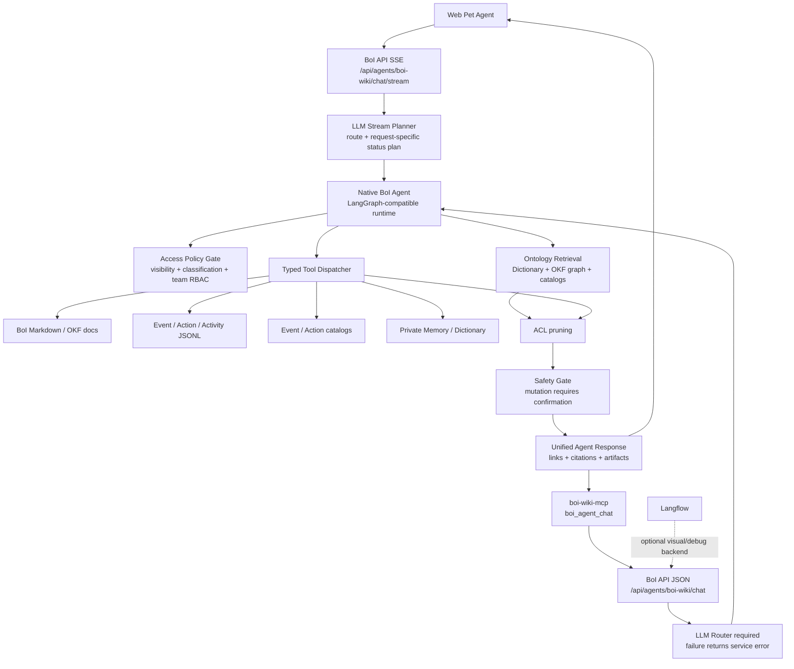
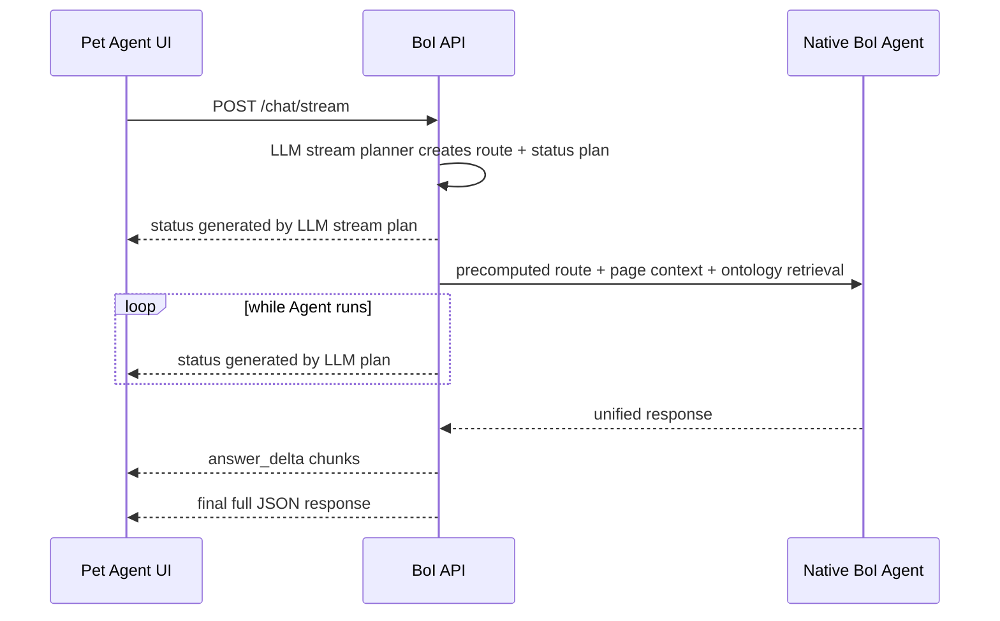

# Summary

BoI Agent의 production path는 `boi-api` 내부 Native Agent다. Langflow는 visual workflow, demo, debug backend로 유지하지만 사용자-facing Agent 응답의 필수 runtime dependency가 아니다.

Native Agent는 LangGraph state graph와 typed tool dispatcher를 함께 제공한다. LLM은 Router, stream planner, 선택적 planner/composer에 쓰이고, 실행 경계는 Python typed tool dispatcher가 통제한다. Router는 `llm_first`가 기본이며 운영 필수 구성이다. 이때 Router LLM은 사용자 답변을 생성하지 않고 `route`, `intent`, `confidence` JSON만 반환한다. Router LLM이 비활성, 미설정, timeout, invalid JSON, low confidence 중 하나라도 해당하면 `/chat`은 rules로 우회하지 않고 `boi_agent_router_unavailable`을 반환한다. Native Agent orchestration도 운영 기본값에서는 LangGraph가 필수다. LangGraph import나 graph 실행이 실패하면 sequential runtime으로 조용히 낮아지지 않고 `native_agent_runtime_unavailable`으로 실패한다. Tool loop는 BoI Wiki 검색, 문서 조회, Action Spec, Workflow Status, Dictionary, Memory를 typed dispatcher로 조회하고, 최종 답변은 이 근거와 artifact를 바탕으로 LLM composer가 업무 문장으로 다듬을 수 있다. Composer가 required로 설정된 운영에서 실패하면 deterministic answer로 숨기지 않고 `native_agent_runtime_unavailable`으로 실패한다. Web Pet Agent의 진행 상태 한 줄도 정해진 대체 문구로 우회하지 않는다. `/chat/stream`은 별도 status LLM과 router LLM을 중복 호출하지 않고, stream planner가 요청별 `route + status` JSON을 한 번에 만든다. `BOI_AGENT_STATUS_REQUIRED=1`일 때 stream planner가 route와 최소 1개 usable status를 만들지 못하면 `/chat/stream`은 `status_generation_failed` 또는 `boi_agent_router_unavailable`을 반환하고 Agent UI는 장애로 표시한다.

# Architecture

# Runtime Components

| Component | Role |
|---|---|
| `boi-api` | Official Agent API, auth, ACL, page context, search, tool dispatch, safety boundary |
| `NativeBoiAgent` | LangGraph-compatible nodes and typed tool loop |
| Ontology search | Compact grouped retrieval for SOP, Event, Action, Dictionary, BoI, runtime evidence |
| MCP | External agent interface that calls the same BoI API |
| Langflow | Optional visual workflow and connector demo, not the required Agent engine |

# Response Streaming Contract

BoI Agent는 동기 JSON API와 streaming API를 모두 제공한다.

| Interface | Use |
|---|---|
| `POST /api/agents/boi-wiki/chat` | machine-to-machine JSON response, MCP bridge, tests |
| `POST /api/agents/boi-wiki/chat/stream` | Web Pet Agent default. Server-Sent Events로 진행 상태와 답변 조각을 전달 |

Streaming response는 다음 event 순서를 따른다.

`status` event는 사용자가 장시간 요청을 멈춘 것으로 오해하지 않도록 한 줄 진행 상황만 전달한다. 이 문구는 code rule이 아니라 OpenAI-compatible Gemma stream planner가 생성한다. stream planner는 같은 JSON에서 route도 함께 결정하므로 SSE 요청 하나 안에서 status LLM과 router LLM을 따로 호출하지 않는다. 운영상 최소 1개 LLM-generated status를 필수로 보고, 모델이 여러 status를 안정적으로 만들면 순서대로 사용한다. stream planner가 실패하면 정해진 문구로 대체하지 않고 `error` event의 `status_generation_failed` 또는 `boi_agent_router_unavailable`로 중단한다. 실제 최종 응답의 canonical contract는 `final` event의 JSON이며, 기존 `/chat` 응답과 같은 `answer_markdown`, `answer_html`, `links`, `citations`, `artifacts`, `context_summary`, `route`, `intent` 필드를 유지한다.

# Backend Selection

`BOI_AGENT_BACKEND` controls the runtime:

| Value | Meaning |
|---|---|
| `native` | Default. Fast and deep routes use Native BoI Agent. |
| `hybrid` | Legacy alias for native-first operation. Native runtime failures are not hidden by Langflow fallback. |
| `langflow` | Legacy/debug mode. Deep route calls Langflow and returns 503 if unavailable. |

# Related Documents

- [BoI Agent API, MCP, Ontology Search Harness](/public/harness/agent-api-mcp-search-harness.md)
- [Native BoI Agent Tool Loop](/public/boi-wiki-manual/agent/native-boi-agent-tool-loop.md)
- [Ontology Retrieval and Search](/public/boi-wiki-manual/agent/ontology-retrieval-and-search.md)
- [Safety, Approval, and Memory](/public/boi-wiki-manual/agent/safety-approval-and-memory.md)
- [Agent Guardrail and ACL](/public/boi-wiki-manual/agent/agent-guardrail-and-acl.md)
- [BoI Profile ACL Policy](/public/boi-wiki-manual/security/boi-profile-acl-policy.md)
- [Deployment and Verification](/public/boi-wiki-manual/agent/deployment-and-verification.md)
