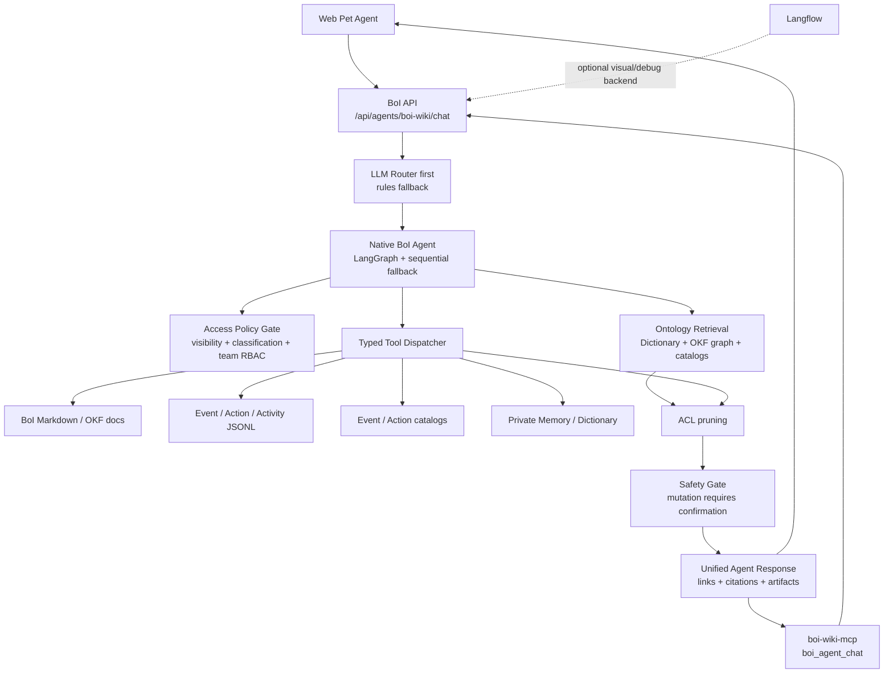

# Summary

BoI Agent의 production path는 `boi-api` 내부 Native Agent다. Langflow는 visual workflow, demo, debug backend로 유지하지만 사용자-facing Agent 응답의 필수 runtime dependency가 아니다.

Native Agent는 LangGraph state graph와 순차 fallback을 함께 제공한다. LLM은 Router와 선택적 planner/composer에 쓰이고, 실행 경계는 Python typed tool dispatcher가 통제한다. Router는 `llm_first`가 기본이며, `BOI_AGENT_ROUTER_LLM_ENABLED=auto`에서는 실제 OpenAI-compatible LLM URL이 설정된 배포에서 LLM Router를 사용하고 placeholder 개발 URL에서는 rules fallback을 사용한다.

# Architecture

# Runtime Components

| Component | Role |
|---|---|
| `boi-api` | Official Agent API, auth, ACL, page context, search, tool dispatch, safety boundary |
| `NativeBoiAgent` | LangGraph nodes and deterministic fallback |
| Ontology search | Compact grouped retrieval for SOP, Event, Action, Dictionary, BoI, runtime evidence |
| MCP | External agent interface that calls the same BoI API |
| Langflow | Optional visual workflow and connector demo, not the required Agent engine |

# Backend Selection

`BOI_AGENT_BACKEND` controls the runtime:

| Value | Meaning |
|---|---|
| `native` | Default. Fast and deep routes use Native BoI Agent. |
| `hybrid` | Native first, optional Langflow fallback for deep requests. |
| `langflow` | Legacy/debug mode. Deep route calls Langflow and returns 503 if unavailable. |

# Related Documents

- [BoI Agent API, MCP, Ontology Search Harness](/public/harness/agent-api-mcp-search-harness.md)
- [Native BoI Agent Tool Loop](/public/boi-wiki-manual/agent/native-boi-agent-tool-loop.md)
- [Ontology Retrieval and Search](/public/boi-wiki-manual/agent/ontology-retrieval-and-search.md)
- [Safety, Approval, and Memory](/public/boi-wiki-manual/agent/safety-approval-and-memory.md)
- [Agent Guardrail and ACL](/public/boi-wiki-manual/agent/agent-guardrail-and-acl.md)
- [BoI Profile ACL Policy](/public/boi-wiki-manual/security/boi-profile-acl-policy.md)
- [Deployment and Verification](/public/boi-wiki-manual/agent/deployment-and-verification.md)
