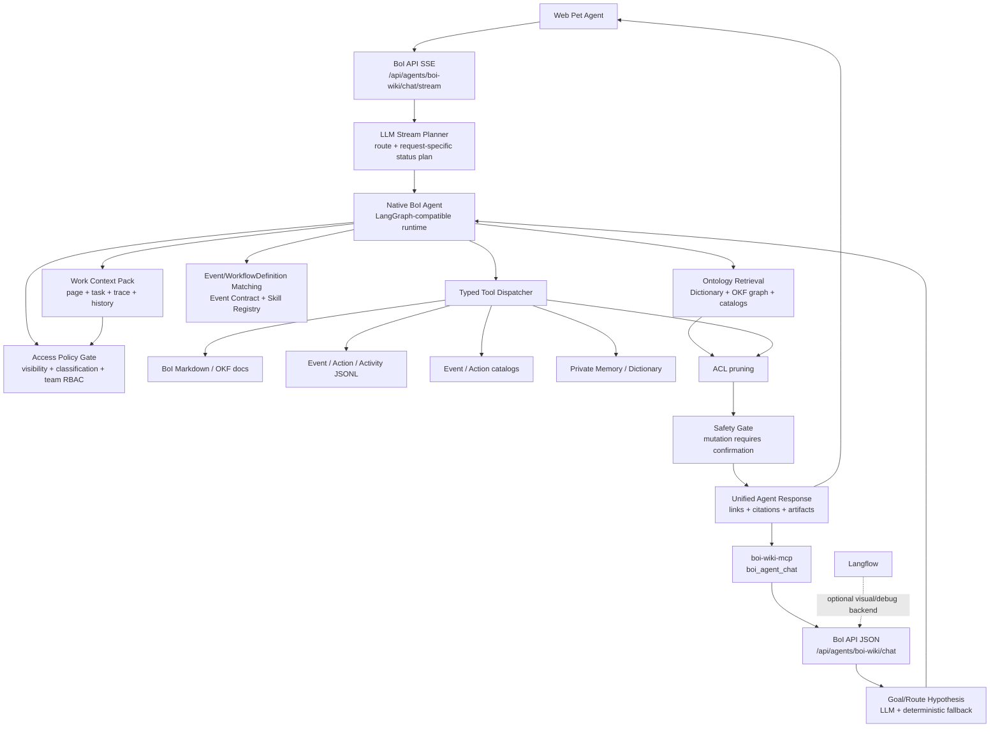
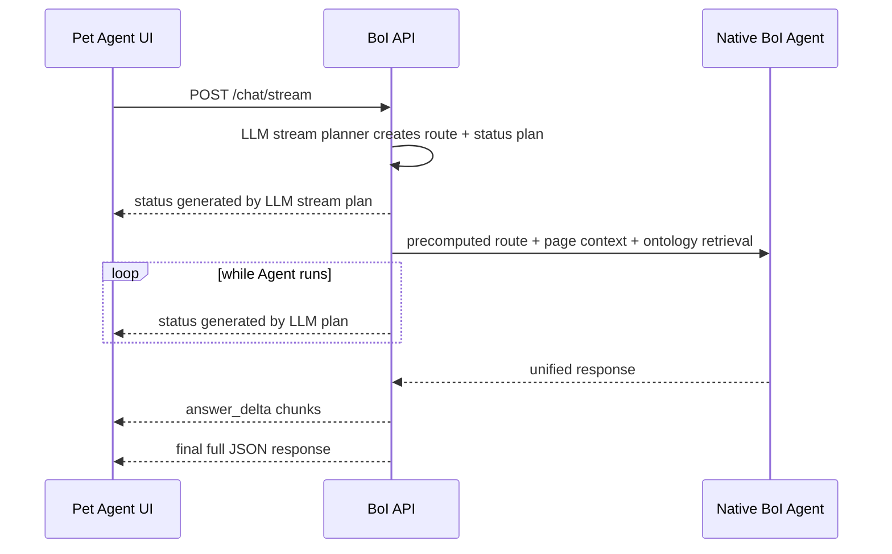

# Summary

BoI Agent의 production path는 `boi-api` 내부 Native Agent다. Langflow는 visual workflow, demo, debug backend로 유지하지만 사용자-facing Agent 응답의 필수 runtime dependency가 아니다.

Native Agent는 LangGraph-compatible state graph와 typed tool dispatcher를 함께 제공한다. LLM은 Router, stream planner, planner/composer, follow-up writer에 쓰이고, 실행 경계는 Python typed tool dispatcher가 통제한다. Router LLM은 사용자 답변을 생성하지 않고 `route`, `intent`, `confidence` JSON 후보를 반환하는 goal hypothesis component다. Router LLM이 timeout, invalid JSON, low confidence를 반환해도 page context, ontology search, WorkContextPack으로 답할 수 있으면 Native Agent는 계속 답변하고 원인은 `component_errors`/`diagnostics`에 남긴다. Native Agent orchestration 자체가 실행되지 못할 때만 `native_agent_runtime_unavailable`으로 실패한다. Tool loop는 BoI Wiki 검색, 문서 조회, Action Spec, Workflow Run Status, Dictionary, Memory를 typed dispatcher로 조회하고, 최종 답변은 이 근거와 artifact를 authoritative contract로 삼는다. LLM composer는 업무 문장 표현을 개선하지만 Mermaid, workflow table, gap table 같은 typed evidence를 대체하지 못한다. Composer가 invalid JSON, timeout, parser failure를 반환해도 typed answer와 artifact는 보존하고 오류는 `component_errors`에 기록한다. `/chat/stream`은 stream planner가 만든 요청별 `route + status` 후보를 사용하되, planner 실패도 `diagnostic` event로 분리하고 Native Agent가 답할 수 있으면 `answer_ready`와 `final`을 계속 보낸다.

Pilot runtime에서는 Agent가 Event Type을 1급 context로 다룬다. 질문이나 현재 페이지에서 Event Type이 확인되면 `data/workflow_catalog/workflows.yaml`에서 해당 Event를 지원하는 내부 WorkflowDefinition을 찾고, `event_context`, `workflow_definition_context`, Action/Event Skill refs를 Agent state에 넣는다. 이 덕분에 “이 이벤트가 발생하면?” 같은 질문은 Event → SOP Stage → Action → Manual Handoff → Next Event 흐름으로 답한다. WorkflowDefinition이 없으면 임의로 추정하지 않고 SOP 추가 또는 BoI Wiki 탐색을 통한 연결을 제안한다. 사용자-facing 링크는 `관련 SOP 보기`, `BoI Wiki에서 보기`, `Event 보기`, `Action 보기`, `업무 상태 보기` 중 하나로 매핑하고, WorkflowDefinition URL은 diagnostics/API 내부 필드로만 둔다.

# Architecture

# Runtime Components

| Component | Role |
|---|---|
| `boi-api` | Official Agent API, auth, ACL, page context, search, tool dispatch, safety boundary |
| `NativeBoiAgent` | LangGraph-compatible nodes and typed tool loop |
| Ontology search | Compact grouped retrieval for SOP, Event, Action, Dictionary, BoI, runtime evidence |
| MCP | External agent interface that calls the same BoI API |
| Langflow | Optional visual workflow and connector demo, not the required Agent engine |

# Response Streaming Contract

BoI Agent는 동기 JSON API와 streaming API를 모두 제공한다.

| Interface | Use |
|---|---|
| `POST /api/agents/boi-wiki/chat` | machine-to-machine JSON response, MCP bridge, tests |
| `POST /api/agents/boi-wiki/chat/stream` | Web Pet Agent default. Server-Sent Events로 진행 상태와 답변 조각을 전달 |

Streaming response는 다음 event 순서를 따른다.

`status` event는 사용자가 장시간 요청을 멈춘 것으로 오해하지 않도록 한 줄 진행 상황만 전달한다. 이 문구는 code rule이 아니라 OpenAI-compatible Gemma stream planner가 생성한다. 서버는 usable한 고유 문장만 표시하며, 모델이 중복 status를 만들면 같은 문장을 heartbeat로 반복하지 않는다. stream planner가 실패하거나 usable status를 하나도 만들지 못하면 `diagnostic` event에 `status_generation_failed` 또는 `boi_agent_router_unavailable`을 남기고, 답변 근거가 있으면 SSE는 `answer_ready`와 `final`까지 계속 진행한다. 실제 최종 응답의 canonical contract는 `final` event의 JSON이며, 기존 `/chat` 응답과 같은 `answer_markdown`, `display_markdown`, `answer_html`, `links`, `citations`, `artifacts`, `execution_cards`, `status_updates`, `status_events`, `tool_trace`, `context_summary`, `access_summary`, `guardrails_applied`, `route`, `intent`, `component_errors` 필드를 유지한다. Streaming으로 이미 표시한 status는 canonical `status_updates`에 남기고, 같은 배열을 `status_events` alias에도 담아 MCP나 외부 API 소비자가 non-streaming 환경에서도 같은 진행 기록을 확인할 수 있게 한다.

# Backend Selection

`BOI_AGENT_BACKEND` controls the runtime:

| Value | Meaning |
|---|---|
| `native` | Default. Fast and deep routes use Native BoI Agent. |
| `hybrid` | Legacy alias for native-first operation. Native runtime failures are not hidden by Langflow fallback. |
| `langflow` | Legacy/debug mode. Deep route calls Langflow and returns 503 if unavailable. |

# Related Documents

- [BoI Agent API, MCP, Ontology Search Harness](/public/harness/agent-api-mcp-search-harness.md)
- [BoI Agent Implementation Structure](/public/boi-wiki-manual/agent/boi-agent-implementation-structure.md)
- [Native BoI Agent Tool Loop](/public/boi-wiki-manual/agent/native-boi-agent-tool-loop.md)
- [Ontology Retrieval and Search](/public/boi-wiki-manual/agent/ontology-retrieval-and-search.md)
- [Safety, Approval, and Memory](/public/boi-wiki-manual/agent/safety-approval-and-memory.md)
- [Agent Guardrail and ACL](/public/boi-wiki-manual/agent/agent-guardrail-and-acl.md)
- [BoI Profile ACL Policy](/public/boi-wiki-manual/security/boi-profile-acl-policy.md)
- [Deployment and Verification](/public/boi-wiki-manual/agent/deployment-and-verification.md)
