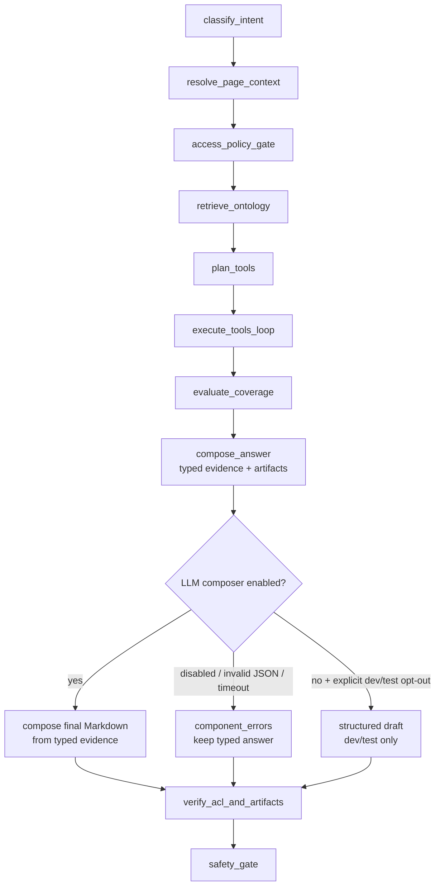
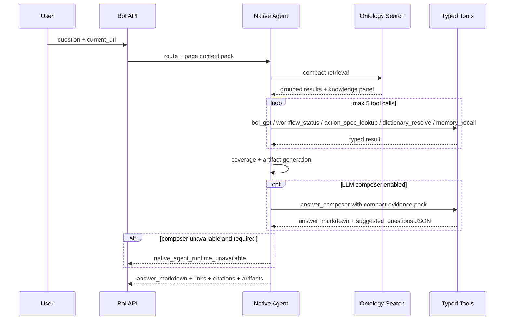

# Summary

Native BoI Agent는 LangGraph node 이름을 코드 구조와 일치시킨다. LangGraph가 없거나 버전 차이로 실패하면 같은 node 순서를 순차 실행한다.

이 loop는 무한 ReAct가 아니라 bounded tool loop다. 검색과 권한 확인은 항상 먼저 수행하고, 사용자가 “Mermaid로 그려줘”, “부족한 Action Spec 찾아줘”처럼 산출물을 요청하면 ontology search에서 찾은 최상위 SOP/BoI 문서를 다시 `boi_get`으로 좁혀 읽는다. 따라서 현재 페이지가 SOP 문서가 아니어도, 질문에 SOP 이름이나 업무 용어가 있으면 `검색 -> 문서 조회 -> Action/Event 확장 -> 산출물 생성` 순서로 처리한다.

# State Graph

# Tool Loop

# Tool Set

| Tool | Purpose |
|---|---|
| `ontology_search` | Dictionary, OKF graph, SOP/Event/Action catalog, runtime evidence 검색 |
| `boi_get` | 특정 BoI/OKF 문서 조회 |
| `event_type_lookup` | Event Type catalog 조회 |
| `action_spec_lookup` | Action contract와 문서 조회 |
| `workflow_status` | trace 기준 SOP 진행 상태 조회 |
| `trace_context_lookup` | event/action/generated BoI evidence 조회 |
| `dictionary_resolve` | private -> team -> public 용어 해석 |
| `memory_recall` | private agent-memory 요약 조회 |
| `boi_inbox` | 담당자가 처리해야 할 검증된 BoI Inbox 보고서 조회 |
| `answer_composer` | typed tool 결과와 artifact를 근거로 최종 Markdown 답변을 작성하는 LLM composer. 실행 권한이나 ACL을 바꾸지 않는다. |

# LLM Contract Failure Policy

User-facing LLM 단계는 “조용히 꾸며내지 않고 계약 실패를 구조화해서 남기는” 방식으로 처리한다. Router는 `route`, `intent`, `confidence` JSON 후보를 반환해야 하고, stream planner는 한 줄 `status` JSON 후보를 반환해야 하며, composer는 answer plan JSON object를 반환해야 한다. 이 계약을 지키지 못하면 서버는 canned fallback 문장을 만들지 않고 `component_errors` 또는 streaming `diagnostic`에 실패 원인을 남긴다.

Composer 응답이 plain Markdown, 잘린 JSON, OpenAI response id, prompt echo, 반복 생성으로 오면 Native Agent는 이를 최종 답변으로 채택하지 않는다. 다만 typed tool loop가 만든 answer/artifact가 있으면 그 결과를 유지하고, composer 실패는 `component_errors`에 기록한다. 운영자는 LLM endpoint, token limit, prompt, model 상태를 점검해야 한다.

Tool loop의 `tool_start`/`tool_done` callback은 audit/debug용 구조화 trace만 남기며, 사용자에게 보이는 진행 문구를 생성하지 않는다. 따라서 stream planner가 status 문장을 만들지 못한 경우 tool trace 문구로 대체하지 않고 `status_generation_failed` diagnostic을 남긴다. 답변 근거가 있으면 Agent는 계속 `answer_ready`와 `final`을 반환한다.

# Artifact Policy

| Intent | Artifact |
|---|---|
| `diagram` | Mermaid flowchart |
| `gap_check` | missing Action Spec table |
| `workflow_explain` | Event -> SOP -> Action -> Manual Handoff table. `workflow_summary` artifact is a verified structured artifact; the LLM composer still writes the user-facing explanation from the same evidence. |
| `trace_reasoning` | trace evidence summary |
| `inbox` | 일반 구성원용 업무 카드 |

Mermaid와 table은 `artifacts`에 구조화해서 내려온다. LLM composer는 Mermaid source나 raw artifact JSON을 다시 쓰지 않고, artifact가 무엇을 의미하는지와 사용자가 다음에 무엇을 보면 되는지를 설명한다. Pet Agent renderer는 Markdown fenced block과 artifact가 같은 Mermaid source를 포함하면 하나만 표시한다. `workflow_summary`와 `gap_table` artifact는 raw JSON이 아니라 table로 렌더링한다. 긴 표, 이미지, task card, confirmation card는 채팅 안에서는 compact하게 보여주고 `크게 보기` viewer에서 크게 확인한다.

Markdown answer renderer는 GFM-like table, ordered/unordered list, checklist, inline code/link/bold/italic/strike, bare URL link를 지원한다. Agent는 표가 필요한 답변을 만들 때 Markdown table과 structured artifact를 함께 내려도 되지만, 두 경로 모두 사람이 읽는 표로 보여야 한다.

# Evidence Ledger and Affordance

Native Agent는 답변 직전에 사용한 근거를 `evidence_ledger`로 모은다. 항목은 `kind`, `label`, `url`, `source`, `confidence`, `acl_decision`, `used_for`를 가진다. 답변, citation, Mermaid/table artifact, follow-up 질문은 이 ledger에 남은 항목만 사용한다. ledger에 없는 문서나 실행 로그를 follow-up에서 새로 암시하지 않는다.

`affordances`는 답변 뒤에 사용자가 할 수 있는 다음 행동이다. 예를 들어 `ask_more`, `open_reference`, `make_artifact`, `check_gap`, `create_draft`, `request_execution`, `complete_handoff`, `approval`이 있다. mutation 성격의 affordance는 즉시 실행하지 않고 confirmation card나 승인 흐름으로만 표현한다. answer-scoped follow-up writer는 이 affordance와 evidence ledger를 함께 보고 후속 질문을 만든다.

# Guardrails in the Loop

Tool 결과는 `access_policy_gate`를 통과한 뒤 state에 들어간다. 답변 생성 후에는 `verify_links_and_artifacts`가 links, citations, Mermaid, table, task card 안의 BoI/Event/Action reference를 다시 검사한다. 이 단계가 실패하면 Agent는 원문을 숨기고 접근 제한 사유를 설명해야 한다.

# Related Documents

- [Pet Agent UX and Artifacts](/public/boi-wiki-manual/agent/pet-agent-ux-and-artifacts.md)
- [Agent Guardrail and ACL](/public/boi-wiki-manual/agent/agent-guardrail-and-acl.md)
- [Native BoI Agent Deployment and Verification](/public/boi-wiki-manual/agent/deployment-and-verification.md)
