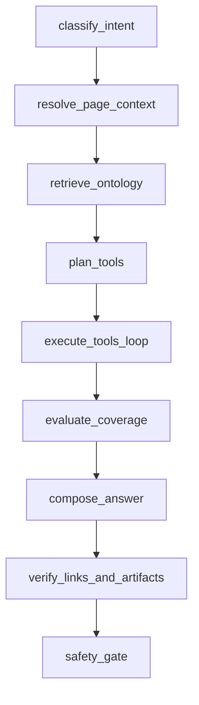
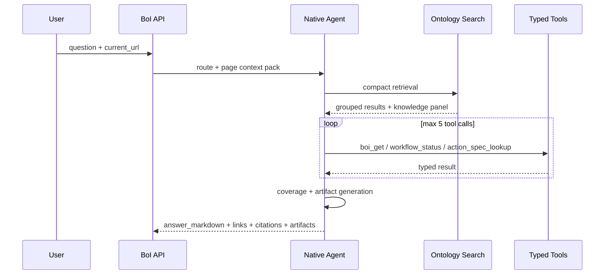

# Summary

Native BoI Agent는 LangGraph node 이름을 코드 구조와 일치시킨다. LangGraph가 없거나 버전 차이로 실패하면 같은 node 순서를 순차 실행한다.

# State Graph

# Tool Loop

# Tool Set

| Tool | Purpose |
|---|---|
| `ontology_search` | Dictionary, OKF graph, SOP/Event/Action catalog, runtime evidence 검색 |
| `boi_get` | 특정 BoI/OKF 문서 조회 |
| `event_type_lookup` | Event Type catalog 조회 |
| `action_spec_lookup` | Action contract와 문서 조회 |
| `workflow_status` | trace 기준 SOP 진행 상태 조회 |
| `trace_context_lookup` | event/action/generated BoI evidence 조회 |
| `dictionary_resolve` | private -> team -> public 용어 해석 |
| `memory_recall` | private agent-memory 요약 조회 |
| `agent_inbox` | 담당자가 처리해야 할 action inbox 조회 |

# Artifact Policy

| Intent | Artifact |
|---|---|
| `diagram` | Mermaid flowchart |
| `gap_check` | missing Action Spec table |
| `workflow_explain` | Event -> SOP -> Action -> Manual Handoff table |
| `trace_reasoning` | trace evidence summary |
| `inbox` | 일반 구성원용 업무 카드 |

Mermaid는 `artifacts`와 Markdown code block 둘 다 제공할 수 있다. Pet Agent renderer는 같은 Mermaid source가 중복으로 내려오면 하나만 표시한다. `workflow_summary`와 `gap_table` artifact는 raw JSON이 아니라 table로 렌더링한다. 긴 표, 이미지, task card, confirmation card는 채팅 안에서는 compact하게 보여주고 `크게 보기` viewer에서 크게 확인한다.

Markdown answer renderer는 GFM-like table, ordered/unordered list, checklist, inline code/link/bold/italic/strike, bare URL link를 지원한다. Agent는 표가 필요한 답변을 만들 때 Markdown table과 structured artifact를 함께 내려도 되지만, 두 경로 모두 사람이 읽는 표로 보여야 한다.

# Guardrails in the Loop

Tool 결과는 `access_policy_gate`를 통과한 뒤 state에 들어간다. 답변 생성 후에는 `verify_links_and_artifacts`가 links, citations, Mermaid, table, task card 안의 BoI/Event/Action reference를 다시 검사한다. 이 단계가 실패하면 Agent는 원문을 숨기고 접근 제한 사유를 설명해야 한다.

# Related Documents

- [Pet Agent UX and Artifacts](/public/boi-wiki-manual/agent/pet-agent-ux-and-artifacts.md)
- [Agent Guardrail and ACL](/public/boi-wiki-manual/agent/agent-guardrail-and-acl.md)
- [Native BoI Agent Deployment and Verification](/public/boi-wiki-manual/agent/deployment-and-verification.md)
