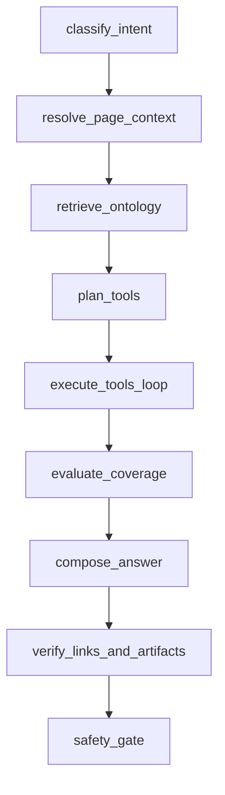
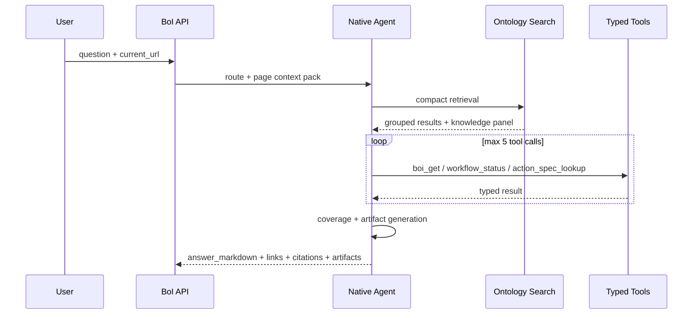

# Summary

Native BoI Agent는 LangGraph node 이름을 코드 구조와 일치시킨다. LangGraph가 없거나 버전 차이로 실패하면 같은 node 순서를 순차 실행한다.

# State Graph

# Tool Loop

# Tool Set

| Tool | Purpose |
|---|---|
| `ontology_search` | Dictionary, OKF graph, SOP/Event/Action catalog, runtime evidence 검색 |
| `boi_get` | 특정 BoI/OKF 문서 조회 |
| `event_type_lookup` | Event Type catalog 조회 |
| `action_spec_lookup` | Action contract와 문서 조회 |
| `workflow_status` | trace 기준 SOP 진행 상태 조회 |
| `trace_context_lookup` | event/action/generated BoI evidence 조회 |
| `dictionary_resolve` | private -> team -> public 용어 해석 |
| `memory_recall` | private agent-memory 요약 조회 |
| `agent_inbox` | 담당자가 처리해야 할 action inbox 조회 |

# Artifact Policy

| Intent | Artifact |
|---|---|
| `diagram` | Mermaid flowchart |
| `gap_check` | missing Action Spec table |
| `workflow_explain` | Event -> SOP -> Action -> Manual Handoff table |
| `trace_reasoning` | trace evidence summary |
| `inbox` | 일반 구성원용 업무 카드 |

Mermaid는 `artifacts`와 Markdown code block 둘 다 제공한다. Web BoI Wiki는 `mermaid` fenced block을 diagram으로 렌더링한다.
