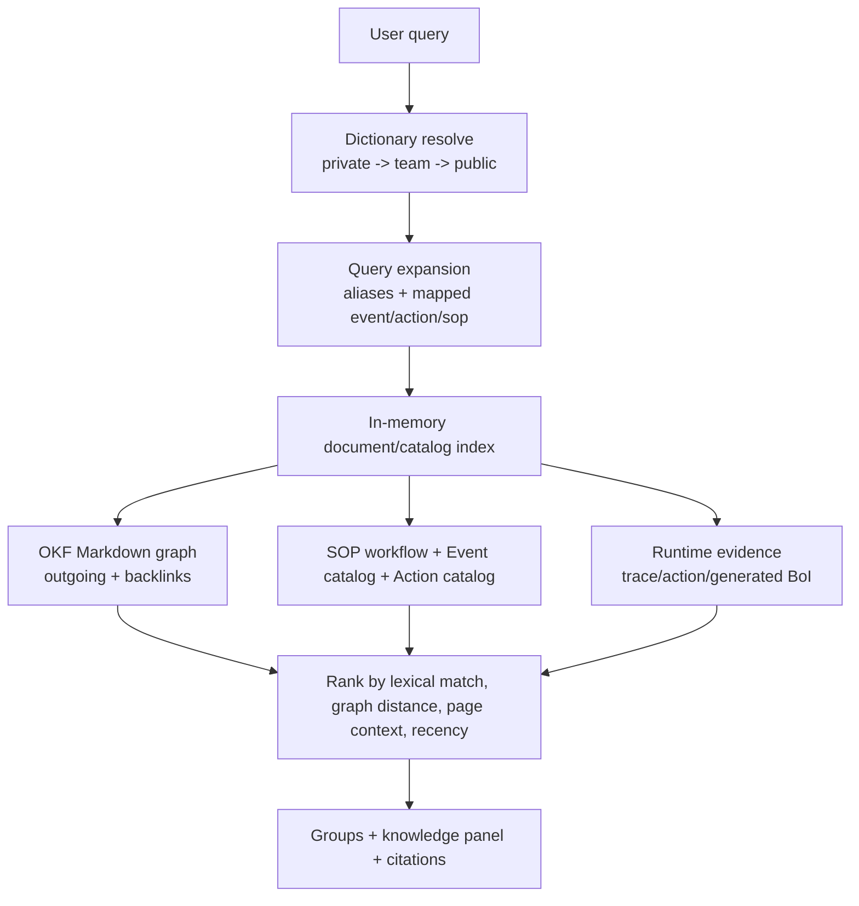

# Summary

`/api/boi?q=...`는 document-only search로 남긴다. 복합 업무 탐색은 `/api/search/ontology`와 MCP `ontology_search`가 담당한다.

Native BoI Agent는 `view=compact` 결과를 먼저 사용하고, 추가 본문이 필요할 때만 `boi_get`으로 좁혀 읽는다.

# Retrieval Flow

# Result Contract

| Field | Meaning |
|---|---|
| `best_matches` | 상위 관련 항목 |
| `groups` | SOP, Event Types, Actions, BoI Documents, Dictionary, runtime evidence |
| `knowledge_panel` | query가 어떤 업무 개념으로 해석됐는지 |
| `query_expansion` | dictionary alias와 mapping 기반 확장어 |
| `graph_paths` | OKF link/backlink 기반 관계 경로 |
| `citations` | 답변 근거 링크 |

# Compact Mode

Agent는 `view=compact`를 사용한다. Compact mode는 metadata/body 전체를 넣지 않고 label, title, doc ref, event type, action key, URL, 짧은 description만 보낸다. 이렇게 해야 NAS 단일 worker에서도 Agent 응답이 문서 상세 렌더링과 경쟁하지 않는다.

# Search Boundary

- `boi_search`: BoI 문서 목록만 반환한다.
- `ontology_search`: Dictionary, SOP, Event, Action, runtime evidence를 함께 반환한다.
- 앱 route 링크와 raw log 링크는 OKF concept graph edge가 아니라 runtime evidence로 분리한다.

# Dictionary Authoring Boundary

Dictionary는 Agent가 사용자 언어를 업무 개념으로 해석하는 기준이므로 scope별 작성 권한을 분리한다.

| Scope | Authoring rule | Reason |
|---|---|---|
| `private` | 본인 사번의 private dictionary에 바로 추가할 수 있다. | 개인 표현, 선호 용어, 임시 업무 맥락을 빠르게 보존한다. |
| `team` | `boi.editor` 역할과 해당 팀 멤버십이 모두 필요하다. | 팀 dictionary는 팀원 전체의 ontology search와 Agent 답변에 영향을 준다. |
| `public` | `boi.editor` 이상 권한이 필요하다. | Public dictionary는 전체 사용자의 seed vocabulary이므로 curated knowledge로 취급한다. |

MCP와 Web API 모두 같은 경계를 사용한다. `dictionary_terms` 조회는 private -> team -> public 우선순위로 해석하지만, shared scope 생성은 권한 검사를 통과해야 한다.

# Related Documents

- [Dictionary Authoring Harness](/public/harness/dictionary-authoring-harness.md)
- [BoI Agent API, MCP, Ontology Search Harness](/public/harness/agent-api-mcp-search-harness.md)
