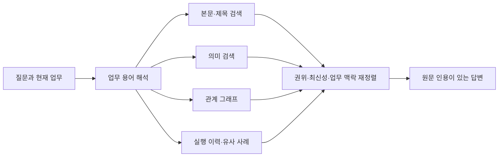

# 한눈에 보기

BoI Agent는 문서 제목만 찾지 않는다. 현재 화면과 진행 중 Task를 업무 해석의 출발점으로 삼고, 접근 가능한 Wiki 전체에서 용어·본문·관계·과거 결과를 함께 탐색한다. 현재 화면은 검색 범위를 가두는 필터가 아니다.

```mermaid
flowchart LR
  Q["질문과 현재 업무"] --> D["업무 용어 해석"]
  D --> L["본문·제목 검색"]
  D --> V["의미 검색"]
  D --> G["관계 그래프"]
  D --> R["실행 이력·유사 사례"]
  L --> RR["권위·최신성·업무 맥락 재정렬"]
  V --> RR
  G --> RR
  R --> RR
  RR --> C["원문 인용이 있는 답변"]
```

# 검색 순서

1. Dictionary의 별칭과 관련 용어로 사용자의 표현을 업무 개념에 맞춘다.
2. Markdown, SOP, Event, Action과 검증된 보고서의 제목·본문을 lexical 방식으로 찾는다.
3. pgvector에서 의미가 가까운 section chunk를 찾는다.
4. 문서 링크, Workflow/Task, Event/Action, Evidence 관계를 온톨로지에서 확장한다.
5. 현재 Task, ACL, 문서 상태, 최신성, 실제 사용 결과로 후보를 다시 정렬한다.

검색 read model이 지연되면 lexical·온톨로지 검색은 계속 제공한다. semantic 검색을 수행하지 못한 상태를 정상처럼 꾸미지 않고 요청 단위로만 `새 지식을 반영 중입니다`라고 알린다.

# Source Set과 현재 화면

- `auto_selected`: Agent가 이번 질문에 맞춰 선택한 자료
- `pinned`: 사용자가 이 작업에 계속 참고하도록 고정한 자료
- `attached`: 파일·URL·외부 AI 요약처럼 사용자가 연결한 자료
- `excluded`: 사용자가 이번 작업에서 제외한 자료

현재 문서나 Task가 실제로 열리고 권한이 있을 때만 context anchor로 사용한다. 404, raw 파일명, `index`, 기술 ID는 사용자용 제목으로 노출하지 않는다.

# Chunk와 citation

문서는 heading과 원문 line 범위를 가진 section chunk로 나뉜다. 검색은 고정된 작은 source·chunk 개수로 답변 맥락을 자르지 않는다. 배포 환경의 retrieval candidate 설정으로 충분한 후보를 모은 뒤 ACL, 질문 관련성, 권위, 최신성, Ontology 관계와 현재 업무 기여도로 정렬하고 provider context window 안에 완전한 항목을 선택한다. 서버는 답변 citation이 실제 회수된 chunk인지 다시 확인하며, 접근할 수 없는 문서나 회수되지 않은 문단을 근거로 만들 수 없다.

Data Lake와 MinIO의 긴 원본은 색인이나 prompt에 전문을 넣지 않는다. summary, profile, sample, checksum과 ACL URL만 사용하고 원본은 자료 보관함에서 연다.

# 그래프 탐색

사용자 화면은 기술적인 edge 목록 대신 다음 질문으로 그래프를 활용한다.

| 사용자 질문 | 그래프 보기 |
|---|---|
| 이 문서와 무엇이 연결돼 있나요? | 연결 관계 |
| 이 Event가 어떤 Task와 Action으로 이어지나요? | 두 항목 연결 경로 |
| 이 SOP를 바꾸면 어디에 영향이 있나요? | 변경 영향 |
| 이 업무를 어떤 순서로 이해하면 되나요? | 업무 이해 순서 |

# 검색에서 제외되는 내용

- `draft`, `candidate`, `deprecated`, smoke·fixture 문서
- 검증되지 않은 Agent 대화와 테스트 로그
- 다른 사용자의 Private 자산
- Data Lake 원본 전문과 secret
- 현재 Inbox로 오인될 수 있는 history seed

관리자 진단에서는 필요한 경우 폐기·초안 문서를 별도로 조회할 수 있지만 일반 답변 근거에는 사용하지 않는다.

# 관련 문서

- [BoI Agent 사용 가이드](/docs/boi:public:boi-wiki-manual:agent:using-boi-agent)
- [Living Knowledge System](/docs/boi:public:boi-wiki-manual:knowledge:living-knowledge-system)
- [Work Learning System](/docs/boi:public:boi-wiki-manual:agent:work-learning-system)
