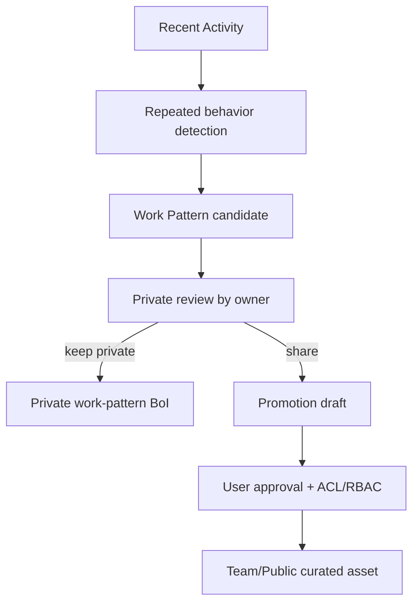

# Summary

BoI Agent의 채팅, follow-up 클릭, 링크 클릭, artifact 크게 보기, Inbox 열람, manual handoff 작성, 승인/거절, 반복 검색은 개인의 업무 처리 패턴을 보여주는 신호다. 이 신호는 단기 `Recent Activity`로 기록하고, 반복성이 확인되면 private `boi/work-pattern` 후보로 정제한다.

# Memory vs Work Pattern

| Concept | Purpose | Storage |
|---|---|---|
| Recent Activity | 최근 행동과 signal ranking | `data/activity/private/{employee_id}` JSONL |
| Agent Memory | 답변 스타일, 선호도, 도메인 배경 | `data/boi/private/{employee_id}/agent-memory/*.md` |
| Work Pattern | 반복 업무 방식, manual-to-AI 후보, Skill 후보 | `data/boi/private/{employee_id}/agent-memory/*.md` 또는 pattern 전용 private BoI |

Work Pattern은 자동 publish하지 않는다. Team/Public 공유는 promotion draft와 사용자 승인 흐름을 거친다.

# Pattern Kinds

| Kind | Meaning |
|---|---|
| `answer_preference` | 표, 체크리스트, Mermaid 같은 답변 형식 선호 |
| `workflow_habit` | 특정 SOP 단계에서 자주 확인하는 순서 |
| `recurring_task` | 반복적으로 요청하는 업무 |
| `manual_to_ai_candidate` | manual 업무를 AI/Action으로 대체할 후보 |
| `skill_candidate` | local/shared skill로 만들 가치가 있는 패턴 |
| `workflow_definition_gap` | WorkflowDefinition이나 Action Spec 보강 후보 |

# Derivation Flow

# API and MCP

- `GET /api/agents/boi-wiki/patterns`
- `POST /api/agents/boi-wiki/patterns/derive`
- `POST /api/agents/boi-wiki/patterns/{pattern_id}/archive`
- MCP `work_patterns_search`
- MCP `work_pattern_derive`
- MCP `skill_candidate_create`

# Guardrails

Agent는 token, password, API key, 민감 개인정보, 승인 우회 선호, high-risk action 자동 승인 선호를 pattern으로 저장하지 않는다. `restricted` 문서에서 나온 활동은 pattern 후보에 넣지 않는다.

# Related Documents

- [Work Context Pack](/public/boi-wiki-manual/agent/work-context-pack.md)
- [Native BoI Agent Safety, Approval, and Memory](/public/boi-wiki-manual/agent/safety-approval-and-memory.md)
- [Action/Event Skill Registry Guide](/public/boi-wiki-manual/workflows/action-event-skill-registry-guide.md)
