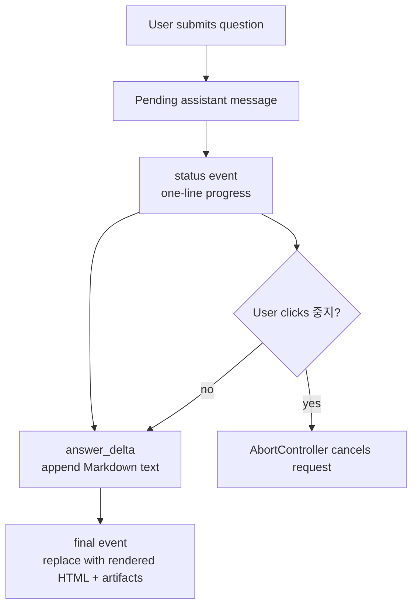
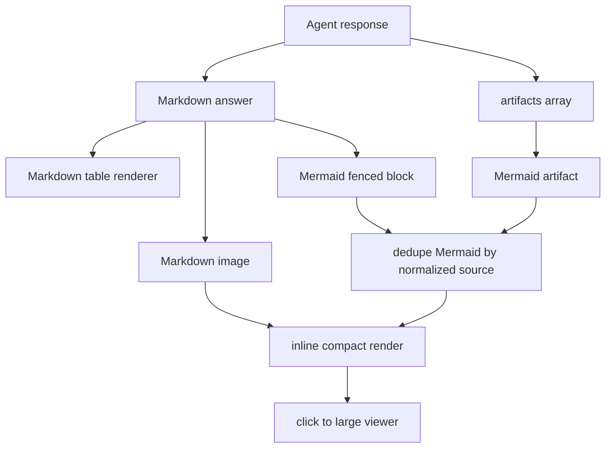

# Summary

Pet Agent는 모든 BoI Wiki 화면에서 현재 페이지를 이해하고 질문, 검색, 도식, Inbox 확인, 조치 기록을 도와주는 보조 UI다. 메뉴는 `Agent`와 `Inbox` 두 개만 둔다. Memory와 Dictionary는 Pet 메뉴가 아니라 BoI 문서와 harness/MCP 기능으로 관리한다.

# UX Principles

- 현재 페이지 context를 기본으로 질문을 추천한다.
- 링크 클릭으로 페이지가 바뀌어도 panel, tab, messages, draft, scroll 상태를 유지한다.
- Enter는 전송, Shift+Enter는 줄바꿈이다.
- 생성 중지는 사용자가 긴 답변을 멈추기 위한 기본 조작이다.
- Agent가 오래 걸리는 질문을 처리할 때는 한 줄 진행 상태를 먼저 보여주고, 답변 본문은 도착하는 조각대로 누적 렌더링한다.
- Mermaid, 표, 이미지, task card artifact는 작은 채팅 영역에 억지로 밀어 넣지 않고 큰 viewer로 열 수 있어야 한다.
- `새 대화`는 desktop과 mobile 모두에서 접근 가능해야 한다.

# Progressive Response UX

Pet Agent의 기본 호출 경로는 `POST /api/agents/boi-wiki/chat/stream`이다. 이 endpoint는 Server-Sent Events를 사용한다.

| Event | UI behavior |
|---|---|
| `status` | 말풍선 위 작은 진행 줄에 마지막 상태 한 줄을 표시한다. 문구는 요청별 LLM status writer가 생성한다. |
| `answer_delta` | 같은 assistant 말풍선의 Markdown 본문에 누적한다. 표와 목록은 조각이 쌓일수록 다시 렌더링될 수 있다. |
| `final` | 최종 `answer_html`, `links`, `artifacts`, `suggested_questions`, metadata로 말풍선을 확정한다. |
| `error` | 현재 말풍선을 실패 메시지로 바꾸고 사용자가 다시 시도할 수 있게 한다. |

기본 화면에서 사용자가 계속 보게 되는 진행 정보는 `status`의 마지막 한 줄이다. 이 한 줄은 고정 rule 문구가 아니라 질문, 현재 페이지, 예상 산출물에 맞춰 LLM status writer가 생성한다. status writer가 JSON status plan을 만들지 못하면 fallback 문구로 숨기지 않고 `status_generation_failed` 오류로 표시한다. 이 경우 Agent UI는 정상 처리 중이 아니라 장애 상태로 보아야 한다. 상세 진행 이력은 같은 말풍선 안의 접힌 `진행 단계` details에 보관해 디버깅과 설명 가능성은 유지하되, 긴 Agent 요청 중 화면을 진행 로그로 채우지 않는다.

`중지`는 현재 streaming request의 `AbortController`를 중단한다. 중지 후에는 상태를 `생성을 중지했습니다.`로 바꾸고, 사용자가 새 질문이나 `새 대화`를 바로 시작할 수 있어야 한다.

Streaming 중에도 panel은 하단으로 자동 스크롤된다. 사용자가 다른 BoI Wiki 페이지로 이동하면 sessionStorage에 저장된 open/tab/messages/draft/scroll 상태를 복원하고, 현재 URL과 page title만 새 화면 기준으로 갱신한다.

# Artifact Rendering Flow

# Markdown Rendering Contract

Pet Agent는 서버가 내려준 `answer_markdown`을 그대로 원문 텍스트로 노출하지 않는다. 다음 문법은 채팅 안에서 HTML로 렌더링되어야 한다.

| Markdown input | Rendered behavior |
|---|---|
| heading, paragraph | 읽기 쉬운 section과 문단 |
| `-`, `*`, `+` list | bullet list |
| `1.` list | ordered list |
| `- [ ]`, `- [x]` | disabled checklist |
| table | `.boi-agent-table-wrap` 안의 HTML table |
| inline code, link, bold, italic, strike | inline semantic HTML |
| bare `http://` or `https://` URL | clickable link |
| Markdown image syntax | inline image with click-to-zoom viewer |
| `mermaid` fenced block | Mermaid diagram with source fallback |

`workflow_summary`와 `gap_table` artifact는 JSON `<pre>`가 아니라 table artifact로 보여준다. 객체나 배열 cell은 표 안에서 list 또는 compact JSON block으로 정리하되, 일반 workflow 요약은 사람이 바로 읽는 표가 기본이다.

Markdown 본문 스타일은 메시지 작성자 라벨 스타일과 분리한다. 예를 들어 `**굵게**`는 문단 안의 inline emphasis로 남아야 하며, 작성자 라벨처럼 block으로 떨어지면 안 된다. 표 parser는 inline code, link URL, escaped pipe 안의 `|`를 셀 분리자로 오해하지 않아야 한다.

# Artifact Viewer

Artifact는 채팅 안에서는 compact하게 보이고, `크게 보기`를 누르면 modal viewer에서 크게 확인한다. Viewer 대상은 Mermaid, table, image, task card, confirmation card다. Markdown image도 이미지를 클릭하면 같은 viewer로 열린다. Mermaid는 Markdown fenced block과 artifact가 같은 source를 포함하면 하나만 렌더링하고, artifacts 배열 안에 같은 source가 중복되어도 한 번만 보여준다.

Pet Agent는 모든 주요 화면에 공통으로 mount된다. 따라서 Mermaid renderer도 문서 상세 전용이 아니라 app shell 전역 script로 로드한다. 사용자가 문서 페이지에서 다이어그램 답변을 받은 뒤 Event Types, Actions, Events 같은 다른 화면으로 이동해도 sessionStorage에서 복원된 Mermaid artifact는 다시 SVG로 렌더링되어야 한다.

# Inbox Display

Inbox는 기술 ID보다 일반 사용자가 이해할 업무 문구를 우선한다.

| Internal status | Display wording |
|---|---|
| `approval_required` | 공유 전 승인 필요 |
| `manual_required` | 조치 내용 입력 필요 |
| `manual_blocked` | 업무 상태 확인 필요 |
| `needs_followup` | 후속 확인 필요 |

`trace_id`, `action_key`, `request_id`, raw URL은 `기술 세부정보`에 접는다.

# Related Documents

- [Agent Guardrail and ACL](/public/boi-wiki-manual/agent/agent-guardrail-and-acl.md)
- [BoI Agent API, MCP, Ontology Search Harness](/public/harness/agent-api-mcp-search-harness.md)
