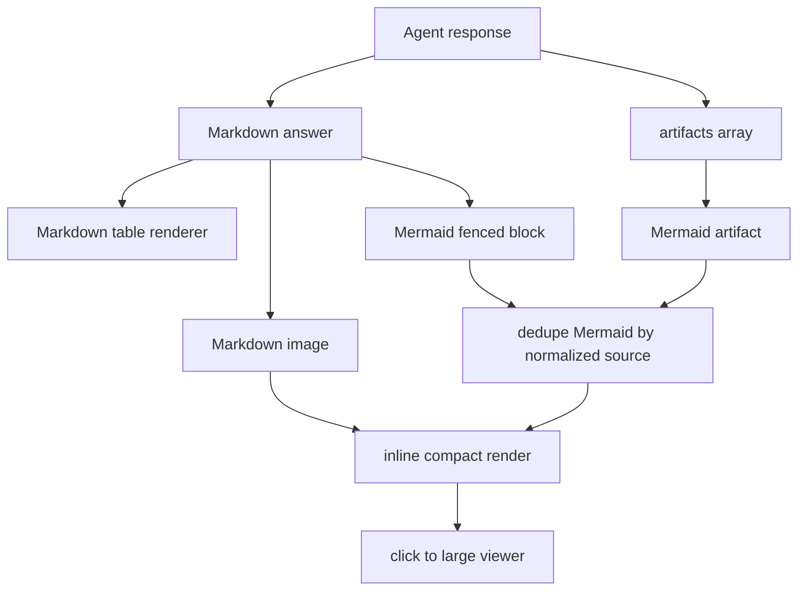

# Summary

Pet Agent는 모든 BoI Wiki 화면에서 현재 페이지를 이해하고 질문, 검색, 도식, Inbox 확인, 조치 기록을 도와주는 보조 UI다. 메뉴는 `Agent`와 `Inbox` 두 개만 둔다. Memory와 Dictionary는 Pet 메뉴가 아니라 BoI 문서와 harness/MCP 기능으로 관리한다.

# UX Principles

- 현재 페이지 context를 기본으로 질문을 추천한다.
- 링크 클릭으로 페이지가 바뀌어도 panel, tab, messages, draft, scroll 상태를 유지한다.
- Enter는 전송, Shift+Enter는 줄바꿈이다.
- 생성 중지는 사용자가 긴 답변을 멈추기 위한 기본 조작이다.
- Mermaid, 표, 이미지, task card artifact는 작은 채팅 영역에 억지로 밀어 넣지 않고 큰 viewer로 열 수 있어야 한다.
- `새 대화`는 desktop과 mobile 모두에서 접근 가능해야 한다.

# Artifact Rendering Flow

# Markdown Rendering Contract

Pet Agent는 서버가 내려준 `answer_markdown`을 그대로 원문 텍스트로 노출하지 않는다. 다음 문법은 채팅 안에서 HTML로 렌더링되어야 한다.

| Markdown input | Rendered behavior |
|---|---|
| heading, paragraph | 읽기 쉬운 section과 문단 |
| `-`, `*`, `+` list | bullet list |
| `1.` list | ordered list |
| `- [ ]`, `- [x]` | disabled checklist |
| table | `.boi-agent-table-wrap` 안의 HTML table |
| inline code, link, bold, italic, strike | inline semantic HTML |
| bare `http://` or `https://` URL | clickable link |
| Markdown image syntax | inline image with click-to-zoom viewer |
| `mermaid` fenced block | Mermaid diagram with source fallback |

`workflow_summary`와 `gap_table` artifact는 JSON `<pre>`가 아니라 table artifact로 보여준다. 객체나 배열 cell은 표 안에서 list 또는 compact JSON block으로 정리하되, 일반 workflow 요약은 사람이 바로 읽는 표가 기본이다.

# Artifact Viewer

Artifact는 채팅 안에서는 compact하게 보이고, `크게 보기`를 누르면 modal viewer에서 크게 확인한다. Viewer 대상은 Mermaid, table, image, task card, confirmation card다. Markdown image도 이미지를 클릭하면 같은 viewer로 열린다. Mermaid는 Markdown fenced block과 artifact가 같은 source를 포함하면 하나만 렌더링하고, artifacts 배열 안에 같은 source가 중복되어도 한 번만 보여준다.

# Inbox Display

Inbox는 기술 ID보다 일반 사용자가 이해할 업무 문구를 우선한다.

| Internal status | Display wording |
|---|---|
| `approval_required` | 공유 전 승인 필요 |
| `manual_required` | 조치 내용 입력 필요 |
| `manual_blocked` | 업무 상태 확인 필요 |
| `needs_followup` | 후속 확인 필요 |

`trace_id`, `action_key`, `request_id`, raw URL은 `기술 세부정보`에 접는다.

# Related Documents

- [Agent Guardrail and ACL](/public/boi-wiki-manual/agent/agent-guardrail-and-acl.md)
- [BoI Agent API, MCP, Ontology Search Harness](/public/harness/agent-api-mcp-search-harness.md)
