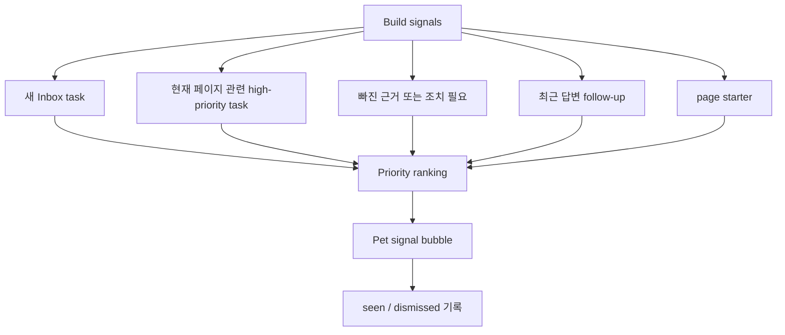

# Summary

Pet 왼쪽 말풍선은 고정 문구가 아니라 `AgentSignal`이다. 사용자가 지금 확인해야 할 업무, 현재 페이지와 관련된 Inbox task, 빠진 근거, 답변 후 follow-up, page starter 중 가장 유용한 것을 짧게 보여준다.

# Priority

우선순위:

1. 새 Inbox task
2. 현재 페이지와 직접 관련된 high-priority task
3. WorkContextPack에서 빠진 근거
4. 방금 답변 기반 follow-up
5. 첫 질문 전 page starter

# UX Rules

- 말풍선은 짧고 업무 문구로 쓴다.
- `trace_id`, `request_id`, `action_key` 같은 기술 식별자는 말풍선에 직접 노출하지 않는다.
- 클릭하면 `Agent` 또는 `Inbox` 탭으로 이동하고 관련 질문이나 task context를 연결한다.
- 본인이 이미 본 signal은 sessionStorage와 activity log에 `seen`으로 남겨 반복 노출을 줄인다.
- 사용자가 dismiss하면 같은 session에서는 다시 띄우지 않는다.

# API and MCP

- `GET /api/agents/boi-wiki/signals?current_url=...`
- `POST /api/agents/boi-wiki/signals/{signal_id}/seen`
- `POST /api/agents/boi-wiki/signals/{signal_id}/dismiss`
- MCP `agent_signals`

# Related Documents

- [Pet Agent UX and Artifacts](/public/boi-wiki-manual/agent/pet-agent-ux-and-artifacts.md)
- [Inbox Work Context and Historical Patterns](/public/boi-wiki-manual/agent/inbox-work-context-and-history.md)
- [Personal Work Pattern Assets](/public/boi-wiki-manual/agent/personal-work-pattern-assets.md)
