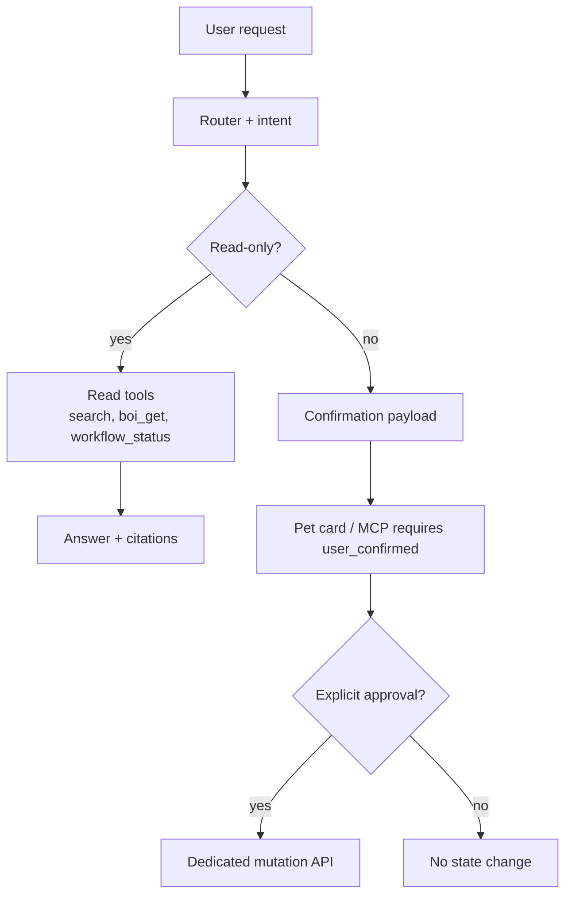

# Summary

Native BoI Agent는 read-heavy Agent다. source edit, body apply, promotion, action invoke, manual handoff completion처럼 상태를 바꾸는 작업은 답변 생성 중 직접 실행하지 않는다.

# Safety Boundary

# Mutating Operations

| Operation | Boundary |
|---|---|
| `manual_handoff_complete` | append-only completion row, no action log rewrite |
| `workflow_start` | SOP entry event 발행. API와 MCP 모두 `user_confirmed=true`가 필수다. |
| `action_invoke` | risk policy and approval guard apply. MCP에서는 실제 실행(`dry_run=false`) 전 `user_confirmed=true`가 필수다. |
| `source_apply` | preview, validation, user confirmation, commit |
| `doc_body_apply` | preview, base hash check, user confirmation, commit |
| `promotion_submit` | preview/diff, sensitivity check, explicit approval. MCP에서도 `user_confirmed=true`가 없으면 API 호출 전 차단한다. |

# Memory

Private Memory는 `data/boi/private/{employee_id}/agent-memory/*.md`에 `boi/agent-memory`로 저장한다. Pet UI에는 Memory 탭을 두지 않는다. 사용자는 일반 BoI 문서처럼 보고 수정한다.

자동 저장 금지 대상:

- token, password, API key
- 민감 개인정보
- approval 우회 선호
- high-risk action 자동 승인 선호

중복 memory는 새 문서 무한 생성 대신 usage count, supersede, compact 정책으로 관리한다.

# Inbox

Inbox는 event/action log에서 계산되는 runtime view다. 일반 구성원에게는 “공유 전 승인 필요”, “조치 내용 입력”, “업무 상태 확인” 같은 업무 문구를 먼저 보여주고, request id, action key, trace id는 details에 둔다.

# Related Documents

- [Visibility and Promotion Policy](/public/boi-wiki-manual/operations/visibility-and-promotion-policy.md)
- [Web Draft Editing Guide](/public/harness/web-draft-editing-guide.md)
