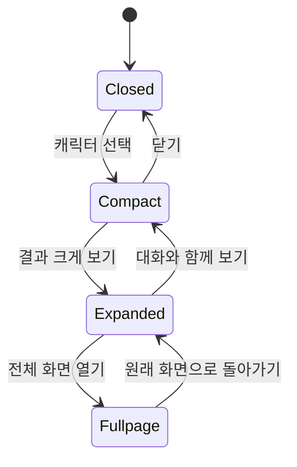
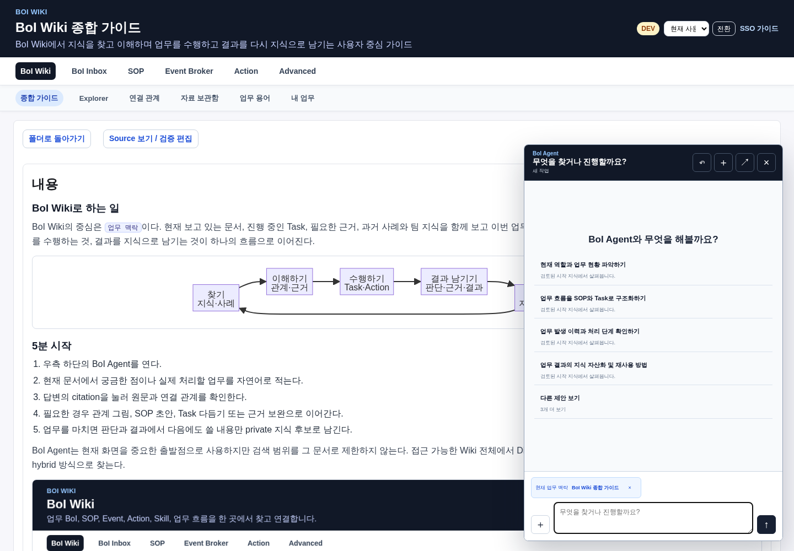
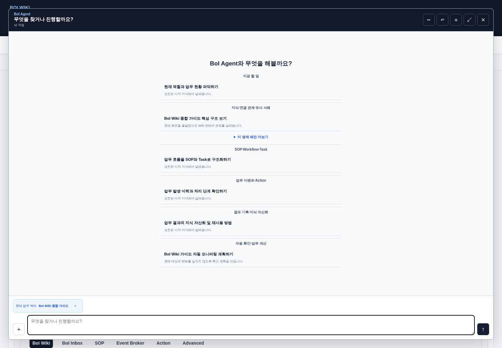
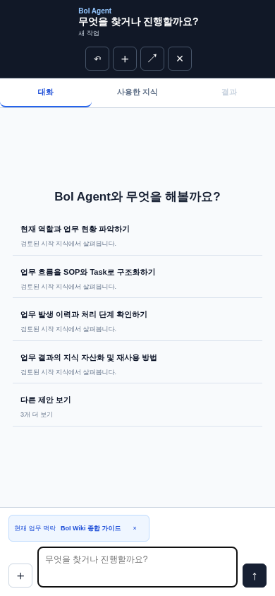
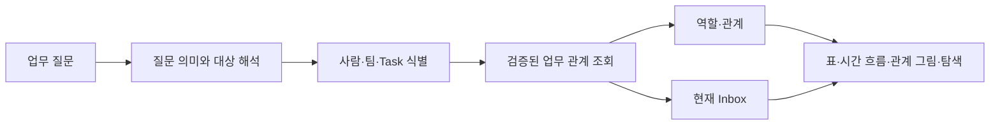
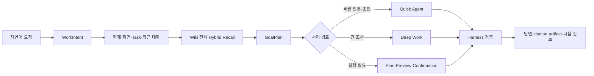
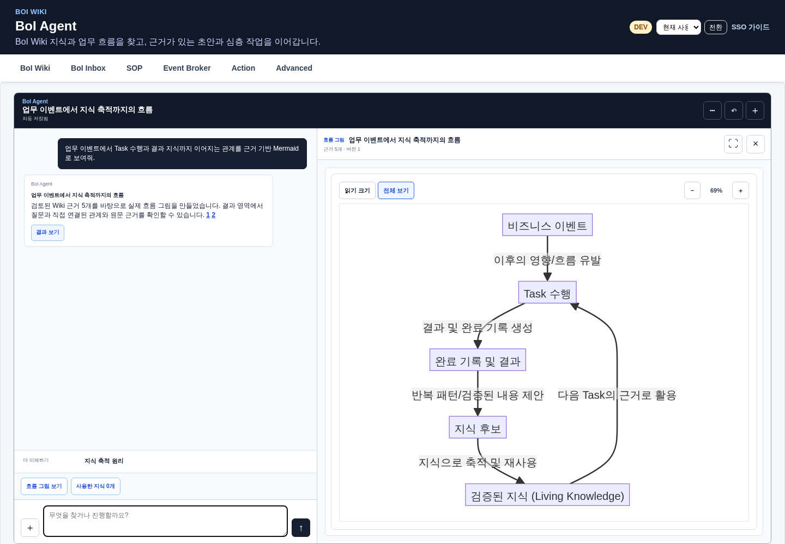
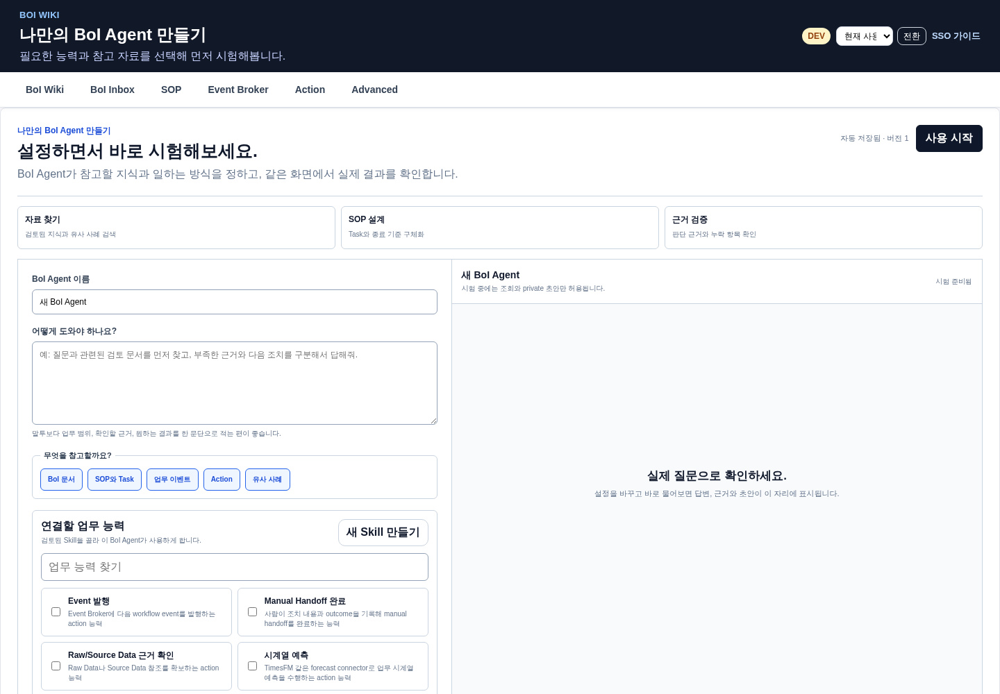

# BoI Agent로 무엇을 할 수 있나

BoI Agent는 BoI Wiki의 기본 Agent UI다. 검색, 관계 설명, 유사 사례, SOP·Task 초안, 업무 이벤트·Action 초안, 근거 검증과 지식 후보 생성을 자연어 요청 하나로 시작한다. 사용자가 기능 모드를 먼저 고를 필요는 없다.

BoI Agent는 현재 화면을 중요한 맥락으로 사용하지만 그 문서 안에서만 답하지 않는다. 접근 가능한 Wiki 전체의 Dictionary, 문서, SOP, Event, Action, Skill, Inbox와 실행 이력을 함께 찾는다.

# 화면 형태

| 형태 | 알맞은 작업 |
|---|---|
| Compact | 짧은 질문, 현재 문서 설명, citation 확인, 후속 질문 |
| Expanded | Mermaid, 관계 탐색, 비교표, SOP 초안, Task 다듬기, 사용한 지식 확인 |
| Fullpage | 긴 대화, 다수 결과, 전체 SOP와 Deep Work 이어가기 |

세 형태는 같은 WorkSession을 사용한다. 페이지 이동, 새로고침과 SOP 편집 화면 왕복 뒤에도 대화, source, artifact와 선택 Task를 복원한다.

관계 탐색 결과가 있으면 일반 분할 화면은 대화 34%, 결과 66%를 사용한다. 실제 그래프 폭이 680px보다 좁은 첫 진입에서는 결과를 크게 열어 노드 이름을 읽을 공간을 먼저 확보한다. 사용자가 `대화와 함께 보기`로 돌아오면 같은 작업에서 그 선택을 기억한다. Compact에서는 그래프를 실행하지 않고 결과 버튼만 보여주며, Expanded·Fullpage와 모바일 `결과` 탭에서만 관계 탐색을 렌더링한다.

BoI Agent는 Advanced에 별도 메뉴로 존재하지 않는다. Pet을 펼치거나 `/agent` 전체 화면을 사용한다. Expanded와 Fullpage의 `⋯` 메뉴에서만 `나만의 BoI Agent 만들기`와 `외부에서 사용`을 연다.

`다른 제안 보기`를 열면 지금 할 일, 지식과 관계, SOP와 Task, 업무 이벤트와 Action, 결과 기록, 자동 확인의 여섯 업무 영역을 한 화면에서 살펴볼 수 있다. 각 제안은 실제로 접근 가능한 Wiki 자산을 근거로 하며, 선택하면 별도의 기능 모드 선택 없이 바로 질문을 시작한다.

Compact는 현재 문서를 가리지 않는 범위에서 질문과 관련 제안을 보여준다.

# 처음 보이는 제안

Compact에는 현재 맥락에서 가장 관련 높은 제안 네 개만 표시한다. 추천 근거는 현재 Inbox, 실제로 열린 문서나 Task, 최근 작업 결과, 최근 사용 지식, 팀 지식, `agent_entrypoint`로 지정된 검토 완료 Public 문서 순으로 선택한다.

`다른 제안 보기`는 다음 여섯 영역을 보여준다.

1. 지금 할 일
2. 지식·연결 관계·유사 사례
3. SOP·Workflow·Task
4. 업무 이벤트·Action
5. 결과 기록·지식 자산화
6. 자동 확인·업무 개선

각 영역은 대표 질문 하나를 먼저 보이고 최대 세 개까지 펼칠 수 있다. `index.md`, `log.md`, deprecated, smoke, history seed와 raw ID 제목은 추천과 현재 맥락에 사용하지 않는다. 제안을 누르면 별도의 보내기 조작 없이 한 번만 전송된다.

추천은 답변만 반복하지 않는다. 실제 관계가 있을 때 `역할과 현재 업무 표`, `업무 변화 Timeline`, `짧은 관계 그림`, `확장 가능한 관계 탐색`, `업무 기록 입력`, `실행 전 확인`처럼 서로 다른 결과 경험으로 이어진다. 화면에는 기술 component 이름을 표시하지 않는다.

# 역할과 현재 업무 묻기

“내가 하는 일이 뭐지?”처럼 넓은 질문은 다음 두 부분을 섞지 않고 보여준다.

1. **역할과 업무 관계**: directory의 공식 역할·팀, 현재 배정, 검증된 수행·완료 기록
2. **지금 처리할 업무**: 현재 Inbox와 다음에 확인할 내용

“지금 처리할 업무만 보여줘”라고 하면 두 번째만 보여준다. 한 번 배정된 Task는 전문성이나 반복 수행으로 표시하지 않으며, AI가 추론한 관계는 권한·자동 배정·완료 판정에 쓰지 않는다. 반복 수행은 최근 180일 안에 서로 다른 검증 완료 실행이 세 번 이상인 경우에만 표시한다.

관계 탐색과 결과 화면의 자세한 사용법은 [업무 관계와 동적 결과 활용 가이드](/docs/boi:public:boi-wiki-manual:agent:work-relations-and-dynamic-results)를 따른다.

# 질문하는 방법

업무 문장을 그대로 적는다.

- “이 문서의 핵심 판단 기준과 연결된 근거를 설명해줘.”
- “설비 Alarm 대응과 비슷한 과거 처리 사례를 비교해줘.”
- “이 업무를 SOP와 Task로 설계해줘.”
- “방금 흐름을 Mermaid로 크게 보여줘.”
- “이 Task의 완료된 모습과 확인할 자료를 제안해줘.”
- “매주 같은 기준으로 다시 확인하도록 준비해줘.”

후속 질문의 `그 흐름`, `방금 근거`, `첫 번째 Task`는 최근 대화, citation과 활성 artifact를 기준으로 해석한다. 명시적인 새 주제가 나오면 이전 대상을 강제로 이어 붙이지 않는다.

# 답변과 citation

답변은 결론을 먼저 보여주고, 실제 retrieved source로 뒷받침할 수 있는 문장에 citation을 붙인다. citation을 선택하면 페이지를 떠나지 않고 원문 문단, 문서 상태와 연결 관계를 확인할 수 있다.

`사용한 지식`에는 다음 항목만 들어간다.

- 이번 답변에 실제 인용된 source
- artifact의 node, edge 또는 판단을 직접 뒷받침한 source
- 사용자가 현재 작업에 고정한 source

검색 후보였지만 사용하지 않은 문서는 Evidence Ledger에 사용된 근거로 기록하지 않는다. 근거가 부족하면 일반 모델 지식으로 채우지 않고 부족한 항목을 알린다.

# 질문 처리 흐름

진행 중에는 `업무 맥락 확인`, `관련 지식 탐색`, `근거 검토`, `답변 정리`처럼 현재 단계를 표시한다. 내부 추론문이나 chain-of-thought는 보여주지 않는다. 중지하면 현재 요청만 취소하고 이전 대화와 결과는 유지한다.

# 관련 질문과 다음 행동

관련 질문은 답변을 더 이해하기 위한 질문이다. 같은 답변 생성 과정에서 최대 세 개를 만들며, 별도 모델 호출로 응답을 늦추지 않는다. 실제 source 관계가 없거나 방금 질문과 중복되는 제안은 제거한다.

다음 행동은 결과를 바꾸거나 이어가는 명령이다. 현재 결과에 가능한 행동만 표시한다.

| 결과 | 가능한 다음 행동 예시 |
|---|---|
| 지식 답변 | 노트로 저장, 관계 그림, 근거 확인 |
| Mermaid | 원문 보기, 명시적으로 요청한 경우에만 Task 분해 또는 SOP 초안 |
| SOP 초안 | Task 다듬기, 전체 SOP 편집, 근거 확인 |
| Task | 완료 항목 제안, 확인 자료 연결, 수행 화면 열기 |

설명용 Mermaid에 `Task로 나누기`나 `SOP로 저장`을 자동으로 붙이지 않는다. 사용자가 변환을 명시한 경우에만 typed action을 제공한다.

# Mermaid와 결과 크게 보기

Mermaid 결과는 raw code가 아니라 실제 SVG로 렌더링한다. `읽기 크기`는 노드와 연결 설명을 읽을 수 있는 배율로 열고, `전체 보기`는 전체 구조를 화면에 맞춘다. 확대된 그림은 드래그와 명확한 스크롤바로 탐색한다.

각 node와 edge는 ACL 안의 citation을 가져야 한다. 질문 대상과 직접 관련이 없거나 근거가 없는 SOP, Task, Event, Action은 그림에 임의로 추가하지 않는다.

# 관계 탐색과 하단 정보

관계가 많은 결과에서는 그래프가 결과 영역 전체 폭을 사용한다. 노드를 선택했을 때만 그래프 아래에 정보 영역이 열리고, 제목, 업무 설명, 종류, 관계 수, 연결 이유, 검증 상태, 유효 시점과 이동 가능한 원문을 보여준다. 정보 영역이 열려도 그래프 폭은 줄지 않는다.

`Esc`는 선택 항목 정보, 결과 크게 보기, Expanded 순서로 가장 안쪽 상태부터 닫는다. 노드 선택, 정보 영역의 열림 상태, 확대 위치와 중심은 작업별로 저장되어 새로고침 후에도 이어진다. 방향키로 노드를 옮기고 `Enter`로 정보를 열 수 있다.

# SOP와 Task 이어가기

SOP 초안은 결과 영역에서 Workflow와 Task 목록으로 보인다. `Task 다듬기`는 같은 화면의 넓은 panel에서 열리고, 이름, 목적, 수행 방식, 완료된 모습, 확인할 자료와 결과물을 수정한다.

전체 SOP 편집기로 이동할 때도 `work_session_id`, `artifact_id`, revision과 돌아올 주소를 유지한다. 돌아오면 같은 초안과 선택 Task를 이어서 보여준다. AI 제안은 변경 전·후 preview를 거쳐 사용자가 적용할 때만 저장한다.

# 자동 확인과 Deep Work

“매주 이 기준으로 다시 확인해줘”처럼 반복 확인을 요청하면 먼저 목적, 다음 확인 조건과 종료 조건을 보여준다. 확인 전에는 routine을 만들지 않는다. 진행 중이거나 실패한 자동 확인이 있을 때만 Pet에 상태를 표시한다.

다수 자료 조사, 긴 보고서, SOP 재구성처럼 오래 걸리는 작업은 DeepAgents worker가 격리된 context에서 수행한다. 결과는 항상 draft이며 production mutation tool을 갖지 않는다. job은 retry, cancel, timeout과 재시작 복구를 지원한다.

나만의 BoI Agent는 지침, 참고 자료와 기존 Skill을 선택하고 같은 화면의 preview에서 먼저 시험한다.

# 지식으로 남기기

답변 또는 Task 결과에서 다음 업무에도 쓸 가치가 있을 때 `노트로 저장`이나 지식 후보 생성을 요청한다. 출처와 중복 여부를 확인한 private provisional 자산으로 저장하고 현재 WorkSession의 source로 바로 사용할 수 있다. Team/Public 공유는 별도 검토를 거친다.

# 안전 경계

- Agent는 사용자보다 넓은 문서를 볼 수 없다.
- prompt의 사번이나 role 요청으로 권한을 높이지 않는다.
- 외부 부작용과 shared 정본 변경은 preview와 confirmation을 거친다.
- Autopilot은 system binding이 없는 완료 항목을 자동 완료하지 않는다.
- 긴 원본과 민감 자료는 자료 보관함에 두고 bounded context만 사용한다.

# 관련 문서

- [BoI Wiki 종합 가이드](/docs/boi:public:boi-wiki-manual:guide:final-operator-guide)
- [Work Learning System](/docs/boi:public:boi-wiki-manual:agent:work-learning-system)
- [BoI Inbox와 Task 수행](/docs/boi:public:boi-wiki-manual:inbox:inbox-and-task-guide)
- [BoI Agent Guardrail과 ACL](/docs/boi:public:boi-wiki-manual:agent:agent-guardrail-and-acl)
- [Ontology 탐색과 외부 지식 Source 활용 가이드](/docs/boi:public:boi-wiki-manual:knowledge:ontology-explorer-and-source-adapters)
