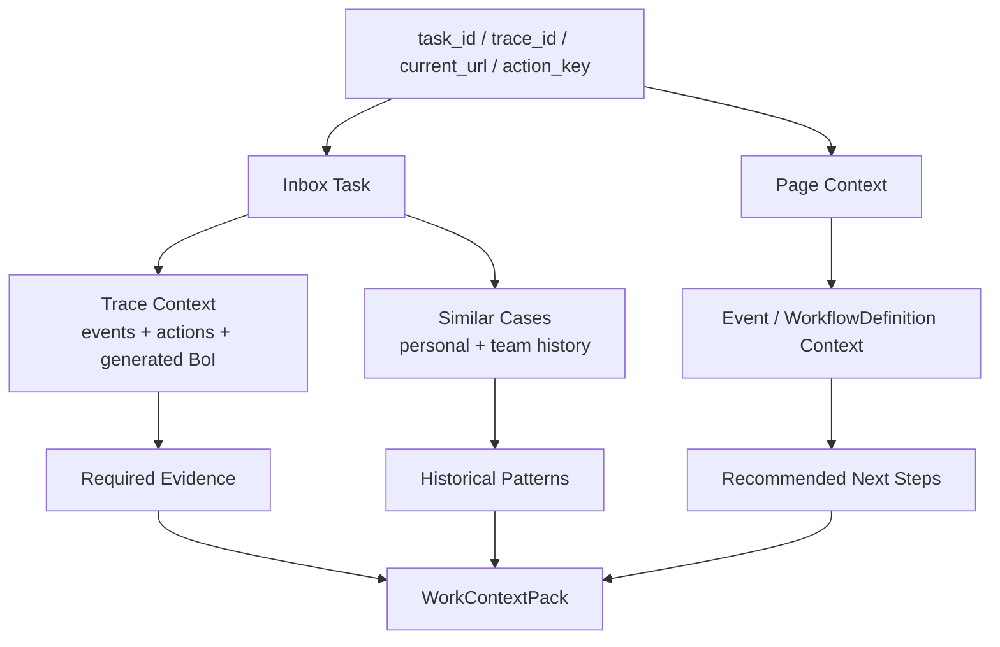

# Summary

`WorkContextPack`은 BoI Agent가 단순 검색 결과를 나열하지 않고 실제 업무 답변을 만들기 위해 사용하는 공통 context 계약이다. Web Pet, REST API, MCP, Inbox, skills/harness는 모두 같은 pack을 기준으로 “지금 어떤 업무를 처리 중인지”, “앞 단계에서 무엇이 처리됐는지”, “비슷한 과거 사례에서 어떻게 했는지”, “다음에 무엇을 해야 하는지”를 이해한다.

# Contract

주요 필드:

| Field | Meaning |
|---|---|
| `task` | 현재 사용자가 처리해야 할 Inbox task. 없으면 현재 페이지와 trace 기준으로 유추한다. |
| `trace_context` | 같은 trace의 이전 Event, Action, generated BoI 요약 |
| `required_evidence` | 현재 단계에서 확인해야 하는 근거 항목 |
| `similar_cases` | action/event/stage/workflow definition 기준으로 찾은 유사 처리 사례 |
| `historical_patterns` | 유사 사례를 익명 집계한 처리 패턴 |
| `recommended_next_steps` | 사용자가 지금 취할 수 있는 업무 조치 후보 |
| `draft_completion_note` | manual handoff에 붙일 수 있는 조치 내용 초안 |
| `work_context_narrative` | LLM이 source id가 있는 근거만 사용해 쓴 사용자-facing 업무 요약 상태 |
| `business_context` | 장비, LOT, Wafer, Alarm, 공정, Trend/Raw 상태처럼 업무 차이를 판단하는 fingerprint |
| `business_context_quality` | business context가 충분한지와 빠진 핵심 필드 |
| `guardrails` | ACL/RBAC/classification 필터링 결과 |

`WorkContextPack` 자체는 source of truth다. 사용자 화면에 보이는 자연어 요약은 `work_context_narrative`가 `ready`일 때만 사용한다. LLM 요약이 아직 없거나 실패했을 때 deterministic count/status 문구를 답변처럼 대체하지 않고, Inbox는 “업무 맥락 요약 준비 중” 상태와 원본 근거 details만 제공한다.

# API and MCP

| Interface | Use |
|---|---|
| `GET /api/context/work` | task, trace, action, SOP, current URL 기준 Work Context 조회 |
| `GET /api/inbox` | WorkContext 기반으로 검증된 Inbox 보고서 BoI 목록 조회 |
| `GET /api/inbox/reports/{report_id}` | 하나의 검증된 Inbox 보고서와 materialized BoI 조회 |
| `GET /api/agents/boi-wiki/inbox/{task_id}/context` | Inbox task 하나에 대한 업무 context 조회 |
| `GET /api/agents/boi-wiki/inbox/{task_id}/history` | 비슷한 처리 사례와 익명 패턴 조회 |
| MCP `work_context_get` | API와 같은 Work Context Pack 반환 |
| MCP `boi_inbox` / `boi_inbox_report_get` | Inbox 보고서 목록과 검증된 보고서 BoI 반환 |
| MCP `agent_inbox_context` | Compatibility task context 반환 |
| MCP `similar_cases_search` | 유사 사례와 처리 패턴 반환 |

API/MCP 응답의 `work_context_narrative`는 `summary_state`, `overall_summary`, `difference_summary`, `recommended_action_note`, `similar_case_insights`, `stage_history_narrative`, `source_ids`, `component_errors`를 포함한다. 모든 narrative 문장은 WorkContextPack의 `event:*`, `action:*`, `boi:*`, `case:*` source id를 필드로만 참조해야 하며, 사용자 문장에는 `source_id`, raw id, 내부 상태어를 쓰지 않는다.

Inbox group 응답에는 `group_context_summary`, `group_narrative`, `comparison_candidates`, `preview_items[].brief`가 포함된다. `group_context_summary`와 `comparison_candidates`는 근거 원장이고, 사용자 기본 화면에는 QA를 통과한 `group_narrative.summary`와 `preview_items[].brief`만 표시한다. 같은 Action이 여러 건 묶이면 그룹 카드는 하나의 업무 요약을 보여주고, 개별 preview는 시간, 대상/상황, 다음 확인 포인트가 서로 구별되어야 한다. 단순히 “서로 다른 trace”, “같은 Action”이라고 말하거나 deterministic 차이 필드를 그대로 노출하는 것은 금지한다. 업무 필드가 없으면 가짜 차이를 만들지 않고 narrative QA 실패로 diagnostics에 남긴다.

Inbox group narrative QA는 다음을 차단한다.

- `source_id`, raw id, `trace`, `라우팅`, `처리 중`, `WorkflowDefinition`
- 같은 문장의 반복 또는 그룹 요약을 preview item마다 반복하는 출력
- 근거 없는 완료/승인/실행 완료 주장

Inbox와 Agent 응답은 내부 WorkflowDefinition URL을 사용자 링크로 직접 노출하지 않는다. API 응답의 `workflow_definition_context`나 `workflow_definition_url`은 내부 진단과 MCP/API 호환 필드이고, 사람이 클릭하는 링크는 `user_links`의 `관련 SOP 보기`, `BoI Wiki에서 보기`, `Event 보기`, `Action 보기`, `업무 상태 보기`, `원본 기록` 중 하나로 제공한다.

# Agent Use

Native BoI Agent는 답변 생성 전에 Work Context Pack을 읽고 `evidence_ledger`, `affordances`, `followup_context`에 반영한다. 따라서 “Trend 확인에 어떤 데이터가 필요해?” 같은 질문은 단순 문서 검색이 아니라 현재 SOP stage, 이전 action 결과, 필요한 evidence, 유사 처리 패턴까지 함께 보고 답해야 한다.

# Related Documents

- [Inbox Work Context and Historical Patterns](/public/boi-wiki-manual/agent/inbox-work-context-and-history.md)
- [Native BoI Agent Tool Loop](/public/boi-wiki-manual/agent/native-boi-agent-tool-loop.md)
- [Agent Guardrail and ACL](/public/boi-wiki-manual/agent/agent-guardrail-and-acl.md)
