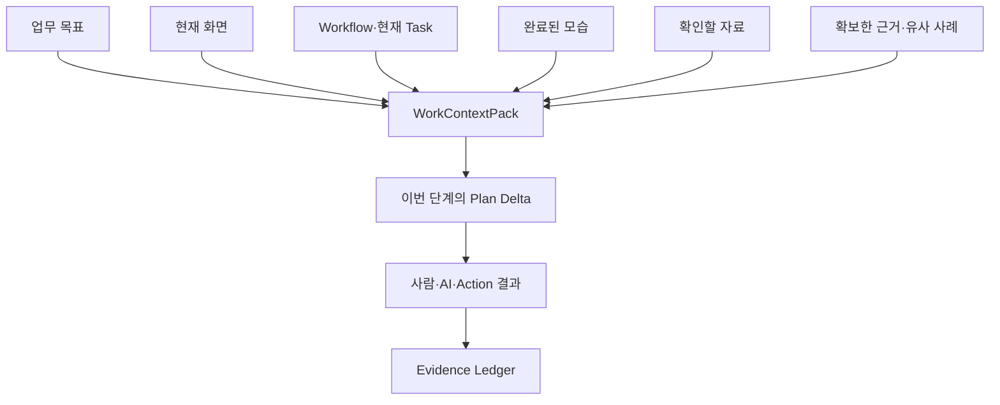

# 목적

`WorkContextPack`은 Agent에게 많은 문서를 한꺼번에 넣는 묶음이 아니다. 이번 질문이나 Task를 이해하고 다음 한 단계를 수행하는 데 필요한 업무 맥락만 선택한 공통 계약이다. Pet, REST, MCP, Codex·Claude Agent Kit, Inbox와 Deep Work가 같은 pack을 사용한다.

```mermaid
flowchart TD
  GOAL["업무 목표"] --> PACK["WorkContextPack"]
  PAGE["현재 화면"] --> PACK
  TASK["Workflow·현재 Task"] --> PACK
  DONE["완료된 모습"] --> PACK
  NEED["확인할 자료"] --> PACK
  FOUND["확보한 근거·유사 사례"] --> PACK
  PACK --> PLAN["이번 단계의 Plan Delta"]
  PLAN --> RESULT["사람·AI·Action 결과"]
  RESULT --> LEDGER["Evidence Ledger"]
```

# 포함하는 정보

- 사용자가 이루려는 업무 결과와 `WorkIntent`
- 현재 화면의 읽을 수 있는 자산과 활성 artifact
- Workflow, 현재 Task, Manual/Copilot/Autopilot 모드
- 사용자가 읽는 `완료된 모습`과 `확인할 자료`
- 확보된 근거, 관련 BoI/SOP/Event/Action/Skill
- 현재 판단에 유용한 유사 사례와 최근 loop delta
- 외부 AI 작업의 summary, checksum, ACL URL
- 사용·제외한 source와 revision을 담은 `ContextManifest`

# 완료 모델

일반 화면은 `exit_criteria`, `required_evidence` 같은 내부 이름을 보여주지 않는다.

| 사용자 표현 | 구조화된 의미 |
|---|---|
| 언제 이 일이 끝났다고 볼까요? | `completion_design.checks` |
| 무엇을 확인하면 될까요? | `completion_design.evidence` |
| 시스템에서 자동 확인 | check의 system binding |
| 담당자가 확인 | human confirmation과 Evidence Ledger |

기존 배열 필드는 외부 연동 호환을 위해 함께 유지하지만 Task Loop는 구조화된 완료 모델과 실제 근거를 우선한다. Autopilot은 모든 필수 완료 항목에 검증 가능한 system binding이 있을 때만 실행 준비 상태가 된다.

# Context 관리 원칙

- `write`: 대화, 작업 메모, artifact와 loop delta를 append-only WorkSession에 저장한다.
- `select`: 현재 목표와 완료 조건에 직접 필요한 완전한 자료 항목을 관련성 순으로 고른다.
- `fit`: 설정된 provider 또는 deployment가 제공하는 실제 context window 안에 완전한 항목을 차례로 배치한다.
- `isolate`: 원본 파일, CSV, 긴 로그와 민감 원본은 MinIO/Data Lake에 두고 checksum과 ACL reference로 연결한다.

선택된 대화 turn, evidence, supporting chunk와 active artifact를 다시 요약하거나 문자열 길이로 자르지 않는다. 물리적인 provider context capacity에 다음 항목 전체가 들어가지 않을 때만 그 항목을 제외하고 `provider_context_capacity` 이유를 manifest에 남긴다. 문장 중간, source 중간 또는 Task 목록 중간을 잘라 맞추지 않는다.

`max_context_tokens=0`은 작은 고정값이 아니라 provider runtime 또는 deployment가 선언한 용량을 자동 사용한다는 뜻이다. 운영자는 특정 실행에 더 작은 명시적 예산을 줄 수 있지만 모델 이름으로 임의의 예산 profile을 선택하지 않는다. 따라서 로컬 Gemma와 사내 관리형 GPT 계열은 같은 계약을 사용하고 각 배포가 제공하는 용량만 다르다.

자료 보관함에 원본을 두는 것은 압축이 아니라 데이터 경계다. 질문에 필요한 profile, sample과 연결 정보는 완전한 context item으로 들어가고, 원본 전체가 필요하면 권한을 확인한 tool이 해당 artifact를 읽는다.

# 사람과 AI의 협업

- Manual: 사람이 수행·확인하고 Agent는 자료와 기록을 돕는다.
- Copilot: 내부 또는 외부 AI가 자료·초안을 준비하고 사람이 마지막 판단을 남긴다.
- Autopilot: allowlist Action과 system binding으로 확인할 수 있는 저위험 단계만 자동 수행한다.

client가 mode를 높여 권한을 확대할 수 없다. 최종 가능 범위는 identity, RBAC, Task mode, Harness와 confirmation의 교집합이다.

# 외부 Agent 사용

MCP `boi_context`와 Agent Kit은 Web과 같은 context item, evidence와 artifact reference를 반환한다. 전송 contract가 원본 파일 자체를 인라인하지 않는 것은 저장 경계이며, 선택된 업무 맥락을 임의로 축약한다는 뜻이 아니다. 권한 있는 진단에서 manifest와 tool trace를 확인할 수 있다.

# 관련 문서

- [Work Learning System](/docs/boi:public:boi-wiki-manual:agent:work-learning-system)
- [Inbox와 Task 수행 가이드](/docs/boi:public:boi-wiki-manual:inbox:inbox-and-task-guide)
- [자료 보관함과 업무 근거](/docs/boi:public:boi-wiki-manual:data-lake:data-lake-artifact-lifecycle)
