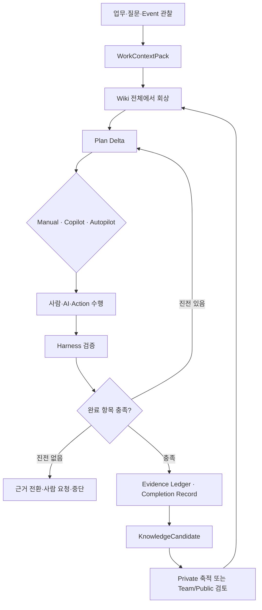
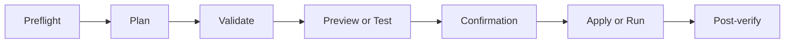

# 목표

Work Learning System은 검색이나 문서 생성에서 끝나지 않는다. 기존 지식을 실제 Task에 사용하고, 수행 과정의 판단·근거·결과를 검증한 뒤, 재사용 가치가 있는 내용만 지식·SOP·Skill 개선 후보로 돌려보낸다.

# Context Engineering

`WorkContextPack`은 모든 Agent turn, Task, Inbox 판단, SOP 실행과 외부 Agent 작업의 공통 입력이다.

| 영역 | 내용 |
|---|---|
| 목표 | 사용자의 요청, 현재 업무와 기대 결과 |
| 현재 상태 | Workflow, Task, 수행 방식, 최근 상태 전환 |
| 완료 설계 | 완료된 모습, 확인할 자료, system binding과 사람 확인 상태 |
| 지식 | 관련 BoI, SOP, Event, Action, Skill과 Dictionary 해석 |
| 근거 | 확보·부족 근거, citation, artifact profile, 유사 사례 |
| 연속성 | 최근 대화 요약, 활성 artifact, 최근 loop delta |
| provenance | source revision, checksum, 외부 AI 기여와 ACL URL |

Context는 `write/select/compress/isolate`로 관리한다.

- write: WorkSession, scratchpad와 Task 상태를 저장한다.
- select: 현재 단계와 완료 항목에 필요한 source만 고른다.
- compress: 오래된 대화와 긴 이력을 bounded summary로 줄인다.
- isolate: 원본 파일, 로그, CSV와 민감 데이터는 prompt 밖에 둔다.

`ContextManifest`는 사용한 source뿐 아니라 제외한 source와 이유도 남겨 재현성과 권한 검토를 돕는다.

# Harness Engineering

Harness는 좋은 답변을 권하는 문서가 아니라 실행되는 품질 계약이다. `HarnessDefinition`은 operation별 필수 context, 입력·출력 schema, validator, 허용 tool, 위험 정책, 완료 조건과 fallback을 정의한다.

모든 변경 작업은 다음 단계를 통과한다.

| Harness | 핵심 검증 |
|---|---|
| Knowledge | citation, 중복, ACL, stale source, 공유 범위 |
| SOP | Workflow, Task, 완료 항목, 근거, Event, Action, 예외, 결과 BoI |
| Action | connector, 입출력 계약, secret 비노출, dry-run, 위험도, 결과 검증 |
| Business Event | source 설정, 조건, dedupe, 상태 전환, sample decision |
| Learning | source 없는 요약, 일회성 잡음, 중복 지식과 미검증 답변 승격 차단 |

Web, REST, MCP와 DeepAgents는 같은 Harness 결과와 blocker를 반환한다.

## Harness 관측과 개선 경계

실행 실패는 단순 오류 문자열이 아니라 `operation → context → validator → blocker → fallback`의 인과 경로로 남긴다. 실패한 시도와 부정 결과도 보존해야 같은 도구 호출과 같은 질문을 반복하지 않고 다음 Plan Delta가 달라질 수 있다.

`ContextPlaybook`은 특정 업무에서 효과가 확인된 context 선택·압축 방식을 private provisional 항목으로 보존한다. 다음 실행은 ACL과 model profile이 맞는 항목만 선택하며, 원본 전문이나 권한 밖 자료를 복제하지 않는다.

Harness 개선 후보는 production 계약을 직접 고치지 않는다. `HarnessCandidate`는 다음 순서를 모두 통과해야 사람 검토 대상으로 올라간다.

1. 기존 사례로 held-in 회귀를 확인한다.
2. 후보 생성에 쓰지 않은 held-out 사례를 통과한다.
3. 권한 우회, 근거 없는 완료, prompt injection 같은 adversarial 사례를 통과한다.
4. 담당자가 diff와 실패·부정 결과를 검토한다.

ACL·RBAC, 위험도, confirmation, Autopilot system binding, 완료 근거와 evaluator 합격선은 immutable boundary다. 후보가 이 경계를 낮추는 변경을 제안하면 평가 전에 차단한다. 모델별 context 길이와 표현 차이는 versioned model profile로 분리하고, 같은 HarnessDefinition의 안전 경계를 바꾸지 않는다.

# Loop Engineering

표준 Task loop는 `Observe → Context → Plan Delta → Act/Ask → Verify → Reflect → Continue/Stop`이다. 반복 횟수가 아니라 진전 여부가 핵심이다.

매 iteration은 다음 중 하나를 `LoopDelta`로 남긴다.

- 새 근거 또는 citation
- Action 결과
- 사람 입력 또는 확인
- 새 artifact
- 상태 전환
- blocker
- KnowledgeCandidate

같은 query, tool과 argument, 같은 질문, 결과 없는 재계획은 no-progress다. 기본 제한은 `max_iterations=5`, `max_no_progress=1`, `max_tool_loops=5`이며 Harness가 operation에 맞게 더 낮출 수 있다.

# 완료 판단

완료는 LLM의 “끝났다”는 문장으로 결정하지 않는다. Task의 `completion_design`, Evidence Ledger, Action 결과와 사람 확인을 평가한다.

| 수행 방식 | 완료 방식 |
|---|---|
| Manual | 담당자가 완료 항목을 확인하고 판단을 기록한다. |
| Copilot | AI가 자료·초안을 준비하고 사람이 최종 확인한다. |
| Autopilot | 모든 필수 항목에 검증 가능한 system binding이 있어야 한다. |

연결되지 않은 Autopilot Task는 초안으로 저장할 수 있지만 실행 준비 상태는 `연결 필요`이며 자동 실행을 차단한다.

# Evidence Ledger와 Completion Record

Evidence Ledger는 어떤 근거가 어떤 완료 항목과 판단을 뒷받침했는지 기록한다. 단순 검색 후보나 열람하지 않은 문서는 근거로 넣지 않는다.

Task가 완료되면 다음을 짧은 `CompletionRecord`로 남긴다.

- 무엇을 결정했는가
- 어떤 근거를 확인했는가
- 어떤 결과가 생겼는가
- 어떤 예외와 blocker가 있었는가
- 다음 업무에서 재사용할 교훈은 무엇인가

# KnowledgeCandidate

다음 조건에서만 지식 후보를 만든다.

- 사용자가 명시적으로 저장을 요청했다.
- 새 판단, 근거 또는 결과가 검증됐다.
- 기존 문서의 gap이나 contradiction을 해결했다.
- 같은 업무 패턴이나 blocker가 반복됐다.
- Task가 검증된 완료 기록을 남겼다.

새 문서를 만들기 전에 hybrid 검색으로 기존 자산을 찾아 보강 또는 supersede를 우선한다. Private 후보는 되돌릴 수 있고, Team/Public 반영은 promotion review를 거친다.

# 외부 AI와 DeepAgents

외부 AI 대화 전문은 WorkContextPack에 넣지 않는다. 요약, checksum, 원본 URL, 사용자가 확인한 결과와 제공자를 연결한다. Copilot Task는 외부 AI 결과만으로 완료되지 않고 사람의 최종 확인을 요구한다.

DeepAgents subagent도 같은 Context, Harness, progress delta와 stop 조건을 사용한다. 격리된 context에서 ACL-visible read tool만 쓰고 draft와 근거를 반환한다.

# 공통 Interface

- `WorkSession`: 대화, source set, 활성 artifact와 편집 revision
- `WorkRun`: intent, context, operation plan, mode, loop와 Harness 결과
- `LoopDelta`: 진전을 증명하는 최소 변화
- `EvidenceLedger`: 완료 판단에 사용한 근거
- `KnowledgeCandidate`: 재사용 가능한 검증 결과 후보

# 관련 문서

- [BoI Wiki 종합 가이드](/docs/boi:public:boi-wiki-manual:guide:final-operator-guide)
- [BoI Agent 사용 가이드](/docs/boi:public:boi-wiki-manual:agent:using-boi-agent)
- [Work Context Pack](/docs/boi:public:boi-wiki-manual:agent:work-context-pack)
- [Living Knowledge System](/docs/boi:public:boi-wiki-manual:knowledge:living-knowledge-system)
- [BoI Agent Guardrail과 ACL](/docs/boi:public:boi-wiki-manual:agent:agent-guardrail-and-acl)
