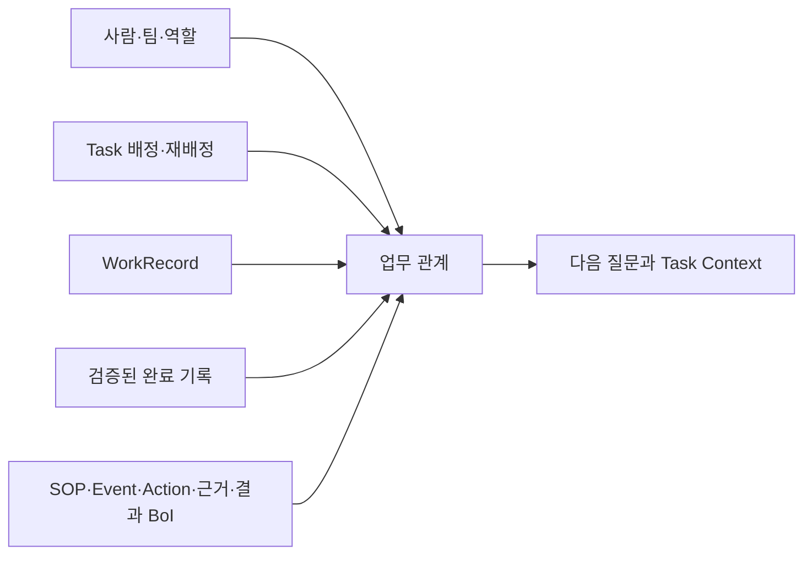
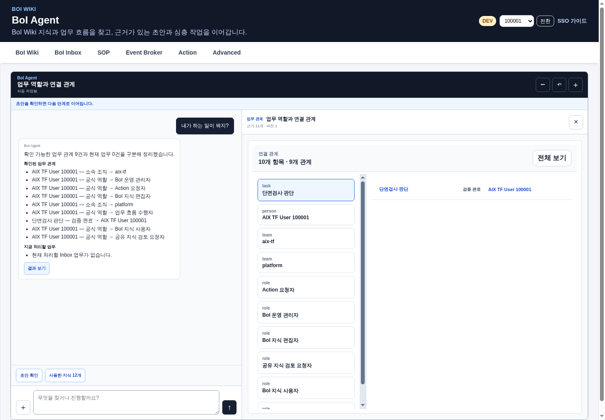
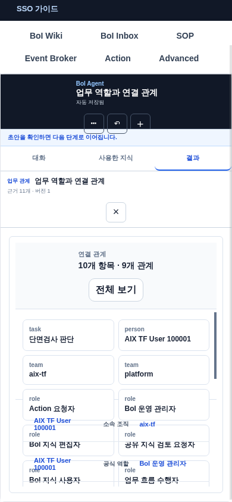

# 무엇을 구분해서 보나

업무 관계 질문은 문서 검색 결과와 Inbox 목록을 한데 섞지 않는다.

| 보고 싶은 것 | 사용하는 근거 | 예시 |
|---|---|---|
| 현재 업무 | 현재 배정과 Inbox 상태 | 지금 처리할 업무만 보여줘 |
| 공식 역할 | directory의 역할·팀 선언 | 내가 맡은 역할은 무엇인가 |
| 수행 관계 | WorkRecord와 검증된 완료 기록 | 최근 어떤 Task를 수행했나 |
| 영향 관계 | SOP·Event·Action·BoI 연결 | 이 Event 이후 어디가 영향을 받나 |

“내가 하는 일이 뭐지?”처럼 넓은 질문은 공식 역할·검증된 관계와 현재 Inbox를 두 영역으로 나누어 보여준다.

# 관계가 만들어지는 방식

관계마다 정본에 명시됐는지, 구조에서 추출됐는지, 사람이 검증했는지와 근거 revision을 함께 저장한다. AI가 추론한 관계는 검토 전에는 권한, 자동 배정, 완료 판단에 쓰지 않는다.

# 결과 화면은 질문에 따라 달라진다

- 항목이 적고 비교가 중요하면 **관계표**를 사용한다.
- 배정·처리·완료가 시간에 따라 바뀌면 **시간 흐름**을 사용한다.
- 짧은 업무 순서나 연결 경로는 **흐름 그림**으로 보여준다.
- 관계가 많고 직접 이동하며 보고 싶으면 **관계 탐색**을 연다.
- 판단·조치·근거를 남겨야 하면 **업무 기록 입력**을 연다.
- 외부 부작용이 있는 Action은 **실행 전 확인**을 거친다.

관계 탐색은 처음에 한 단계 이웃만 연다. 항목을 선택할 때 필요한 주변 관계만 추가하므로 큰 Wiki 전체를 한 번에 브라우저로 보내지 않는다.

모바일에서는 대화와 결과를 탭으로 나누고, 같은 관계와 근거를 유지한다.

# 근거를 확인하는 방법

일반 사용자는 이동 가능한 BoI, Task, Event, Action과 자료 근거만 본다. 권한이 없으면 명시적으로 제한 상태를 표시한다. 코드 파일은 업무 근거가 아니며 관리자에게만 접힌 `기술 검증 근거`와 읽기 전용 화면으로 제공한다.

표시된 관계가 한 번의 배정인지, 공식 역할인지, 반복 수행인지 확인한다. 한 번의 배정은 전문성의 증거가 아니다.

# 안전한 사용

- 현재 화면은 관계 탐색의 출발점이며 Wiki 전체 검색을 제한하지 않는다.
- 동명이인이나 동일한 이름의 자산이 둘 이상일 때만 대상을 한 번 확인한다.
- 화면 표현이 실패하면 같은 의미의 기존 답변·표·입력 화면으로 복구한다.
- 동적 결과 화면에서 Action, 배정, 완료를 직접 우회 실행하지 않는다.
- 공유 지식 변경은 preview, Harness와 검토를 거친다.

# 함께 보기

- [BoI Agent 사용 가이드](/docs/boi:public:boi-wiki-manual:agent:using-boi-agent)
- [Task 수행과 업무 관계 활용 가이드](/docs/boi:public:boi-wiki-manual:workflows:task-execution-ontology-guide)
- [Living Knowledge System](/docs/boi:public:boi-wiki-manual:knowledge:living-knowledge-system)
- [Task·Ontology·동적 화면 검증 기준](/docs/boi:public:boi-wiki-manual:operations:task-ontology-a2ui-acceptance)
