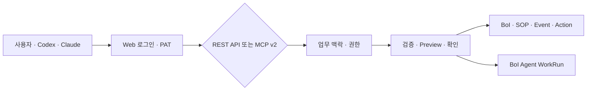
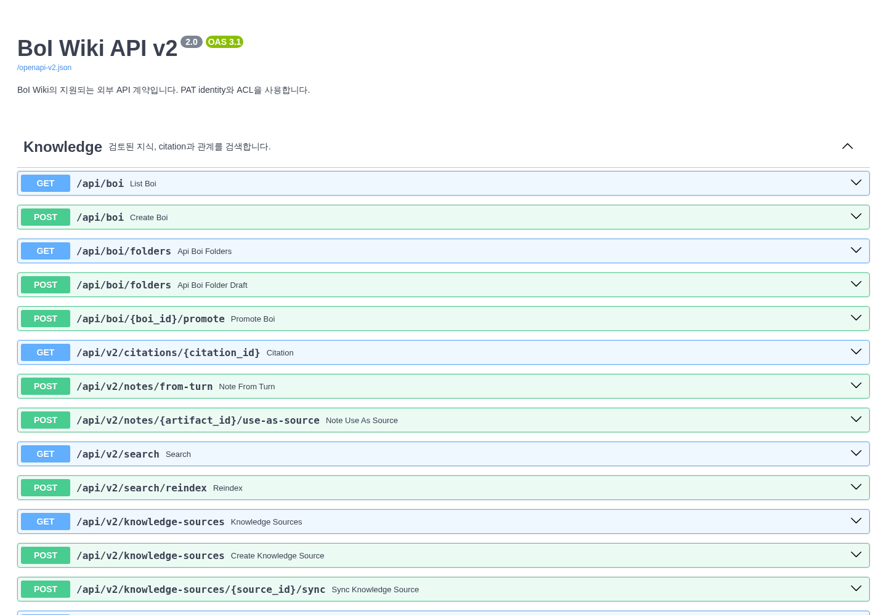

# BoI Wiki API v2

API v2는 BoI Wiki의 지식, 업무 맥락, SOP, 업무 이벤트, Action과 BoI Agent를 외부 도구에서 동일한 권한과 검증 절차로 사용하는 공개 계약이다. 전체 구현 API를 나열하는 호환 문서와 달리, `/api/reference`에는 외부 사용자가 안정적으로 호출할 영역만 표시한다.

# 어디에서 확인하나요

| 목적 | 위치 |
|---|---|
| 공개 API 탐색과 요청 schema 확인 | `<BOI_BASE_URL>/api/reference` |
| OpenAPI v2 JSON | `<BOI_BASE_URL>/openapi-v2.json` |
| 개인 PAT와 Codex·Claude 설정 | BoI Agent `⋯` → `외부에서 사용` |
| 플랫폼 API 상태 | Advanced → API |
| 전체 호환 OpenAPI | `<BOI_BASE_URL>/openapi.json` |

`/openapi.json`은 기존 연동을 위해 유지되며 deprecated operation을 포함할 수 있다. 신규 연동은 `/openapi-v2.json`의 `2.0` contract를 기준으로 한다.

# 인증과 권한

1. Web SSO로 로그인한다.
2. BoI Agent를 펼쳐 `⋯` 메뉴에서 `외부에서 사용`을 연다.
3. 필요한 scope만 선택해 PAT를 만든다.
4. 요청에 `Authorization: Bearer <BOI_PAT>`를 보낸다.

PAT identity가 사용자와 권한을 결정한다. URL query나 요청 본문에 `employee_id`를 넣어 권한을 바꾸지 않는다. 기본 scope는 조회와 private 초안이며, 실행 권한은 RBAC와 Task mode가 함께 허용할 때만 부여된다.

# 공개 영역

| 영역 | 주요 용도 |
|---|---|
| Knowledge | 지식 검색, 원문과 관계 확인 |
| Work | 현재 업무, Context, WorkRun 진행 |
| SOP | Workflow·Task 조회와 private 초안 |
| Business Event | 업무 이벤트 정의와 판단 preview |
| Action | 카탈로그 조회, 계획, dry-run과 확인 |
| Agent | 자연어 turn, session, artifact |
| Files | 업무 근거 자료 연결과 조회 |
| System | readiness와 공개 contract 상태 |

# Web·REST·MCP 일치 원칙

같은 사용자와 질문은 Web, REST, MCP에서 같은 source, citation, WorkRun과 artifact를 가리켜야 한다. REST는 결정적인 시스템 연동과 상세 schema가 필요할 때 적합하고, MCP의 `boi_agent`는 Codex나 Claude가 자연어 업무를 이어갈 때 적합하다.

# 안전한 실행

조회와 private 초안은 즉시 진행할 수 있다. 외부 부작용이 있는 Action, 공유 지식 반영, SOP 게시와 고위험 실행은 `plan → preview/test → confirm → apply` 순서를 지킨다. 실패 응답의 `code`, 사용자용 `message`, `retryable`을 확인하고 raw 예외나 내부 파일 경로에 의존하지 않는다.

# 관련 문서

- [BoI Wiki 종합 가이드](/docs/boi:public:boi-wiki-manual:guide:final-operator-guide)
- [BoI Wiki MCP 등록과 사용](/docs/boi:public:boi-wiki-manual:mcp:register-and-use-boi-wiki-mcp)
- [연결 상태 이해하기](/docs/boi:public:boi-wiki-manual:operations:integration-status)
