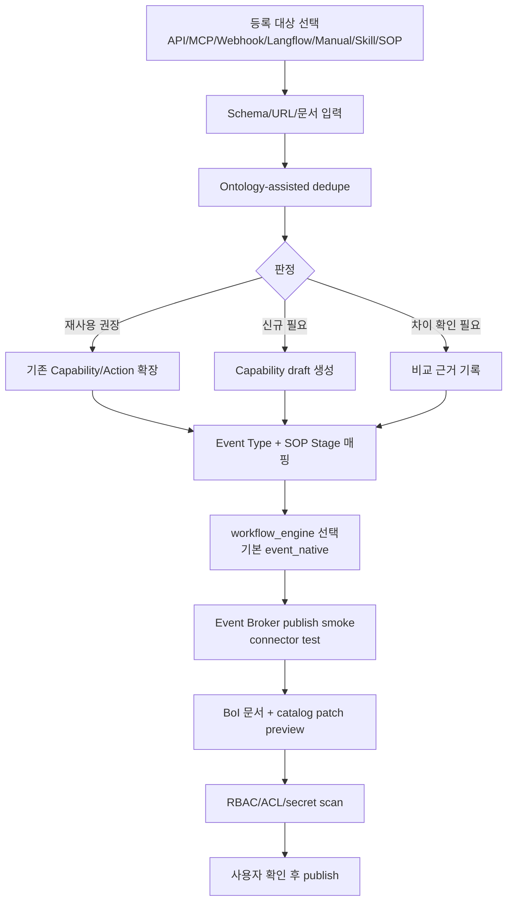

# Summary

BoI Wiki Pilot의 등록 단위는 단일 Action이 아니라 Capability Pack이다. API, MCP, Webhook, Langflow flow, Manual 업무, skill, harness, SOP를 등록하면 Event Contract, Capability Pack, Action/Event Skill, 문서, 테스트, 권한 정책이 함께 연결되어야 한다.

Langflow는 실행 방식 중 하나다. 기본 workflow engine은 `event_native`이며, Event Broker, SOP metadata, Action Catalog, BoI Writer만으로 동작해야 한다.

# Registration Flow

# Required Objects

| Object | Purpose |
|---|---|
| Event Type | 업무가 발생했다는 runtime 계약 |
| Capability Pack | Event, SOP, Action, Manual Handoff, evidence, affordance를 묶는 업무 능력 |
| Action Skill | Agent가 Action을 어떤 업무 의미로 이해할지 설명 |
| Event Skill | Agent가 Event를 workflow trigger/transition으로 해석하는 기준 |
| Action Spec | Action Gateway가 실제 실행할 connector 계약 |
| BoI Manual | 사람이 읽고 검토할 운영 문서 |

# Publish Rule

Capability publish는 draft, dedupe, schema validation, Event Broker smoke, connector smoke, RBAC/ACL, secret scan을 통과해야 한다. 승인 전에는 catalog에 반영하지 않는다.

# Related Documents

- [Event Contract Guide](/public/boi-wiki-manual/capabilities/event-contract-guide.md)
- [Event-Native Workflow Guide](/public/boi-wiki-manual/capabilities/event-native-workflow-guide.md)
- [Action/Event Skill Registry Guide](/public/boi-wiki-manual/capabilities/action-event-skill-registry-guide.md)
- [Duplicate Detection Guide](/public/boi-wiki-manual/capabilities/duplicate-detection-guide.md)
- [Action Authoring Harness](/public/harness/action-authoring-harness.md)
