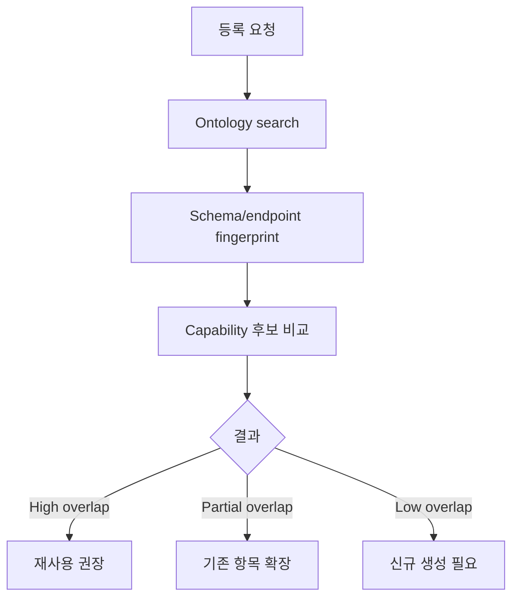

# Summary

Pilot에서 가장 큰 운영 리스크는 유사한 API, Action, Event Type, SOP가 반복 등록되는 것이다. Registration Studio는 publish 전에 ontology-assisted dedupe를 필수로 수행한다.

# Comparison Signals

| Signal | Why |
|---|---|
| Event Type name | 같은 runtime trigger인지 확인 |
| payload schema | 입력 계약 유사도 확인 |
| topic/routing policy | Event Broker route 중복 확인 |
| SOP workflow/stage | 같은 업무 단계인지 확인 |
| endpoint/tool/flow fingerprint | 같은 외부 시스템 호출인지 확인 |
| input/output contract | 같은 기능 재구현인지 확인 |
| recommended action/manual action | 같은 후속 업무인지 확인 |
| Dictionary alias/domain term | 현장 용어 차이 흡수 |
| runtime usage | 실제 많이 쓰는 기존 경로 우선 |

# Dedupe Result

신규 생성을 선택하더라도 draft에는 기존 후보와 차이점을 남긴다. 이 정보는 이후 Agent가 “왜 새 Capability가 필요한가”를 설명하는 근거가 된다.
