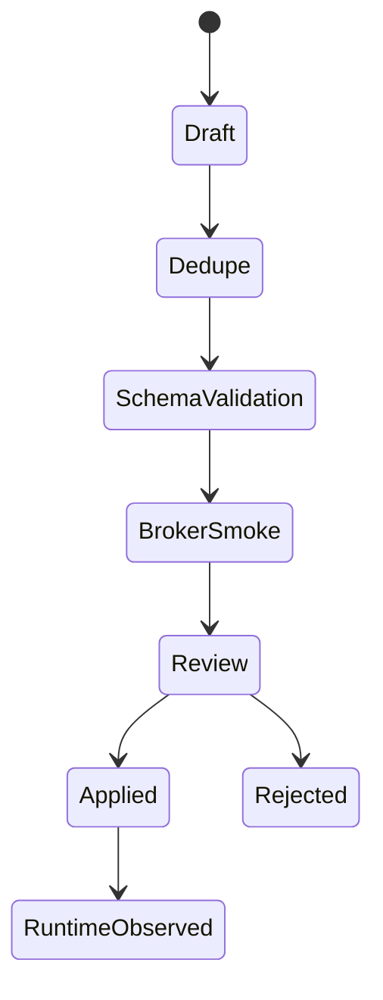

# Summary

Event Type은 BoI runtime의 시작점이자 전이 계약이다. Pilot에서는 Event Type metadata가 단순 이름이 아니라 payload, actor, trace, visibility, workflow, SOP, recommended action을 포함해야 한다.

# Event Metadata

| Field | Meaning |
|---|---|
| `payload_schema` | 이벤트 payload JSON schema |
| `required_payload_fields` | routing과 materialization에 필요한 최소 필드 |
| `trace_policy` | trace 생성/상속/필수 여부 |
| `idempotency_key_fields` | 중복 발행 방지 기준 |
| `actor_policy` | 발행자 사번/팀/role 정책 |
| `visibility_policy` | public/team/private BoI 생성 범위 |
| `workflow_key` | 연결 workflow |
| `sop_ref` | 연결 SOP 문서 |
| `sop_stage_id` | 시작 또는 전이 stage |
| `recommended_actions` | 자동 또는 권장 Action |
| `recommended_manual_actions` | 담당자 수동 조치 |
| `emits_event_types` | 후속 Event Type |
| `capability_refs` | 지원 Capability Pack |

# Lifecycle

신규 Event Type은 draft로 시작한다. 즉시 runtime catalog에 반영하지 않고 dedupe와 schema validation을 통과해야 한다.

# Agent Use

BoI Agent는 “이 이벤트가 발생하면?” 질문을 Event Type에서 시작해 Capability Pack, SOP Stage, Action, Manual Handoff, Next Event 순서로 해석한다. 연결된 Capability가 없으면 임의 답변 대신 등록/연결 후보를 제안한다.
