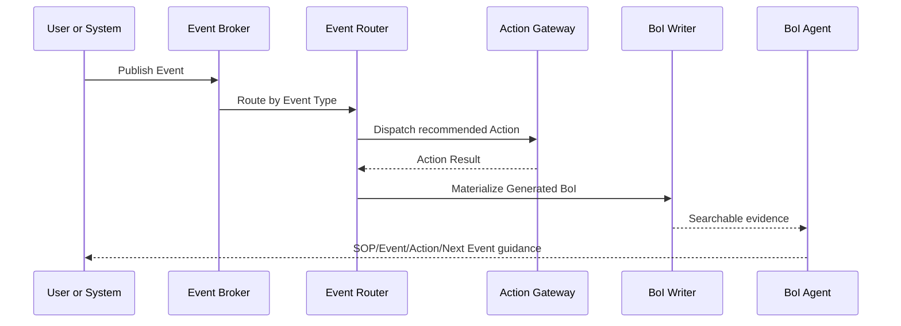

# Summary

`event_native` workflow는 BoI Wiki Pilot의 기본 엔진이다. Event Broker가 업무 발생과 전이를 전달하고, Action Gateway가 실행 가능한 요청을 처리하며, BoI Writer가 실행 근거와 결과를 문서화한다.

Langflow는 `langflow_assisted` Capability에서만 필요하다. Capability의 `required_connectors`에 Langflow가 없으면 Langflow 장애와 무관하게 workflow가 계속 동작해야 한다.

# Workflow Engine Policy

| Engine | Use |
|---|---|
| `event_native` | 기본값. Event Catalog, SOP metadata, Action Catalog로 동작 |
| `external_orchestrator` | 사내 orchestration 시스템이 주도 |
| `manual_only` | 사람이 수행하고 BoI에 기록 |
| `langflow_assisted` | 특정 stage/action에서 Langflow를 선택적으로 사용 |

# Runtime Flow

# Validation

Event-native Capability publish requires:

- Event schema validation
- Event Broker publish smoke
- Connector smoke for required actions
- ACL/RBAC check
- secret/sensitive scan
- BoI document and catalog patch preview

Failure must be visible. A missing Langflow flow is not an error for `event_native`.
