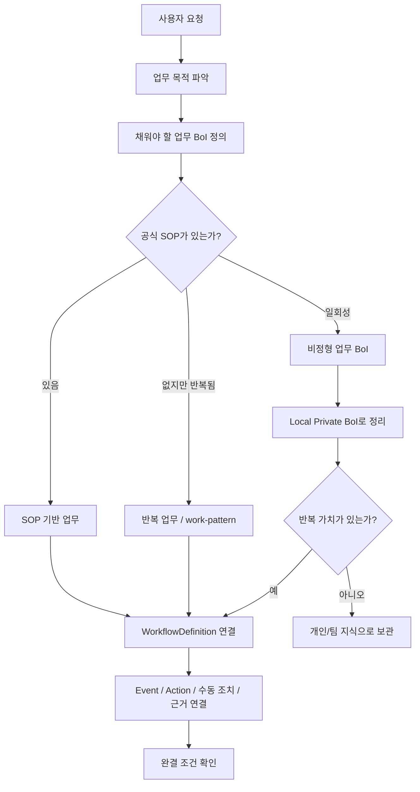

# Summary

BoI Wiki의 중심은 `업무 BoI`다. SOP는 공식 절차가 있는 업무를 설명하는 강한 기준이지만 모든 업무가 처음부터 SOP를 갖지는 않는다. 따라서 Agent와 사용자는 먼저 업무 목적과 필요한 근거를 확인하고, SOP가 있으면 SOP 흐름에 맞추며, SOP가 없으면 비정형 업무 BoI 또는 반복 업무 패턴으로 시작한다.

# Concept Flow

# 업무 유형

| 유형 | 언제 쓰는가 | 대표 산출물 |
|---|---|---|
| SOP 기반 업무 | 공식 절차와 단계가 있는 업무 | SOP, WorkflowDefinition, 실행 현황, Action, 수동 조치 |
| 반복 업무 | 매주/매월/상황별로 반복되지만 공식 SOP가 없는 업무 | work-pattern, WorkflowDefinition draft, Skill 후보 |
| 일회성 비정형 업무 | 회의 정리, 임시 분석, 개인 보고 초안처럼 바로 표준화할 필요가 없는 업무 | local-private 업무 BoI, context pack, promotion draft |

# 반도체 도메인 예시

| 요청 | 판단 | 처리 방향 |
|---|---|---|
| 설비 Alarm이 발생했을 때 Trend/Raw/원인 분석 흐름을 알려줘 | SOP 기반 업무 | 설비 이상 대응 SOP와 WorkflowDefinition을 기준으로 설명 |
| 직개발 결과 확인에서 Response Trend와 Map View를 확인해야 해 | SOP + evidence 기반 업무 | SOP 단계, 필요한 evidence, Action 명세를 연결 |
| 매주 FAB Trend 비교 보고를 자동화하고 싶어 | 반복 업무 | 개인/팀 work-pattern을 만들고 WorkflowDefinition draft 후보 제안 |
| 오늘 회의 내용을 BoI로 정리해줘 | 비정형 업무 | Local Private 업무 BoI로 저장하고 공유 필요 시 promotion draft 생성 |
| 신규 품질 API를 등록하고 싶어 | 업무 흐름 연결 | 업무 목적, 중복 WorkflowDefinition, Action 연결, 검증 초안 순서로 처리 |

# Agent 판단 기준

BoI Agent는 질문을 받으면 먼저 SOP 여부를 묻지 않는다. 대신 업무 목적, 필요한 업무 BoI, 근거, 다음 행동을 확인한다. SOP가 있으면 SOP 단계로 정렬하고, SOP가 없으면 업무 패턴이나 비정형 업무 BoI로 답한다. 반복 가치가 보이면 WorkflowDefinition, SOP, Skill 후보를 제안한다.

# Related Documents

- [WorkflowDefinition Registration Guide](/public/boi-wiki-manual/workflows/workflow-definition-registration-guide.md)
- [Work Context Pack](/public/boi-wiki-manual/agent/work-context-pack.md)
- [BoI Wiki Local Integration](/public/boi-wiki-manual/local/boi-wiki-local-integration.md)
