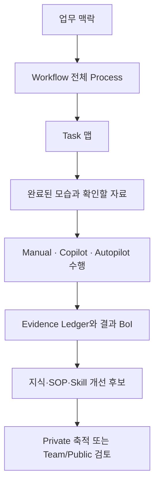

# Summary

BoI Wiki의 중심은 `업무 BoI`다. 업무 BoI는 단순 로그가 아니라 어떤 업무 맥락에서 어떤 판단을 했고, 어떤 근거를 확인했으며, 어떤 결과와 지식 업데이트가 남았는지를 구조화한 기록이다.

현재 작성 기준은 `Workflow / Task` 모델이다. Workflow는 전체 SOP Process이고, Task는 그 안에서 사람이 이해하고 실행할 수 있는 작은 업무 단위다. 사용자는 처음부터 모든 Task를 상세히 정의하지 않아도 된다. Workflow 제목 또는 설명과 Task 1개 이상이면 틀을 저장하고, 필요한 Task만 나중에 구체화할 수 있다.

# Concept Flow

```mermaid
flowchart TD
  C["업무 맥락"] --> W["Workflow 전체 Process"]
  W --> T["Task 맵"]
  T --> D["완료된 모습과 확인할 자료"]
  D --> E["Manual · Copilot · Autopilot 수행"]
  E --> R["Evidence Ledger와 결과 BoI"]
  R --> K["지식·SOP·Skill 개선 후보"]
  K --> M["Private 축적 또는 Team/Public 검토"]
```

# Workflow / Task

| 개념 | 의미 | 사용자 화면 |
|---|---|---|
| Workflow | SOP 전체 Process. 시작 신호부터 완료와 지식 업데이트까지의 큰 흐름 | Workflow 개요, Task 맵, TAT summary |
| Task | Workflow 안의 작은 업무 단위. 판단 질문, 근거, 실행 방식, 결과를 가진다 | Task 카드, Task 상세 panel |
| WorkflowDefinition | runtime 내부 실행 정의. Event, Action, Skill, routing을 묶는 기술 계약 | Advanced/API/MCP 진단 필드 |

사용자-facing 기본 용어는 `Workflow / Task`다. `WorkflowDefinition`은 내부 실행 정의로 유지하지만 일반 사용자가 SOP를 만들 때 먼저 다루는 개념은 아니다.

# Task 실행 방식

| 표시 | 의미 | 기록 기준 |
|---|---|---|
| Manual | 사람이 직접 판단하거나 작업하고 결과를 남긴다 | 결과 메모, 결정 기록, 필요 시 Data Lake artifact |
| Copilot | BoI Wiki Agent/Skill/API 또는 외부 AI/도구의 도움을 받아 사람이 최종 판단한다 | 내부 도움은 tool trace, 외부 도움은 결과와 근거만 기록 |
| Autopilot | Agent/System이 정책 범위 안에서 자동 실행하고 검증 기록을 남긴다 | approval policy, verification result, fallback owner 필수 |

Copilot은 BoI Wiki 내부 Agent만 의미하지 않는다. 사용자가 ChatGPT, Claude, Excel, 사내 도구, 별도 스크립트를 활용해 처리하고 결과만 BoI Wiki에 남기는 경우도 Copilot이다.

# Task 완료 모델

일반 사용자는 raw `exit_criteria`와 `required_evidence`를 직접 작성하지 않는다. 다음 두 질문으로 Task의 완료를 설계한다.

| 사용자 질문 | 내부 계약 |
|---|---|
| 언제 이 일이 끝났다고 볼까요? | 완료 항목과 사람·시스템 확인 방식 |
| 무엇을 확인하면 될까요? | 필수 근거, source 종류와 연결 |

Manual은 담당자가 완료 항목을 확인하고, Copilot은 AI가 자료를 준비한 뒤 사람이 최종 확인한다. Autopilot은 모든 필수 완료 항목에 검증 가능한 system binding이 있을 때만 실행할 수 있다. LLM의 자기 선언만으로 Task를 완료하지 않는다.

# SOP Builder 기준

`/sops/new`의 현재 Wizard는 다음 순서다.

1. `Workflow 개요`: 업무 대상, 상황, 판단 질문, 필요한 근거, 남길 결과를 적는다.
2. `Task 맵`: 전체 Workflow를 작은 Task로 나눈다.
3. `Task 상세`: 필요한 Task만 실행 방식, 완료된 모습, 확인할 자료, Action/Skill, TAT 기준을 구체화한다.
4. `시작/연결`: 기존 업무 이벤트, Webhook, API 조회, MCP, 자료 보관함 query, Kafka, 일정과 수동 시작 중 시작 신호를 정한다.
5. `검토·저장`: Workflow 틀, Task, 자동 자산화 계획, 게시 전 차단 조건을 확인한다.

SOP Builder는 SOP 정의와 근거 요구사항을 설계하는 화면이다. Raw Data, PDF, PPT, Excel, 로그, 캡처 같은 실제 업무 파일은 실행 중 SOP Run, Inbox 판단, Report BoI 검토, Agent 대화에서 자료 보관함 artifact로 첨부한다.

# 자료 보관함

자료 보관함은 MinIO 기반 artifact store의 사용자-facing 명칭이다. OKF 본문에는 원본 파일을 넣지 않는다. BoI 문서에는 stable download URL, profile, sample, checksum, validation metadata, 첨부 사유만 남긴다.

PostgreSQL은 Data Lake 필수 구성요소가 아니다. PostgreSQL은 Legacy DB Demo 또는 structured query adapter 예시로만 사용한다.

# TAT And AI Native 전환

Workflow와 Task는 TAT 측정 단위이기도 하다.

| 지표 | 의미 |
|---|---|
| Workflow TAT | 시작 신호부터 완료까지 |
| Task TAT | Task 시작부터 완료 또는 다음 Task 전환까지 |
| 표시값 | 최근 실행, 평균, 중앙값, 최근 N건 |
| 전환 효과 | Manual -> Copilot -> Autopilot 전환으로 줄어든 시간 |
| Guardrail | 실패율, 반려율, 근거 부족률, 사람 대기 시간 |

목표는 단순 자동화가 아니라 어떤 Task에서 AI Native 전환이 TAT와 판단 품질을 얼마나 개선했는지 정량적으로 남기는 것이다.

# 반도체 도메인 예시

| 요청 | 판단 | 처리 방향 |
|---|---|---|
| 설비 Alarm이 발생했을 때 Trend/Raw/원인 분석 흐름을 알려줘 | SOP 기반 Workflow | 이상 감지, 근거 확인, 원인 판단, 조치 실행, 승인/보고 Task로 나눈다 |
| 직개발 결과 확인에서 Response Trend와 Map View를 확인해야 해 | Workflow/Task 기반 업무 | Response Trend 확인, Map View 확인, 단면검사 판단, Reporting Task와 TAT를 남긴다 |
| 매주 FAB Trend 비교 보고를 자동화하고 싶어 | 반복 Workflow 후보 | 반복 업무 패턴을 Task 맵으로 정리하고 Copilot/Autopilot 후보를 분리한다 |
| 오늘 회의 내용을 BoI로 정리해줘 | 비정형 업무 | Local Private 업무 BoI로 저장하고 공유 필요 시 promotion draft 생성 |
| 신규 품질 API를 등록하고 싶어 | Task 실행 연결 | 어떤 Task에서 API가 필요한지 정하고 Action 또는 Skill 초안으로 연결한다 |

# BoI Agent 판단 기준

BoI Agent는 질문을 받으면 먼저 SOP 여부를 묻거나 모든 설명을 SOP로 전환하지 않는다. 요청의 목적을 이해하고 현재 화면을 anchor로 Wiki 전체에서 관련 지식과 업무 관계를 찾는다. SOP가 실제로 관련되거나 사용자가 설계·변환을 요청한 경우에만 Workflow/Task 초안을 만든다.

Task가 완료되면 판단, 근거, 결과와 예외를 Completion Record로 남긴다. 재사용 가치가 검증된 내용만 KnowledgeCandidate가 되며, 기존 자산 보강을 새 문서 생성보다 우선한다.

Agent가 WorkflowDefinition을 사용할 수는 있지만, 사용자 답변에는 내부 URL이나 raw id를 직접 노출하지 않는다. 사용자-facing 링크는 `관련 SOP 보기`, `BoI Wiki에서 보기`, `Event 보기`, `Action 보기`, `업무 상태 보기`처럼 메뉴와 업무 의미 중심으로 제공한다.

# Related Documents

- [Workflow/Task Builder 따라하기](/docs/boi:public:boi-wiki-manual:sop-workflows:workflow-task-builder-step-by-step)
- [업무 이벤트 정의 가이드](/docs/boi:public:boi-wiki-manual:workflows:business-event-definition-guide)
- [Work Learning System](/docs/boi:public:boi-wiki-manual:agent:work-learning-system)
- [자료 보관함과 업무 근거](/docs/boi:public:boi-wiki-manual:data-lake:data-lake-artifact-lifecycle)
- [Living Knowledge System](/docs/boi:public:boi-wiki-manual:knowledge:living-knowledge-system)
