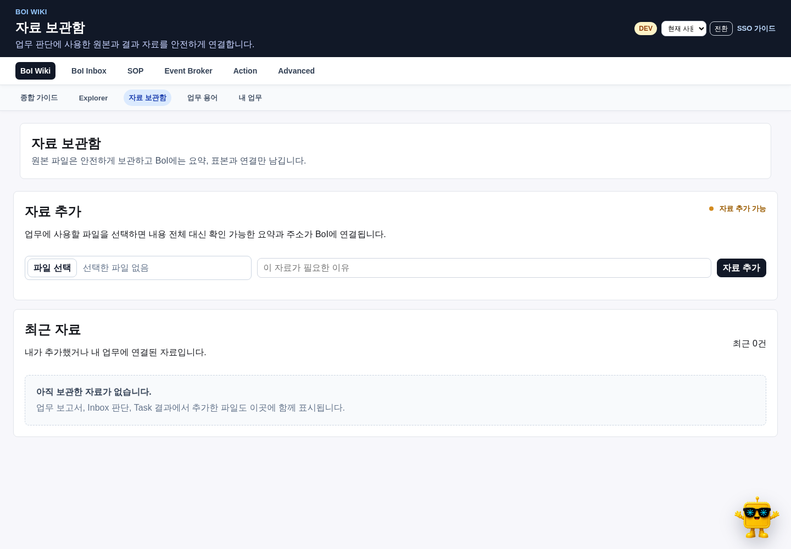

# 자료 보관함이 필요한 이유

CSV, PDF, PPT, Excel, 장비 로그, 캡처와 외부 AI 대화처럼 긴 원본을 Wiki 본문이나 Agent prompt에 통째로 넣으면 읽기와 검색이 느려지고 context가 쉽게 넘친다. 자료 보관함은 원본을 MinIO에 보존하고 업무에는 필요한 부분만 안전하게 전달한다.

사용자 화면에서는 `자료 보관함`이라고 부른다. Data Lake, MinIO, bucket과 endpoint는 운영·진단 문서에서만 사용한다.

# 기본 제공 방식

모든 표준 설치에서 `BOI_DATALAKE_MODE=bundled`가 기본이며 MinIO를 함께 시작한다. 사내 공용 저장소를 사용할 때만 `external`과 endpoint, credential을 지정한다. 특수 복구 환경에서만 `disabled`를 명시한다.

자료 원본과 Wiki 정본은 다르다.

| 저장 대상 | 정본 위치 |
|---|---|
| 문서와 업무 정의 | OKF Markdown, catalog와 Git |
| 긴 원본 파일 | 자료 보관함 MinIO |
| Agent 검색 index | Postgres/pgvector read model |
| 실행 상태 | runtime Event/Action, WorkRun과 Evidence Ledger |

# 자료 보관함 사용하기

`BoI Wiki → 자료 보관함`에서 다음 흐름으로 사용한다.

1. 파일을 선택하고 한 줄 업무 맥락을 적는다.
2. 업로드 후 profile과 sample을 확인한다.
3. 필요한 BoI, Task, Inbox, 보고서 또는 Agent 작업에 연결한다.
4. 판단에 실제 사용한 자료만 Evidence Ledger에 남긴다.
5. 원본이 바뀌면 checksum과 revision이 다른 새 artifact로 관리한다.

기본 visibility는 private이다. Team/Public 사용은 별도 권한과 검토를 거친다.

# 어떤 자료를 넣나

| 자료 | 예시 | 주 사용처 |
|---|---|---|
| Raw data | CSV, JSONL, 장비 로그, trend export | Task와 원인 판단 |
| 작업 결과 | PDF, PPT, Excel, 수동 점검 기록 | Manual/Copilot 결과 |
| 분석 산출물 | chart, table, report, notebook output | 검증 보고서와 BoI |
| 참고 자료 | API 문서, 외부 가이드, spec | SOP·Action 설계 |
| 외부 AI 원본 | 긴 대화 또는 export | 요약과 checksum으로 Copilot 근거 연결 |

# 어디에 연결하나

| 화면 | 목적 |
|---|---|
| Task 수행 | 현재 완료 항목을 확인할 Raw Data와 결과 첨부 |
| BoI Inbox | 승인, 반려, 보류, 추가 근거 요청의 판단 자료 |
| 검증 보고서 BoI | 보고서 보강 파일과 chart source |
| Action 결과 | 사람이 수행한 조치나 외부 시스템 응답 |
| BoI Agent | 분석할 자료와 생성 artifact 연결 |
| 일반 BoI 문서 | 장기 보존할 원본 reference와 검증 정보 연결 |

SOP Builder는 미래 Task가 요구하는 근거 종류를 설계하는 화면이다. 실제 원본 업로드는 업무가 수행되는 Task, Inbox, 보고서와 Agent 작업에서 한다.

# Agent Context에 들어가는 정보

Agent에는 원본 전문 대신 다음만 전달한다.

- 사용자용 제목과 한 줄 설명
- profile과 제한된 sample
- checksum, 크기, content type과 revision
- 현재 업무에서의 attachment role
- ACL이 적용된 download URL
- 누가 언제 어떤 목적으로 연결했는지

Agent가 원본이 필요하다고 판단해도 권한과 tool budget 안에서 필요한 일부만 조회한다.

# Artifact 상태

| 상태 | 의미 |
|---|---|
| uploaded | 원본 보존이 완료됐다. |
| profiled | summary, profile과 sample을 만들었다. |
| review_required | 민감정보, 형식 또는 품질 확인이 필요하다. |
| verified_evidence | 사람이 업무 판단 근거로 채택했다. |

파일이 존재한다는 사실만으로 verified evidence가 되지 않는다.

# Interface

UI와 외부 Agent는 MinIO에 직접 접속하지 않고 BoI API/MCP를 사용한다.

| API | 역할 |
|---|---|
| `POST /api/data-lake/artifacts/upload` | 파일 업로드와 artifact record 생성 |
| `GET /api/data-lake/artifacts` | 권한 내 최근 자료와 연결 조회 |
| `GET /api/data-lake/artifacts/{id}/download` | ACL을 다시 확인한 원본 다운로드 |
| `POST /api/data-lake/artifacts/{id}/profile` | profile과 sample 생성 |
| `POST /api/data-lake/artifacts/{id}/attach` | 업무 대상에 연결 |

MCP v2에서는 기본 tool을 늘리지 않고 `boi_tools_search`로 자료 보관함 capability를 찾는다.

# 안전 원칙

- token, password와 secret이 포함된 자료는 업로드 전에 분리하거나 redaction한다.
- 문서 본문에 presigned URL이나 object key를 고정하지 않는다.
- 원본 파일을 embedding index에 넣지 않는다.
- profile과 sample에도 ACL을 적용한다.
- 공유 범위를 바꾸는 작업은 preview와 confirmation을 거친다.

# 관련 문서

- [BoI Inbox와 Task 수행](/docs/boi:public:boi-wiki-manual:inbox:inbox-and-task-guide)
- [Work Learning System](/docs/boi:public:boi-wiki-manual:agent:work-learning-system)
- [Data Lake Artifact Harness](/docs/boi:public:harness:data-lake-artifact-harness)
- [BoI Wiki 운영 Runbook](/docs/boi:public:boi-wiki-manual:operations:operator-runbook)
