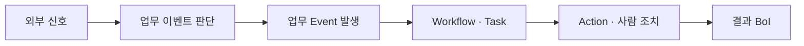
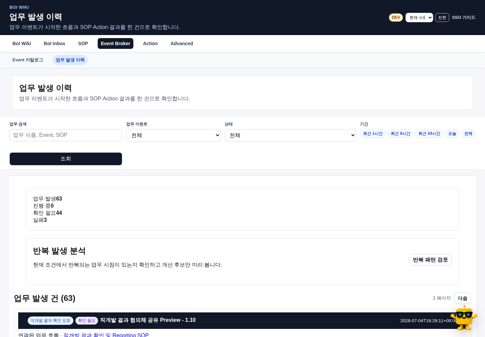
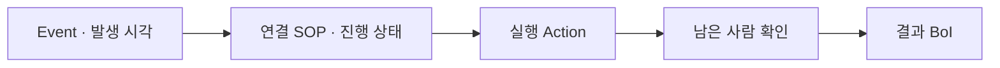

# 정의와 실제 업무 건을 구분하기

`Event 카탈로그`는 어떤 순간을 업무가 발생한 것으로 부를지 정리한 목록이다. `업무 발생 이력`은 그 정의에 맞는 Event가 실제로 들어와 Workflow와 Action이 실행된 업무 건을 보여준다. Kafka payload와 dispatch 정보는 운영 진단용 기술 로그다.

# Event 카탈로그

상단 `Event Broker`를 누르면 Event 카탈로그가 열린다. 각 Event Type에서 다음을 확인한다.

- 사람이 이해할 수 있는 업무 이름과 발생 의미
- 어떤 BoI와 Workflow에서 사용하는지
- 실제 발생 이력과 연결 Action
- 소유자와 현재 사용 상태

`상세`는 주 작업 버튼이고, 실제 연결이 있을 때만 관련 BoI·업무 발생 이력·Action 버튼이 나타난다.

# 업무 발생 이력

업무 발생 이력은 같은 trace에 속한 Event, SOP, Action, 수동 확인과 결과 BoI를 하나의 `BusinessEventOccurrence`로 묶는다.

기본 화면에서는 업무 제목, 진행 상태, 연결 SOP, 실행 Action 수, 남은 확인과 결과만 본다. trace ID, producer, connector, dispatch와 raw JSON은 일반 업무 판단에 필요하지 않으므로 `연결 정보` 또는 권한 있는 Advanced의 `Event 기술 로그`에서 확인한다.

# 상태 해석

| 상태 | 의미 |
|---|---|
| 진행 중 | Workflow나 Action이 처리 중이다 |
| 확인 필요 | 담당자의 판단 또는 근거 보완이 남았다 |
| 완료 | 완료 조건과 필요한 확인이 충족됐다 |
| 실패 | 실행이 중단됐으며 원인과 재시도 여부를 확인해야 한다 |

# 반복 발생 분석

반복 여부는 로그 한 줄마다 표시하지 않는다. 기간과 Event 종류를 먼저 필터링한 뒤 `반복 발생 분석`으로 같은 대상·원인의 반복과 업무 이벤트 정의 개선 후보를 검토한다. 반복됐다는 이유만으로 새 SOP나 Event를 자동 생성하지 않는다.

# 관련 문서

- [업무 이벤트 정의 가이드](/docs/boi:public:boi-wiki-manual:workflows:business-event-definition-guide)
- [SOP 작성과 연결](/docs/boi:public:boi-wiki-manual:sop-workflows:create-and-connect-sop)
- [BoI Wiki 종합 가이드](/docs/boi:public:boi-wiki-manual:guide:final-operator-guide)
