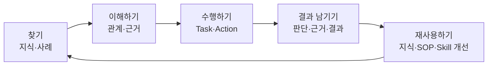
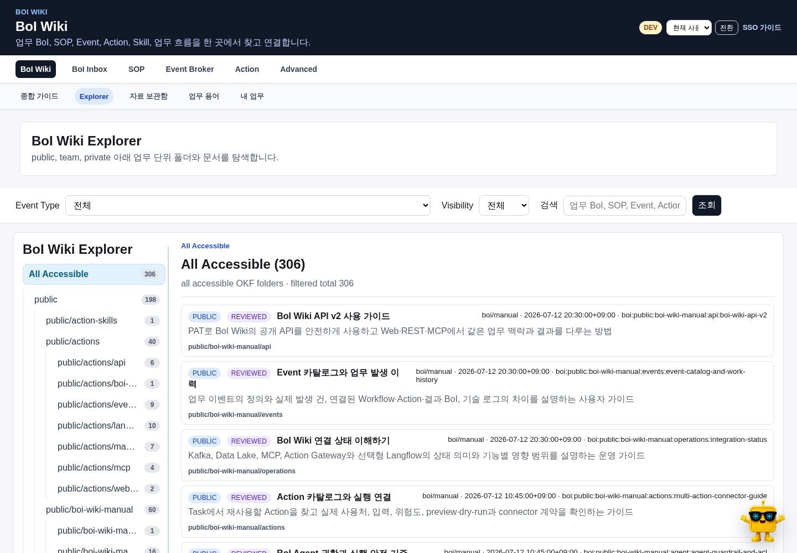
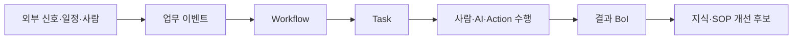
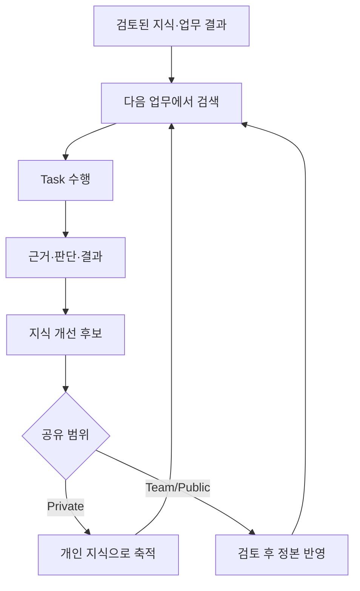

# BoI Wiki로 하는 일

BoI Wiki의 중심은 `업무 맥락`이다. 현재 보고 있는 문서, 진행 중인 Task, 필요한 근거, 과거 사례와 팀 지식을 함께 보고 이번 업무에서 필요한 판단과 결과를 만든다. 문서를 읽는 것과 업무를 수행하는 것, 결과를 지식으로 남기는 것이 하나의 흐름으로 이어진다.

# 5분 시작

1. 우측 하단의 BoI Agent를 연다.
2. 현재 문서에서 궁금한 점이나 실제 처리할 업무를 자연어로 적는다.
3. 답변의 citation을 눌러 원문과 연결 관계를 확인한다.
4. 필요한 경우 관계 그림, SOP 초안, Task 다듬기 또는 근거 보완으로 이어간다.
5. 업무를 마치면 판단과 결과에서 다음에도 쓸 내용만 private 지식 후보로 남긴다.

BoI Agent는 현재 화면을 중요한 출발점으로 사용하지만 검색 범위를 그 문서로 제한하지 않는다. 접근 가능한 Wiki 전체에서 Dictionary, 문서, SOP, Event, Action, 업무 이력과 유사 사례를 hybrid 방식으로 찾는다.

Explorer는 전체 구조를 훑을 때 사용하고, 실제 질문이나 업무는 같은 화면의 BoI Agent에서 이어간다.

# 현재 목적에 맞는 시작점

| 하고 싶은 일 | 시작 화면 | 다음 흐름 |
|---|---|---|
| 업무 지식이나 관계를 찾기 | BoI Wiki 또는 BoI Agent | citation 확인 → 관련 질문 → 노트 또는 업무 적용 |
| 받은 업무를 검토하기 | BoI Inbox | 자동 보고서 → 업무 흐름 → 근거 → 판단 기록 |
| 절차를 만들거나 고치기 | SOP 추가 | Workflow 개요 → Task 맵 → 실행 연결 → 업무 이벤트 |
| 업무 발생 시점을 정하기 | SOP 추가의 업무 이벤트 정의 | 외부 신호 → 발생 방식 → 샘플 확인 → Workflow 연결 |
| 실행 요청을 찾거나 시험하기 | Action | 사용처 확인 → 입력 → preview/dry-run → 확인 후 실행 |
| 긴 원본을 근거로 쓰기 | 자료 보관함 | 업로드 → profile → 업무·BoI에 연결 |
| 실제 업무 발생과 처리 상태 보기 | Event Broker → 업무 발생 이력 | 업무 건 선택 → SOP·Action·남은 확인·결과 BoI 확인 |
| Codex·Claude에서 활용하기 | BoI Agent `⋯` → 외부에서 사용 | PAT 발급 → MCP v2 또는 REST API 연결 |

# BoI Agent

BoI Agent는 별도 챗봇이 아니라 BoI Wiki의 공통 작업 표면이다. 작은 Pet과 `/agent` 전체 화면은 같은 WorkSession, source, citation, artifact와 진행 상태를 사용한다.

- 짧은 질문과 현재 문서 설명은 Compact에서 처리한다.
- Mermaid, SOP, Task, 비교표 같은 결과가 생기면 Expanded 결과 영역에서 확인한다.
- 긴 조사와 다수 자료 분석은 Deep Work로 넘기되 결과는 항상 검토 가능한 초안으로 남긴다.
- 후속 질문은 같은 session의 대상, 근거와 artifact를 이어받는다.
- 실제 게시, 고위험 Action과 공유 정본 변경은 preview와 확인을 다시 거친다.

처음 열면 현재 Inbox, 현재 문서, 최근 작업과 검토된 팀 지식을 근거로 가장 관련 높은 질문 네 개를 먼저 보여준다. `다른 제안 보기`에서는 지금 할 일, 지식·관계, SOP·Task, 업무 이벤트·Action, 결과 자산화, 자동 확인의 여섯 영역을 살펴볼 수 있다. 제안을 누르면 해당 근거와 함께 바로 질문한다.

Expanded 또는 Fullpage의 `⋯` 메뉴에서 `나만의 BoI Agent 만들기`와 `외부에서 사용`으로 이동한다. Agent 자체는 Advanced 메뉴에 두지 않는다.

자세한 사용법은 [BoI Agent 사용 가이드](/docs/boi:public:boi-wiki-manual:agent:using-boi-agent)를 따른다.

# BoI Inbox와 Task

Inbox 업무는 보고서가 완성될 때까지 숨지 않는다. 업무 카드는 먼저 표시되고, 보고서는 백그라운드에서 자동 생성된다. 준비가 끝나면 `검증된 보고서 BoI`를 열어 결론, 근거, 유사 사례와 전체 업무 흐름을 확인한다.

판단이 필요한 업무는 승인, 반려, 보류 또는 추가 근거 요청과 사유를 남긴다. Task 수행 화면에서는 확인한 내용, 수행한 조치, 판단·결과와 사용 근거를 먼저 기록한다. 완료된 모습은 이 업무 기록과 Evidence Ledger를 기준으로 판정하며 LLM의 자기 선언이나 빈 확인 버튼만으로 완료하지 않는다. 여러 담당자를 지정한 Task는 각 담당자의 Inbox에 같은 업무로 표시된다.

자세한 흐름은 [BoI Inbox와 Task 수행](/docs/boi:public:boi-wiki-manual:inbox:inbox-and-task-guide)을 따른다.

복수 담당자와 업무 관계 탐색은 [Task 수행과 업무 관계 활용 가이드](/docs/boi:public:boi-wiki-manual:workflows:task-execution-ontology-guide)에서 확인한다.

# SOP와 업무 이벤트

Workflow는 Task의 집합이다. 각 Task는 목적, 수행 방식, 완료된 모습, 확인할 자료와 남길 결과를 가진다. Action은 기본적으로 Task에 연결하고, 업무 이벤트는 Workflow를 시작하거나 상태를 전환한다.

업무 이벤트는 모든 raw 신호를 그대로 발행하지 않는다. 바로 발생, 조건, 반복·지속, 상태 변화, 복합 신호, 담당자 확인, 직접 실행 중 업무에 맞는 방식을 선택한다. 자세한 내용은 [업무 이벤트 정의 가이드](/docs/boi:public:boi-wiki-manual:workflows:business-event-definition-guide)를 따른다.

# 자료 보관함

자료 보관함은 모든 표준 설치에서 기본으로 제공된다. CSV, PDF, PPT, Excel, 로그, 캡처 같은 긴 원본은 MinIO에 보존하고, Agent와 문서에는 summary, profile, sample, checksum과 권한이 적용된 URL만 전달한다.

파일을 prompt나 Markdown 본문에 통째로 복사하지 않는다. 실제 업무의 Task, Inbox 판단, 보고서 또는 Agent 작업에 연결해 출처와 사용 목적을 남긴다. 자세한 내용은 [자료 보관함과 업무 근거](/docs/boi:public:boi-wiki-manual:data-lake:data-lake-artifact-lifecycle)을 따른다.

# Event와 Action

| 개념 | 의미 |
|---|---|
| 외부 신호 | Webhook, API 조회, MCP, Data Lake, Kafka, Scheduler에서 온 원본 입력 |
| 업무 이벤트 정의 | 어떤 신호와 상태를 실제 업무 발생으로 볼지 정한 기준 |
| Event Type | Broker와 Workflow가 공유하는 업무 이벤트 계약 |
| 업무 발생 이력 | 같은 trace의 Event·SOP·Action·사람 확인·결과 BoI를 묶은 실제 업무 건 |
| Event 기술 로그 | producer, connector, dispatch와 raw JSON을 보는 운영 진단 화면 |
| Action | Task에서 호출할 수 있는 API, MCP, Webhook, Manual, Event, BoI Writer 또는 Langflow 실행 단위 |

Action은 카탈로그에서 실제 사용 Workflow, 입력 schema, 위험도와 연결 상태를 먼저 확인한다. 외부 부작용은 preview 또는 dry-run 이후 확인을 거쳐 실행한다.

상단 `Event Broker`는 Event 카탈로그를 연다. 실제 발생 건은 하위 `업무 발생 이력`에서 확인하고, raw 로그는 권한 있는 운영자만 Advanced의 `Event 기술 로그`에서 본다. 자세한 내용은 [Event 카탈로그와 업무 발생 이력](/docs/boi:public:boi-wiki-manual:events:event-catalog-and-work-history)을 따른다.

# 지식이 쌓이는 방식

모든 대화와 로그가 지식이 되는 것은 아니다. 새 판단, 검증된 근거, Task 결과, 반복되는 업무 패턴처럼 재사용 가치가 있을 때만 KnowledgeCandidate를 만든다. Private 후보는 되돌릴 수 있고, Team/Public 정본 변경은 Harness 검증과 검토를 통과한다.

자세한 구조는 [Work Learning System](/docs/boi:public:boi-wiki-manual:agent:work-learning-system)과 [Living Knowledge System](/docs/boi:public:boi-wiki-manual:knowledge:living-knowledge-system)을 참고한다.

# 외부 Agent 연결

Codex, Claude와 다른 MCP client도 Web BoI Agent와 같은 Context, Harness, WorkRun과 권한 정책을 사용한다. Web SSO 로그인 후 BoI Agent의 `⋯` 메뉴에서 `외부에서 사용`을 열어 PAT를 발급하고 MCP v2의 10개 기본 도구 또는 REST API를 사용한다. prompt나 query의 사번은 권한 근거로 사용하지 않는다.

연결 방법은 [BoI Wiki MCP 등록과 사용](/docs/boi:public:boi-wiki-manual:mcp:register-and-use-boi-wiki-mcp)과 [BoI Wiki API v2](/docs/boi:public:boi-wiki-manual:api:boi-wiki-api-v2)에 정리되어 있다.

# 안전한 사용 원칙

- citation이 없는 답변을 Team/Public 정본으로 옮기지 않는다.
- 공유 전에는 출처, 공개 범위, 중복과 민감정보를 확인한다.
- Autopilot은 시스템에서 검증할 수 있는 완료 항목과 허용된 저위험 Action만 사용한다.
- 원본 파일과 긴 외부 AI 대화는 자료 보관함에 두고 요약과 checksum만 Context에 넣는다.
- 연결 상태와 운영 진단은 일반 업무 화면이 아니라 Advanced의 `연결 상태`에서 확인한다.

# 역할별 다음 문서

- 일반 구성원: [BoI Agent 사용 가이드](/docs/boi:public:boi-wiki-manual:agent:using-boi-agent)
- 업무 설계자: [Workflow/Task Builder 따라하기](/docs/boi:public:boi-wiki-manual:sop-workflows:workflow-task-builder-step-by-step)
- 외부 Agent 사용자: [BoI Wiki MCP 등록과 사용](/docs/boi:public:boi-wiki-manual:mcp:register-and-use-boi-wiki-mcp)
- 운영자: [BoI Wiki 운영 Runbook](/docs/boi:public:boi-wiki-manual:operations:operator-runbook)
- 플랫폼 담당자: [BoI Wiki Architecture](/docs/boi:team:platform:boi-wiki-architecture-v0.1)
