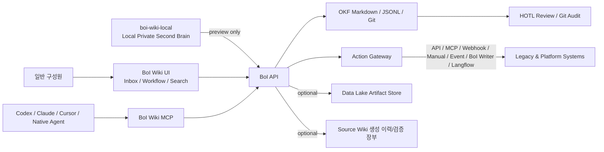
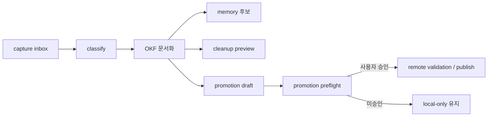

# Summary

이 문서는 BoI Wiki의 최종 운영 허브다. 일반 구성원은 Inbox, Workflow/Task, Local Private, promotion만 이해하면 되고, DT Platform 담당자와 Legacy System 담당자는 API/MCP/Action Gateway/Source Wiki 계약을 보면 된다.

BoI Wiki core는 계속 가볍게 유지한다. source of truth는 OKF Markdown/JSONL, Git, BoI API/MCP, Action Gateway다. Data Lake, Legacy DB, local memory, local Source Wiki runner는 선택형 overlay이며, core runtime이 이 overlay 없이는 실패하지 않아야 한다.

# Quick Links

| 필요 | 문서 |
|---|---|
| 전체 개요 | [BoI Wiki Manual Overview](/public/boi-wiki-manual/overview.md) |
| 과학적 문서 검증 | [Science Verifier 운영과 신뢰 경계](/public/boi-wiki-manual/guide/science-verifier-operation.md) |
| 권한과 사번 기준 identity | [SSO and Permission Model](/public/boi-wiki-manual/security/sso-and-permissions.md) |
| Team/Public 공유와 promotion | [Visibility and Promotion Policy](/public/boi-wiki-manual/operations/visibility-and-promotion-policy.md) |
| MCP 등록과 tool catalog | [BoI Wiki MCP 등록과 사용](/public/boi-wiki-manual/mcp/register-and-use-boi-wiki-mcp.md) |
| Workflow/Task 작성 | [Workflow/Task Builder Step-by-step](/public/boi-wiki-manual/sop-workflows/workflow-task-builder-step-by-step.md) |
| Action/API/MCP connector | [Multi-action connector guide](/public/boi-wiki-manual/actions/multi-action-connector-guide.md) |
| Local Private 시작 | [Local Private 시작하기](/public/boi-wiki-manual/local-private/overview.md) |
| boi-wiki-local 연계 | [BoI Wiki Local 연계 가이드](/public/boi-wiki-manual/local/boi-wiki-local-integration.md) |
| Data Lake artifact | [Data Lake Artifact Lifecycle](/public/boi-wiki-manual/data-lake/data-lake-artifact-lifecycle.md) |
| 화면 캡처 규칙 | [OKF Media and Browser Screenshot Guide](/public/boi-wiki-manual/media/okf-media-and-screenshots.md) |

# 운영 확인

종합 가이드는 운영 허브이므로 자체 화면 캡처를 본문에 넣지 않는다. 화면 증거는 Workflow, MCP, Langflow, use case 같은 기능별 문서에 둔다.

| 확인 | 방법 |
|---|---|
| Harness acceptance | `GET /api/harness/acceptance` |
| Science Verifier Candidate 경계 | `release_candidate`/inactive 상태와 `G0..G4` 자동 qualification, `G5..G7 PENDING`을 [Science Verifier 운영과 신뢰 경계](/public/boi-wiki-manual/guide/science-verifier-operation.md)에서 함께 확인 |
| OKF/media 정합성 | `python scripts/okf_lint.py --root data --strict-media` |
| Data Lake 포함 로컬 smoke | `python scripts/check_local_full_datalake.py --base-url http://localhost:28000 --allow-disabled` |
| Source Wiki 생성 이력/검증 장부 | `data/source-wikis/boi-wiki-platform-source/latest.json`, `data/source-wikis/boi-wiki-local-source/latest.json` |

# Science Verifier 운영 경계

Science Verifier는 AI 답변을 과학 권위로 취급하지 않는다. User·Codex·Claude·Qwen은 모두 untrusted Claim 후보만 제출하며, 서버가 canonical document, alias, ontology reference, Claim 역할, 조건을 재검증한다. client가 보낸 verdict·Rule·Evidence·citation은 사용하지 않고, LLM 없이도 결정론적 경로가 동작해야 한다. Qwen은 선택적 실험 어댑터이므로 live availability, tuning, context size, 특정 응답 성공은 release 조건이 아니다.

Wiki 문서의 local revision은 원본 `boi:*`를 덮어쓰지 않는다. submit·confirm·`verify_claim`·`verify_document` 시점마다 server-derived canonical source ref/digest와 원본 ACL을 다시 확인한다. 계보는 재시작 뒤에도 남아야 하며 누락·위조·malformed lineage는 fail closed한다. 직접 붙여 넣은 문서는 최초 owner만 접근하는 semantics를 유지한다.

구현 증거에서 `FINAL / VERIFIED`는 Git revision에 결속된 pytest suite identity(수량·digest·실제 실행), 수식 asset·fallback·모바일·비운영 경계를 포함한 정확히 27개의 browser check/capture hash, Candidate qualification, exact-commit 독립 리뷰가 일치한다는 뜻이다. 이것은 과학적 진실·안전·공정 승인·Release activation이 아니다. 현재 Release는 `release_candidate`/inactive이고, `G0..G4` 자동 Candidate qualification과 별개로 G5 독립 sealed holdout, G6 active stored-report parity, G7 사람 Science Admin review/activation audit는 `PENDING`이다.

# Final Architecture



운영 기본 경로는 `UI -> API`, `MCP -> API`, `API -> Action Gateway`, `API -> OKF/Git`이다. Langflow는 시각화, debug, demo, 일부 agent flow용 보조 connector이며 production Agent의 기본 엔진이 아니다.

# Harness Acceptance

Harness paper의 6개 책임은 BoI Wiki에서 runtime acceptance matrix로 고정한다.

| 책임 | BoI 기준 | API/MCP |
|---|---|---|
| Observation | 문서, Inbox, runtime evidence, action catalog, source inventory를 권한 안에서 관찰 | `boi_search`, `ontology_search`, `boi_inbox`, `source_wiki_plan` |
| Context | 현재 업무, 사번, 팀/RBAC, citations, WorkContextPack을 bounded context로 구성 | `boi_agent_chat`, `boi_inbox_report_get`, `agent_memory_review` |
| Control | `user_confirmed`, `approved_by`, high-risk approval, host allowlist, spoofing 방지 | `rbac_check`, `doc_access_check`, `harness_acceptance` |
| Action | Action Gateway가 API/MCP/Webhook/Manual/Event/BoI Writer/Langflow를 동등 connector로 실행 | `action_invoke`, `workflow_start`, `manual_handoff_complete` |
| State | OKF Markdown/JSONL, Git commit, trace id, evidence ledger, last-good source wiki manifest | `promotion_status`, `source_wiki_job_get` |
| Verification | OKF lint, source refs, duplicate check, dry-run, validation report, compose smoke, tests | `promotion_preview`, `source_wiki_refresh_preview`, `/api/harness/acceptance` |

운영자는 `GET /api/harness/acceptance` 또는 MCP `harness_acceptance`로 이 matrix가 깨졌는지 먼저 본다. 실패 항목은 사용자-facing 장애보다 먼저 고쳐야 하는 release blocker다.

# Inbox Permission

Inbox identity는 인증된 7자리 사번이 authoritative source다. 개발 모드에서만 query `employee_id`를 편의로 허용하고, SSO/trusted header 모드에서는 query spoofing을 403으로 막는다.

| 동작 | 정책 |
|---|---|
| 목록 조회 | 같은 사번 task 또는 명시 팀/역할/shared queue assignment만 노출 |
| `employee_id` 없는 task | 기본 숨김. 공용 queue로 쓰려면 assignment metadata가 필요 |
| Web UI | opaque `task_ref`만 사용. raw `task_id`는 visible text와 일반 DOM data attribute에 노출하지 않음 |
| MCP/API compatibility | raw `task_id`는 전환기 호환으로 허용하지만 새 client는 `task_ref`와 `boi_inbox*`를 사용 |
| decision/preview/snooze/dismiss/manual complete | 모두 같은 visibility helper를 통과 |

`agent_inbox*`는 deprecated compatibility alias다. 신규 문서, skill, client 예제는 `boi_inbox`, `boi_inbox_report_get`, `boi_inbox_decision_preview`, `boi_inbox_decision_submit`을 canonical로 쓴다.

# API Surface

| Endpoint | 성격 |
|---|---|
| `GET /api/harness/acceptance` | release acceptance matrix 조회 |
| `POST /api/source-wikis/plan` | repo/source wiki 생성 계획, source inventory, skip reason 산출 |
| `POST /api/source-wikis/jobs` | 사용자 확인 후 source wiki page와 manifest 생성 |
| `GET /api/source-wikis/jobs/{job_id}` | source wiki job manifest 조회 |
| `POST /api/source-wikis/{wiki_id}/refresh-preview` | last-good를 보존한 refresh 검증 |
| `GET /api/source-wikis/{wiki_id}/markdown` | generated source wiki Markdown export |
| `POST /api/promotions/preview` | Team/Public promotion 비파괴 preview |
| `GET /api/agents/boi-wiki/memory/review` | Private Second Brain 후보, cleanup 후보, promotion 후보 조회 |

`preview`, `plan`, `review`는 비파괴다. `jobs`, `submit`, `apply`, real action execution은 `user_confirmed=true`와 권한 검증을 요구한다.

# MCP Surface

| Tool | 사용 |
|---|---|
| `harness_acceptance` | 운영 release blocker 확인 |
| `source_wiki_plan` | source inventory와 문서화 계획 |
| `source_wiki_job_start` | 사용자 확인된 source wiki 생성 |
| `source_wiki_job_get` | job manifest 조회 |
| `source_wiki_refresh_preview` | last-good 보존 refresh 검증 |
| `source_wiki_markdown_export` | generated source wiki export |
| `promotion_preview` | 비파괴 promotion preflight |
| `agent_memory_review` | 개인 Second Brain 검토 |

MCP transport는 `MCP_ALLOWED_HOSTS`와 service token으로 보호한다. 외부 노출 시 `MCP_REQUIRE_SERVICE_TOKEN=true`가 기본이어야 한다.

# Source-Grounded Wiki

Source Wiki는 외부 hosted OpenWiki 서비스가 아니라 BoI API/MCP가 로컬 checkout 또는 사내 allowlist mirror를 읽어 만드는 internal documentation overlay다. 사내 코드와 문서 원문은 외부 hosted OpenWiki, 외부 public GitHub repo, 외부 LLM provider로 보내지 않는다.

| 항목 | 운영 기준 |
|---|---|
| 생성 기본 경로 | BoI API `/api/source-wikis/*`와 MCP `source_wiki_*` |
| 입력 | 로컬 `source_path` 또는 `SOURCE_WIKI_ALLOWED_REPOS`에 등록된 사내 repo mirror |
| 출력 | OKF Source Wiki 문서와 `data/source-wikis/*/latest.json` |
| 금지 | 외부 hosted OpenWiki에 사내 repo URL, source path, 코드, 문서 원문 전송 |
| 참고 패턴 | `langchain-ai/openwiki` local CLI, `kdsz001/OpenWiki` local desktop UX |

BoI Source Wiki는 source inventory, selected/skipped file, commit SHA, generated page, citation, validation report, last-good revision manifest를 남긴다. refresh 실패 시 기존 last-good 문서는 유지한다. 사내 저장소가 GitHub Enterprise, GitLab, Gitea로 바뀌어도 allowlist와 env만 바꾸면 같은 API/MCP 계약을 유지한다.

## Generated BoI Source Wiki

2026-07-05 기준 BoI Source Wiki overlay로 실제 repository 내용을 생성했다. 이 문서 묶음은 외부 hosted 서비스가 아니라 BoI API의 `source_wiki_job_start` 흐름으로 만든 source-grounded OKF 문서다.

BoI Wiki Platform Source는 `source-wiki-20260706003025-aa8e71f8`, 로컬 checkout `boi-wiki@4ce6413` 기준이다.

- [Overview](/public/source-wikis/boi-wiki-platform-source/boi-public-100001-20260706003025-36db14.md)
- [Runtime Surfaces](/public/source-wikis/boi-wiki-platform-source/boi-public-100001-20260706003025-064b5f.md)
- [Knowledge, Harness, and Catalogs](/public/source-wikis/boi-wiki-platform-source/boi-public-100001-20260706003025-237fbe.md)
- [Automation and Verification](/public/source-wikis/boi-wiki-platform-source/boi-public-100001-20260706003025-06e792.md)
- [Source Map and Citations](/public/source-wikis/boi-wiki-platform-source/boi-public-100001-20260706003025-8d7e3d.md)

BoI Wiki Local Source는 `source-wiki-20260706003025-05706f63`, 로컬 checkout `boi-wiki-local@93978a9` 기준이다.

- [Overview](/public/source-wikis/boi-wiki-local-source/boi-public-100001-20260706003025-da81ff.md)
- [Local Second Brain Lifecycle](/public/source-wikis/boi-wiki-local-source/boi-public-100001-20260706003025-2d3900.md)
- [Automation and Verification](/public/source-wikis/boi-wiki-local-source/boi-public-100001-20260706003025-ee43d6.md)
- [Source Map and Citations](/public/source-wikis/boi-wiki-local-source/boi-public-100001-20260706003025-e200c9.md)

Source Wiki 생성 이력/검증 장부는 `data/source-wikis/boi-wiki-platform-source/latest.json`과 `data/source-wikis/boi-wiki-local-source/latest.json`에 남는다. 여기에는 selected/skipped inventory, source SHA, page SHA, validation report, last-good 상태가 들어가므로 로컬/사내 runner가 생성한 repository 문서화를 재생성하거나 비교할 때 기준점으로 쓴다.

# Local Second Brain

`boi-wiki-local` 사용자는 문서를 읽지 않아도 agent가 다음 흐름을 자동 보조해야 한다.



local helper는 서버, DB, Docker 없이 표준 Python만 사용한다.

```bash
python3 scripts/local_capture.py --check
python3 scripts/local_review.py --check
python3 scripts/promotion_preflight.py --check
```

원칙은 단순하다. raw Local Private 원문은 승인 없이 원격 전송하지 않는다. agent는 후보 생성, 분류, preview, preflight까지 적극 수행하지만 Team/Public publish와 high-risk action은 사용자의 확인과 RBAC/approval guard를 통과해야 한다.

# Promotion And Action Approval

`user_confirmed`와 `approved_by`는 다르다.

| 값 | 의미 |
|---|---|
| `user_confirmed=true` | 사용자가 실행 의도를 확인했다는 MCP/API guard |
| `approved_by` | high-risk action의 승인자 또는 승인 시스템 |

`promotion_preview`는 공개 범위, redaction, source refs, duplicate/source citation, OKF validation을 먼저 보여준다. `promotion_submit`, public/team publish, high-risk real action은 preview가 가능해도 confirmation과 권한 검증 전에는 실행하지 않는다.

Action 결과에는 trace id, dry-run 여부, simulation 여부, approval 상태, evidence artifact 경로를 일관되게 남긴다.

# Deployment And Repository Move

외부 GitHub repo는 PoC 기준이며, 사내에서는 별도 사내 저장소로 이전할 수 있다.

| 바뀔 수 있는 값 | 운영 방식 |
|---|---|
| Git provider | GitHub Enterprise, GitLab, Gitea 모두 env/allowlist로 문서화 |
| MCP/API URL | user client 설정과 `.env`만 변경 |
| Source Wiki 입력 | 로컬 `source_path` 또는 사내 mirror repo URL을 allowlist에 추가 |
| Data Lake/Legacy overlay | core 배포와 분리한 profile/feature flag |
| OpenWiki류 도구 | 외부 hosted 금지. 필요한 경우 사내 PC/서버에서 local CLI 또는 내부 runner로만 실행 |

core image와 local workspace는 특정 provider SDK에 묶지 않는다. Git push/merge와 Source Wiki refresh는 delivery 절차이며 runtime dependency가 아니다.

# Operator Acceptance

최종 배포 전 최소 확인:

```bash
python -m pytest -s tests -q
python scripts/okf_lint.py --root data --strict-media
python scripts/check_runtime_git_guardrails.py
docker compose --profile local-full config --quiet
docker compose --profile local-full-datalake config --quiet
docker compose --profile local-full-legacy-db-demo config --quiet
/home/chokukil/boi-wiki-local/check.sh /home/chokukil/boi-wiki-local
```

시나리오 smoke는 `search -> plan -> preview -> inbox decision -> action dry-run -> approved execution -> evidence ledger` 순서로 검증한다. 실패 시 화면보다 acceptance matrix, 권한 guard, evidence ledger를 먼저 본다.

# 참고한 오픈소스 패턴

- [Harness Engineering 2026](https://revfactory.github.io/harness-paper/)
- [langchain-ai/openwiki local CLI](https://github.com/langchain-ai/openwiki)
- [kdsz001/OpenWiki local desktop](https://github.com/kdsz001/OpenWiki)
