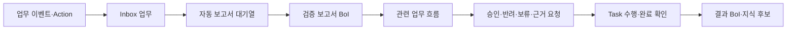
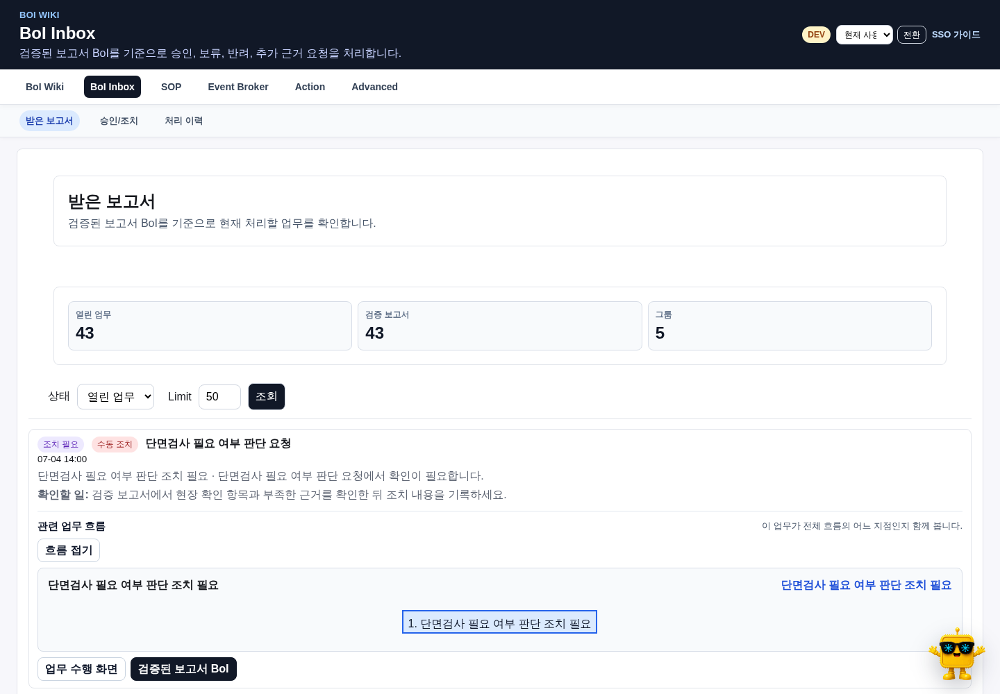
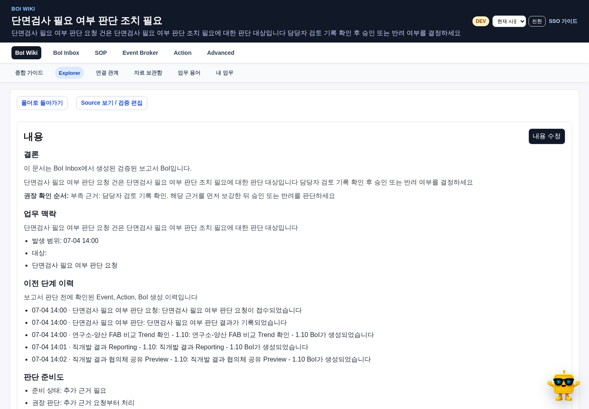
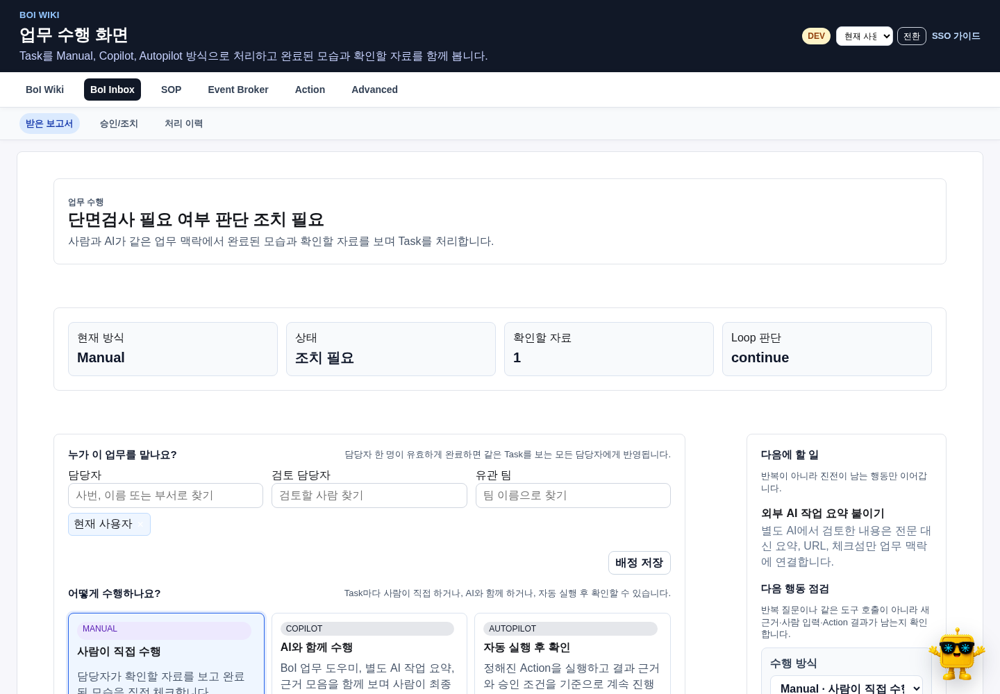

# Inbox의 역할

BoI Inbox는 Event와 Action 처리 중 사람의 판단, 승인 또는 수동 조치가 필요한 업무를 보여준다. 단순 알림 목록이 아니라 검증 보고서, 전체 업무 흐름, 판단 근거와 처리 이력을 연결한다.

# 보고서는 자동으로 준비된다

사용자가 Inbox 페이지를 열거나 버튼을 눌러야 보고서가 생성되는 구조가 아니다. `InboxReportCoordinator`가 앱 시작 시 누락 보고서를 확인하고, 이후 새 업무를 즉시 등록하며 주기적으로 backfill한다.

| 상태 | 화면 의미 |
|---|---|
| 보고서 준비 중 | 업무는 먼저 보이고 보고서를 백그라운드에서 생성한다. |
| 검증된 보고서 BoI | 결론, 근거, 유사 사례와 조치 판단을 확인할 수 있다. |
| 준비 지연 | 저장소나 모델 상태를 재시도 중이며 업무 원본은 유지된다. |

일반 화면에는 수동 `보고서 생성` 버튼을 두지 않는다. 운영 복구 API는 Advanced와 테스트에서만 사용한다.

# 업무 흐름 보기

첫 Inbox 카드의 흐름은 첫 화면에 바로 표시한다. 나머지는 viewport 근처에서 최대 네 개씩 미리 조회하고 실제 화면에 들어올 때 Mermaid를 렌더링한다. 사용자가 접은 흐름은 다시 자동으로 열지 않는다.

업무 흐름은 Action row와 Workflow 정의로 결정적으로 구성하며 LLM이나 embedding을 호출하지 않는다. 일반 흐름 그림에는 `Task로 나누기`, `SOP 저장`, `업무 이벤트 연결` 같은 범용 변환 버튼을 자동 부착하지 않는다.

# 검증된 보고서 읽기

보고서에서는 다음 순서로 확인한다.

1. 결론과 요청된 판단을 읽는다.
2. 확보된 근거와 부족한 근거를 구분한다.
3. 전체 업무 흐름에서 현재 위치와 선후 관계를 확인한다.
4. 유사 사례는 참고하되 자동 승인 근거로 사용하지 않는다.
5. 필요한 경우 자료 보관함의 원본을 열거나 보강 파일을 연결한다.
6. 판단 결과와 사유를 기록한다.

완료된 과거 업무의 보고서와 흐름은 계속 읽을 수 있지만 조치 입력은 읽기 전용이다.

# 판단 기록

| 판단 | 언제 사용하나 |
|---|---|
| 승인 | 근거와 완료 조건이 충족되고 요청된 실행을 진행해도 된다. |
| 반려 | 기준을 충족하지 못했거나 잘못된 요청이다. |
| 보류 | 추가 상태 변화나 외부 응답을 기다려야 한다. |
| 추가 근거 요청 | 결론에 필요한 자료나 확인이 부족하다. |

판단에는 사유를 남긴다. 고위험 group bulk approve는 차단하고 개별 업무의 근거와 권한을 다시 확인한다.

# Task 수행 방식

| 방식 | 사람과 AI의 역할 |
|---|---|
| Manual | 사람이 작업하고 완료 항목을 직접 확인한다. |
| Copilot | AI 또는 외부 도구가 자료와 초안을 준비하고 사람이 최종 확인한다. |
| Autopilot | 연결된 Event, Action 또는 데이터로 system 확인이 가능한 항목만 자동 판단한다. |

Task 화면의 기본 질문은 `언제 이 일이 끝났다고 볼까요?`와 `무엇을 확인하면 될까요?`다. raw `exit_criteria`, `required_evidence`, Event/Workflow ID는 연결 정보에만 둔다.

# 완료된 모습과 확인할 자료

완료된 모습은 사용자가 이해하는 문장으로 작성한다.

- “Alarm 접수가 확인되었어요.”
- “조치 결과가 기록되었어요.”
- “담당자가 최종 판단을 남겼어요.”

확인할 자료는 BoI 문서, 업무 이벤트, Action 결과, 데이터, 파일, 담당자 메모와 외부 AI 요약에서 고른다. 기본적으로 필수이며 선택 자료 지정은 연결 정보에서만 한다.

Autopilot 항목에 검증 가능한 연결이 없으면 초안 저장은 가능하지만 실행 준비 상태를 `연결 필요`로 표시한다. 자동 실행을 막고 연결 보완 또는 Copilot 전환을 제안한다.

# 외부 AI 결과

사람이 플랫폼 밖의 AI와 작업한 결과도 Copilot 근거로 연결할 수 있다. 대화 전문을 prompt에 복사하지 않고 다음을 기록한다.

- 사용한 도구 또는 제공자
- 사람이 확인한 결과 요약
- 원본 URL 또는 자료 보관함 reference
- checksum과 기록 시각
- 어떤 완료 항목을 뒷받침하는지

외부 AI 요약만으로 Copilot Task를 완료하지 않고 담당자의 최종 확인을 남긴다.

# 완료와 학습

Manual/Copilot 확인은 Evidence Ledger와 사람 입력 LoopDelta를 남긴 뒤 Task 완료 조건을 다시 평가한다. 완료 시 결정, 근거, 결과, 예외와 재사용할 교훈을 Completion Record로 정리한다. 검증된 새 내용이나 반복 패턴이 있으면 KnowledgeCandidate를 제안한다.

# 관련 문서

- [BoI Wiki 종합 가이드](/docs/boi:public:boi-wiki-manual:guide:final-operator-guide)
- [BoI Agent 사용 가이드](/docs/boi:public:boi-wiki-manual:agent:using-boi-agent)
- [Work Learning System](/docs/boi:public:boi-wiki-manual:agent:work-learning-system)
- [자료 보관함과 업무 근거](/docs/boi:public:boi-wiki-manual:data-lake:data-lake-artifact-lifecycle)
- [업무 BoI-first 개념 모델](/docs/boi:public:boi-wiki-manual:concepts:work-boi-first-model)
