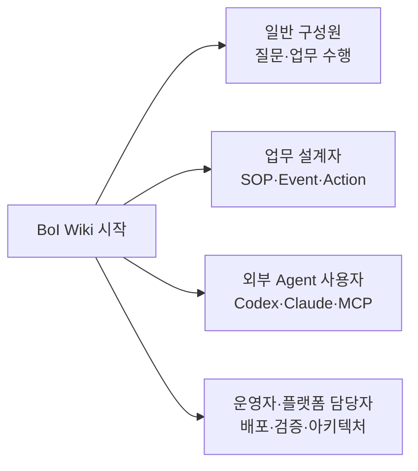

# 처음 오셨다면

[BoI Wiki 종합 가이드](/docs/boi:public:boi-wiki-manual:guide:final-operator-guide)에서 시작한다. 화면 메뉴를 외우기보다 `찾기 → 이해하기 → 수행하기 → 결과 남기기 → 재사용하기` 흐름으로 BoI Wiki를 익힐 수 있다.

# 일반 구성원

- [BoI Agent 사용 가이드](/docs/boi:public:boi-wiki-manual:agent:using-boi-agent)
- [BoI Inbox와 Task 수행](/docs/boi:public:boi-wiki-manual:inbox:inbox-and-task-guide)
- [Workflow/Task Builder 따라하기](/docs/boi:public:boi-wiki-manual:sop-workflows:workflow-task-builder-step-by-step)
- [자료 보관함과 업무 근거](/docs/boi:public:boi-wiki-manual:data-lake:data-lake-artifact-lifecycle)
- [Local Private 시작하기](/docs/boi:public:boi-wiki-manual:local-private:overview)

# 업무 설계자

- [업무 BoI-first 개념 모델](/docs/boi:public:boi-wiki-manual:concepts:work-boi-first-model)
- [업무 이벤트 정의 가이드](/docs/boi:public:boi-wiki-manual:workflows:business-event-definition-guide)
- [SOP Workflow 작성과 Runtime 연결](/docs/boi:public:boi-wiki-manual:sop-workflows:create-and-connect-sop)
- [Action 카탈로그와 실행 연결](/docs/boi:public:boi-wiki-manual:actions:multi-action-connector-guide)
- [Event Contract](/docs/boi:public:boi-wiki-manual:workflows:event-contract-guide)

# 외부 Agent 사용자

- [BoI Wiki MCP 등록과 사용](/docs/boi:public:boi-wiki-manual:mcp:register-and-use-boi-wiki-mcp)
- [Work Learning System](/docs/boi:public:boi-wiki-manual:agent:work-learning-system)
- [Living Knowledge System](/docs/boi:public:boi-wiki-manual:knowledge:living-knowledge-system)
- [권한과 승인 경계](/docs/boi:public:boi-wiki-manual:agent:agent-guardrail-and-acl)

# 운영자와 플랫폼 담당자

- [운영 Runbook](/docs/boi:public:boi-wiki-manual:operations:operator-runbook)
- [BoI Wiki Architecture](/docs/boi:team:platform:boi-wiki-architecture-v0.1)
- [배포와 검증](/docs/boi:public:boi-wiki-manual:agent:deployment-and-verification)
- [SSO와 권한](/docs/boi:public:boi-wiki-manual:security:sso-and-permissions)
- [화면 캡처와 Media 규칙](/docs/boi:public:boi-wiki-manual:media:okf-media-and-screenshots)

# 문서 원칙

일반 화면과 사용자 문서는 한국어 업무 용어를 우선한다. API, raw ID, pgvector, model route 같은 구현 정보는 기술 문서나 접힌 진단 영역에서만 다룬다. 구형 문서는 Git 이력과 호환 확인을 위해 남길 수 있지만 현재 사용법은 위 canonical 문서를 기준으로 한다.
