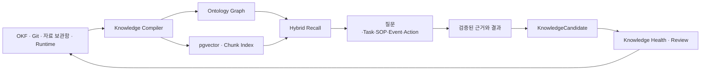
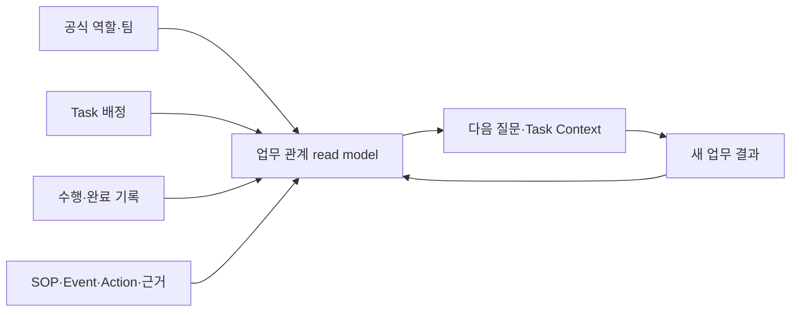
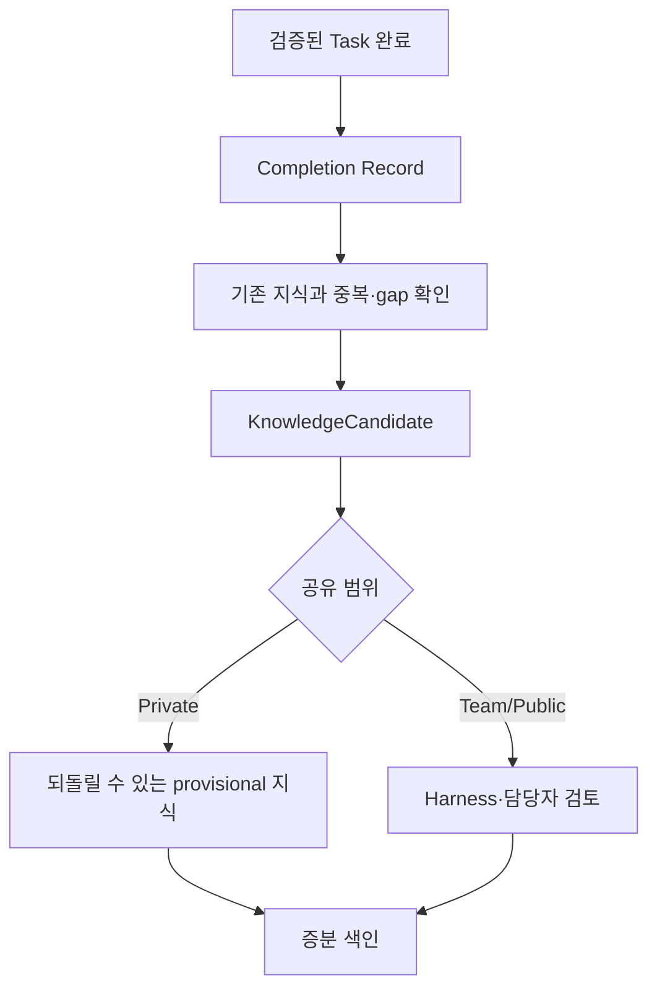

# 목표

Living Knowledge System은 문서를 많이 만드는 기능이 아니다. 검증된 지식과 업무 결과가 다음 질문, SOP 설계와 Task 수행에 실제로 재사용되고, 오래되거나 모순되는 내용은 근거가 있는 개선 후보로 발견되는 구조다.

# 정본과 조회 모델

| 구분 | 저장 내용 | 원칙 |
|---|---|---|
| 정본 | OKF Markdown, JSONL, catalog, Git | 사람이 검토하고 되돌릴 수 있다. |
| 원본 artifact | MinIO 자료 보관함 | 전문을 prompt나 embedding에 넣지 않는다. |
| 검색 read model | Postgres/pgvector chunk | 삭제 후 정본에서 재생성 가능하다. |
| 관계 read model | ontology node/edge | provenance와 source revision을 가진다. |
| Agent 상태 | WorkSession, WorkRun, job, plan, evaluation | 지식 정본과 분리한다. |

# Knowledge Source

`KnowledgeSourceDefinition`은 source 종류, 위치, visibility, revision/checksum, adapter와 sync 정책을 정의한다. 기본 source는 OKF Markdown, Git 변경 이력과 자료 보관함이다.

Graphify, codegraph 같은 외부 도구는 production 기본 의존성이 아니다. `KnowledgeSourceAdapter` 뒤에서 동일 corpus의 관계 정확도, 증분 속도, token/tool call 감소, 보안과 라이선스를 비교한 뒤 source별로 선택한다.

# 외부 패턴을 반영한 기준

| 참고 패턴 | BoI Wiki에 반영한 부분 | 그대로 도입하지 않은 부분 |
|---|---|---|
| Karpathy LLM Wiki | 원본을 보존하고 누적 Markdown을 서로 연결하며 schema와 lint로 품질을 지킨다. | Agent가 작성한 문장을 검증 없이 정본으로 승격하지 않는다. |
| Google OKF | Markdown frontmatter, 링크 그래프와 정본의 이식성을 호환 profile로 유지한다. | 아직 draft인 표준만으로 사내 ACL, Task, Event와 Action 관계를 제한하지 않는다. |
| Graphify·codegraph | 파서 기반 관계 추출, 증분 graph 갱신과 Agent의 graph-first 탐색을 adapter 후보로 둔다. | 외부 graph DB나 특정 CLI를 production 필수 의존성으로 고정하지 않는다. |
| Understand Anything | `어떻게 이어지나요`, `어디에 영향이 있나요`, `이 순서로 살펴보기` 탐색을 제공한다. | 코드 구조만을 전체 업무 온톨로지로 간주하지 않는다. |
| OpenWiki | source 변경을 감지하고 영향을 받은 문서와 관계의 갱신 후보를 만든다. | 공유 문서를 자동으로 다시 쓰거나 바로 게시하지 않는다. |
| OpenKB | PDF·Office 원본을 목차와 개념 후보로 구조화한 뒤 lexical·semantic 검색을 적용한다. | 원본 전문을 prompt나 embedding index에 그대로 복제하지 않는다. |
| Obsidian Second Brain | 야간 health 작업으로 stale claim, 모순, 중복과 고립 지식을 찾는다. | 오류까지 누적되지 않도록 의미 변경은 diff와 검토를 반드시 거친다. |

# 증분 Knowledge Compiler

Compiler는 file checksum, Git revision과 삭제 tombstone으로 변경된 source만 처리한다.

1. 문서와 catalog의 metadata와 구조 관계를 읽는다.
2. Markdown heading 단위로 800~1,200자 chunk와 overlap을 만든다.
3. 수정 문서의 이전 chunk와 stale edge를 제거한다.
4. lexical index, embedding과 ontology를 갱신한다.
5. 모든 변경이 처리되고 target/current signature가 같을 때만 ready로 기록한다.

embedding model이나 index schema가 바뀔 때만 전체 reindex를 수행한다. 색인 실패는 Markdown 저장 성공을 취소하지 않으며 별도로 재시도한다.

# 관계 provenance

`KnowledgeEdge`는 관계를 사실처럼 뭉뚱그리지 않는다.

| provenance | 의미 |
|---|---|
| declared | 문서나 catalog에 명시된 관계 |
| extracted | parser가 구조에서 결정적으로 추출한 관계 |
| inferred | LLM이 제안한 의미 관계 |
| human_verified | 담당자가 확인한 관계 |
| ambiguous | 충돌하거나 추가 확인이 필요한 관계 |

모든 관계는 confidence, source refs, extractor version과 source revision을 가진다. inferred 관계는 Team/Public 정본을 자동 수정하지 않는다.

# 업무 관계의 누적

업무 관계에는 directory의 공식 역할·팀, Task 배정과 재배정, WorkRecord, 검증된 CompletionRecord, Task가 사용한 SOP·Event·Action·Evidence와 결과 BoI가 증분 반영된다.

관계 조회 결과는 다음 질문의 Context와 hybrid rerank에 재사용하지만 한 번의 배정을 전문성으로 승격하지 않는다. 반복 수행은 최근 180일, 서로 다른 검증 완료 실행 3건 이상과 마지막 수행 시점을 가진 `WorkRoleProfile` read model에서 판단한다.

# Hybrid Retrieval

검색은 한 종류의 점수에 의존하지 않는다.

1. Dictionary alias, broader/narrower와 업무 개념을 해석한다.
2. lexical과 pgvector로 관련 chunk 후보를 찾는다.
3. SOP→Workflow→Task, Event→Action→BoI, runtime trace와 backlink를 확장한다.
4. ACL, 권위, 최신성, 현재 Task와 page anchor로 rerank한다.
5. 최종 source와 chunk만 citation 후보로 제공한다.

사용자는 기술어 대신 다음 보기를 사용한다.

| 사용자 보기 | 검색 view |
|---|---|
| 연결 관계 | `neighbors` |
| 어떻게 이어지나요 | `path` |
| 어디에 영향이 있나요 | `impact` |
| 이 순서로 살펴보기 | `tour` |

# Knowledge Health

주기적 health 작업은 다음 문제를 찾는다.

- 오래된 판단과 freshness 위험
- 서로 모순되는 claim
- 중복 또는 supersede 후보
- 연결되지 않은 중요 자산
- 끊어진 canonical link
- source나 업무 범위의 coverage gap

결과는 근거와 diff를 가진 `KnowledgePatchProposal`이다. checksum, backlink, index 같은 결정적 복구만 자동 적용할 수 있다. 문장의 의미, 정책, Team/Public 문서 변경은 검토가 필요하다.

# 자연스러운 지식 자산화

업무 결과는 다음 단계를 거친다.

대화 횟수나 로그 양만으로 후보를 만들지 않는다. 검증되지 않은 Agent 답변, source 없는 요약, 일회성 잡음과 민감정보는 Learning Harness가 차단한다.

# 시간과 변경

변화하는 판단은 `valid_from`, `valid_to`, `observed_at`, `supersedes`와 verification 상태를 사용한다. 새 내용을 기존 사실 위에 조용히 덮어쓰지 않는다. Git과 proposal diff가 변경 이유와 되돌리기 근거를 제공한다.

# Agent와 외부 도구 활용

Web, REST, MCP와 Agent Kit은 같은 source ID, citation ID와 graph path를 반환한다. 외부 Agent도 먼저 기존 지식을 찾고, citation을 남기며, Task 결과와 사람 정정을 Evidence Ledger에 연결한 뒤 KnowledgeCandidate를 제안한다.

# 운영 기준

- deprecated와 generated 문서는 기본 검색에서 제외하거나 후순위화한다.
- history seed는 유사 사례에만 사용한다.
- index가 갱신 중이어도 lexical과 ontology 검색은 유지한다.
- 일반 화면에는 checksum, adapter, embedding과 raw graph ID를 노출하지 않는다.
- Knowledge Health finding을 정본 수정 승인으로 해석하지 않는다.

# 관련 문서

- [BoI Wiki 종합 가이드](/docs/boi:public:boi-wiki-manual:guide:final-operator-guide)
- [Work Learning System](/docs/boi:public:boi-wiki-manual:agent:work-learning-system)
- [BoI Agent 사용 가이드](/docs/boi:public:boi-wiki-manual:agent:using-boi-agent)
- [자료 보관함과 업무 근거](/docs/boi:public:boi-wiki-manual:data-lake:data-lake-artifact-lifecycle)
- [Visibility와 Promotion](/docs/boi:public:boi-wiki-manual:operations:visibility-and-promotion-policy)
