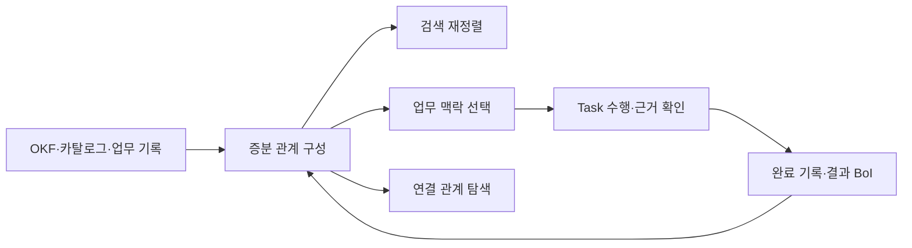
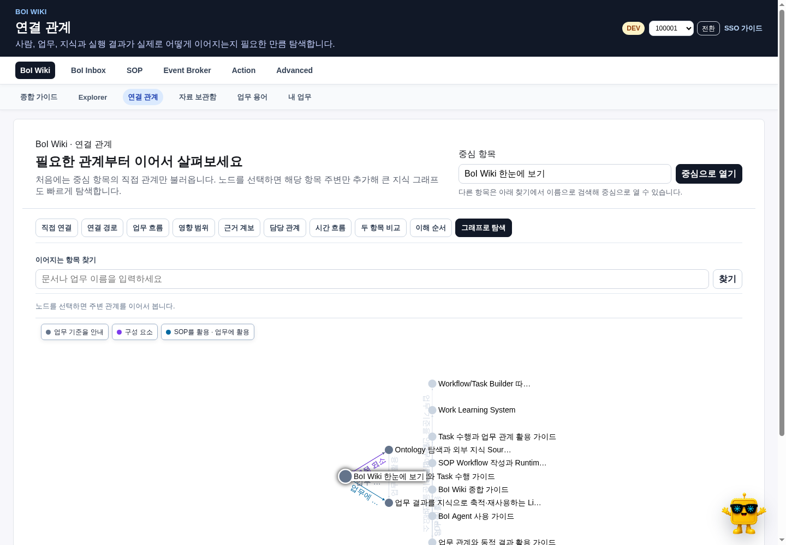
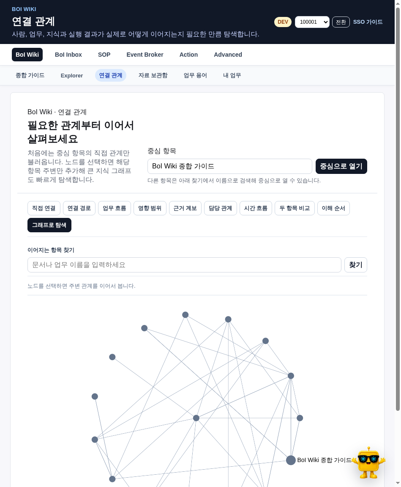
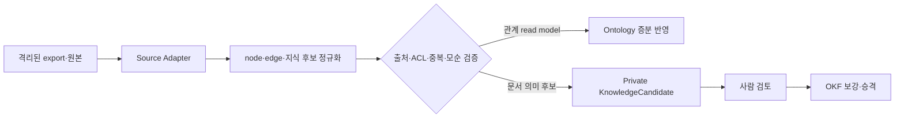
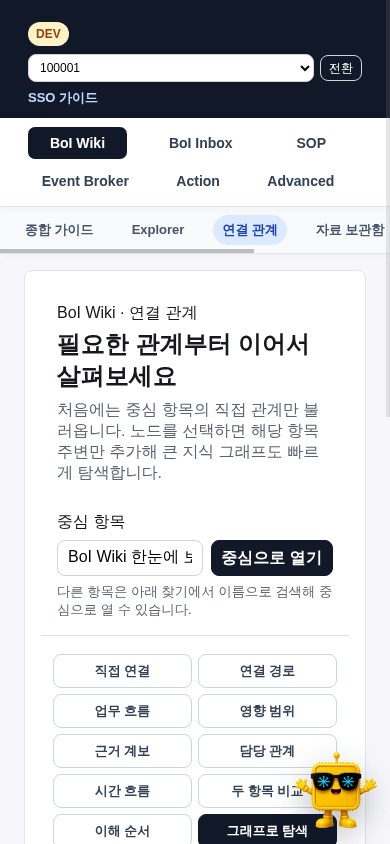

# 왜 관계를 탐색하나

Ontology는 Wiki를 보기 좋게 그리는 전시 화면이 아니다. 검색 결과의 관련성을 높이고, Task에 필요한 근거를 찾고, Event 이후 영향을 받는 Workflow와 Action을 확인하며, 판단 결과가 어떤 지식으로 재사용됐는지 추적하는 조회 모델이다.

# 연결 관계 화면

BoI Wiki의 `연결 관계`에서 문서, 사람, 팀, SOP, Workflow, Task, Event, Action, Skill, 근거와 결과를 검색한다. 처음에는 선택한 항목의 한 단계 이웃만 연다. 항목을 선택하면 필요한 주변 관계만 더 불러오므로 전체 Wiki를 한 번에 브라우저로 보내지 않는다.

그래프는 결과 영역 전체 폭을 사용한다. 노드를 선택한 경우에만 아래쪽 정보 영역이 열리며 다음을 확인한다.

- 사용자용 이름과 자산 종류
- 왜 연결됐는지 보여주는 관계 이름
- 선언·추출·사람 검증·추론 여부
- 관찰 시점과 유효 기간
- 관계를 뒷받침하는 이동 가능한 근거
- 해당 문서나 업무 화면으로 이동하는 명령

그래프 안에는 항목 이름과 방향 화살표를 우선 표시한다. 관계 문구를 모든 선 위에 반복하면 교차 지점에서 읽을 수 없으므로, 선택 경로의 관계 이름과 provenance는 범례·필터·아래쪽 정보 영역에서 확인한다.

아래쪽 정보 영역은 데스크톱에서 최대 220px, 모바일에서 화면 높이의 45%까지만 사용한다. 열고 닫아도 그래프 폭은 바뀌지 않으며 ResizeObserver가 남은 높이에 맞춰 canvas를 조정한다. `Esc`는 선택 정보부터 닫고, Agent 안에서는 이어서 결과 크게 보기와 Expanded를 순서대로 닫는다. 선택 노드와 확대 위치는 작업별로 복원한다.

AI가 추론한 관계는 검토 전 권한, 자동 배정, 전문성, 완료 판단과 Autopilot에 사용하지 않는다.

# 질문에 맞는 관계 질의

| 보고 싶은 것 | 관계 질의 | 결과 예시 |
|---|---|---|
| 직접 연결 | neighbors | 이 SOP와 직접 연결된 Event·Action |
| 두 항목의 연결 | path | 이 Event가 결과 BoI까지 이어지는 경로 |
| 실제 업무 순서 | workflow | Workflow→Task→Action→결과 |
| 변경 영향 | impact | 이 Action 계약이 바뀔 때 영향받는 Task |
| 근거 계보 | lineage | 원본 자료→판단→완료 기록→지식 후보 |
| 담당 관계 | responsibility | 공식 역할·현재 배정·검증된 반복 수행 |
| 시간 변화 | timeline | 배정·수행·상태 변경 이력 |
| 두 관계 비교 | compare | 두 SOP가 공유하거나 다르게 쓰는 Action |
| 이해 순서 | tour | 처음 보는 업무를 살펴볼 권장 순서 |

각 질의는 같은 이웃 목록에 이름만 바꾼 것이 아니다. 방향, 시간, relation 종류와 traversal 계약이 다르다. 짧은 순서는 흐름 그림, 시간 변화는 Timeline, 두 항목 비교는 표, 항목이 많은 결과는 관계 탐색 화면으로 자동 선택한다.

2026-07-13 브라우저 acceptance에서는 표의 아홉 보기를 모두 실제 화면 버튼으로 전환했다. Timeline은 시간순 event payload를, tour는 권장 순서를, path는 두 항목 사이의 경로를, compare는 두 부분 그래프의 공통점과 차이를 표로 각각 사용한다. 빈 보조 배열 때문에 실제 결과가 가려지지 않도록 첫 번째 non-empty 의미 payload만 렌더링한다.

# 사람과 팀 관계를 해석할 때

특정 사번이나 이름을 묻는 것은 `responsibility` 질의의 한 사례다. 사람 전용 하드코딩 없이 같은 Entity Resolver와 권한 검사를 사용한다.

- `공식 역할`: directory에 선언된 역할과 팀
- `현재 담당`: 아직 유효한 Task 배정
- `수행 기록`: 출처가 있는 WorkRecord
- `반복 수행`: 최근 180일의 서로 다른 검증 완료 Task가 세 건 이상

한 번 배정됐다는 이유만으로 그 사람의 전문성으로 표시하지 않는다. 조회자에게 보이지 않는 Task와 자료 관계도 그래프 결과에서 제외한다.

# 외부 Source를 가져오는 경계

외부 도구의 결과는 OKF 정본을 직접 수정하지 않는다.

## Graphify export

관리자가 staging 영역의 `graph.json`을 Source로 등록하면 구조 node·edge, source 위치, community와 centrality를 읽는다. 기존 import manifest와 비교해 사라진 관계만 tombstone 처리하고 변경된 source 소유 항목을 upsert한다. EXTRACTED, INFERRED, AMBIGUOUS provenance를 보존하며 정본 Markdown은 바꾸지 않는다.

Graphify CLI는 선택 설치다. 2026-07-14 release gate에서는 격리된 실제 CLI에 `extract <source> --code-only --no-cluster` 계약으로 작은 Python corpus를 전달해 5개 node와 6개 edge를 만들고 import와 rollback을 검증했다. CLI가 없거나 export 검증이 실패해도 기본 BoI 검색, Ontology와 Agent는 계속 동작한다.

## OpenKB export

PDF·Word·PPT·Excel 원본은 자료 보관함에 유지한다. staging `manifest.json`의 page·summary·claim을 private `KnowledgeCandidate`로 가져오며 `review_required` 상태로 시작한다. 원본 위치와 revision을 보존하고, 중복·모순·ACL 검토 전에는 Team/Public 문서에 쓰지 않는다.

Apache-2.0의 `OpenKB 0.4.4`는 격리된 durable job으로 실행한다. OpenKB가 요청하는 `json_object` 형식은 loopback compatibility gateway가 이미 로드된 Gemma의 일반 JSON 요청으로 바꾸고, 결과를 schema로 검증한다. 한 번의 복구 시도 뒤에도 유효하지 않으면 job을 실패 처리한다.

2026-07-13 release gate에서는 실제 PDF 한 건에서 private KnowledgeCandidate 4개를 만들었고 `index.md`, `log.md`는 제외했다. compatibility 요청 5건 중 4건을 변환했으며 모델 load/unload 요청은 0건이었다. 후보는 중복·모순·ACL 검토 전 Team/Public 정본에 쓰지 않는다.

# 성능과 복구

- 관계 탐색은 마지막으로 검증된 read model을 즉시 사용한다.
- source revision별 증분 upsert와 삭제 tombstone을 사용한다.
- 복구·migration 명령이 아닌 일반 동기화에서 전체 truncate를 하지 않는다.
- Explorer는 최초 40~80개, 브라우저 최대 500개 node로 제한한다.
- 관계 canvas는 workbench 폭의 90% 이상을 사용하고 선택 정보가 canvas 폭을 줄이지 않아야 한다.
- Adapter 실패는 source job과 validation report에 남고 다른 Source를 막지 않는다.
- Adapter 동기화는 queued job을 즉시 반환하고 running·completed·failed·cancelled 상태를 보존한다. timeout과 사용자 cancel을 확인하며, 재시작 시 queued/running 작업을 다시 대기열에 넣는다.
- Gemma와 BGE-M3는 이미 로드된 모델만 사용하며 load/unload API를 호출하지 않는다.

관계 질의 결과는 답변 문장보다 먼저 결정할 수 있을 때 서버가 바로 artifact로 저장한다. 표·Timeline·Mermaid·Explorer 선택과 화면 compile을 위해 추가 모델 호출을 만들지 않는다. 자연어 Planner가 선택한 focal entity와 query kind는 ACL·provenance 검증을 통과한 뒤에만 graph query로 실행한다.

# 함께 보기

- [업무 관계와 동적 결과 활용 가이드](/docs/boi:public:boi-wiki-manual:agent:work-relations-and-dynamic-results)
- [Living Knowledge System](/docs/boi:public:boi-wiki-manual:knowledge:living-knowledge-system)
- [Task 수행과 업무 관계 활용 가이드](/docs/boi:public:boi-wiki-manual:workflows:task-execution-ontology-guide)
- [Task·Ontology·동적 화면 검증 기준](/docs/boi:public:boi-wiki-manual:operations:task-ontology-a2ui-acceptance)
