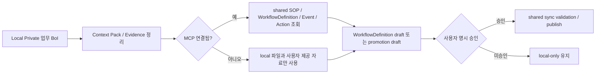

# Summary

BoI Wiki Local은 개인 PC에서 시작하는 Local Private 업무 BoI 작업공간이다. SOP 초안뿐 아니라 회의록, 임시 분석, 보고 초안, 반복 업무 패턴을 먼저 안전하게 정리하고, 사용자가 명시 승인한 경우에만 shared BoI Wiki로 promotion draft를 보낸다.

# Local to Shared Boundary

# Local에서 다루는 업무

| 업무 | 저장 위치 | shared 연계 |
|---|---|---|
| 회의록/개인 메모 | `notes/` | 필요 시 요약 또는 promotion draft |
| SOP 초안 | `sop-drafts/` | SOP 후보 또는 WorkflowDefinition 연결 |
| API/Action 초안 | `action-drafts/` | Action 등록과 WorkflowDefinition draft |
| Event 후보 | `event-drafts/` | Event Contract draft |
| 업무 context pack | `context-packs/` | Agent/MCP가 읽는 업무 맥락 |
| 반복 업무 패턴 | `reports/`, `notes/`, future `work-patterns/` | WorkflowDefinition 또는 Skill 후보 |

# Local Lifecycle

`boi-wiki-local`은 shared Web runtime에 private 원문을 자동 전송하지 않는다. 하지만 lifecycle metadata는 Web과 맞춘다.

| Metadata | Use |
|---|---|
| `artifact_visibility` | `memory`, `working`, `background`, `archived`, `delete_candidate`, `protected` |
| `lifecycle_state` | 현재 보관 상태 |
| `memory_candidate` | Agent가 장기 기억 후보로 제안했는지 |
| `cleanup_policy` | keep, generated artifact cleanup, promotion protected 같은 정책 |

Local generated artifact는 `.boi-trash/{cleanup_id}/`로 quarantine하고 7일 후 hard delete한다. 삭제 전에는 preview를 보여줘야 하며, promotion draft, 사용자가 직접 작성한 memory/working 문서, protected 문서는 cleanup 대상이 아니다. Web으로 promotion하기 전에는 local cleanup이 promotion 대상 원문을 보호해야 한다.

# MCP 사용 기준

MCP가 있으면 agent는 shared BoI Wiki에서 다음을 조회한다.

| Tool | 목적 |
|---|---|
| `ontology_search` | SOP, Event, Action, Dictionary, runtime evidence를 함께 검색 |
| `workflow_definitions_search` | 내부 WorkflowDefinition 기준 기존 연결 중복 확인 |
| `workflow_definition_get` | 내부 WorkflowDefinition 상세 확인 |
| `workflow_definition_deduplicate` | 신규 등록 전 재사용/확장/신규 판단 |
| `boi_agent_chat` | shared BoI Agent에게 현재 업무 질문 |
| `boi_search` | 문서 목록만 필요한 경우 |

# 사용 예시

| 사용자 요청 | Agent 처리 |
|---|---|
| 이번 회의 내용을 BoI로 정리해줘 | Local Private 업무 BoI로 저장 |
| 매주 FAB Trend 보고를 자동화하고 싶어 | 반복 업무 패턴을 정리하고 SOP 추가/Action 연결 초안 제안 |
| 이 API를 연결하고 싶어 | 기존 SOP/Event/Action 후보와 내부 WorkflowDefinition 중복 확인 후 Action draft 생성 |
| Public으로 공유해줘 | local promotion draft와 preview를 만든 뒤 승인 요청 |

# Guardrail

Local Private 원문은 사용자 명시 승인 없이 원격으로 보내지 않는다. shared로 보내는 것은 검증된 promotion candidate, context pack 요약, 또는 draft proposal이다. 7자리 사번 기반 private path와 `local_owner_ref`는 항상 일치해야 한다.

Generated report나 sandbox artifact를 shared로 보낼 때도 raw 원문 전체를 기본 전송하지 않는다. 필요한 경우 summary/profile/artifact reference를 만들고, 사용자가 선택한 promotion candidate만 Web API/MCP로 보낸다.

# Related Documents

- [업무 BoI-first 개념 모델](/public/boi-wiki-manual/concepts/work-boi-first-model.md)
- [Local Private 시작하기](/public/boi-wiki-manual/local-private/overview.md)
- [Register and Use BoI Wiki MCP](/public/boi-wiki-manual/mcp/register-and-use-boi-wiki-mcp.md)
