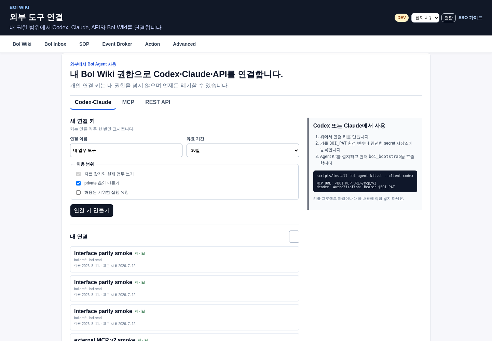
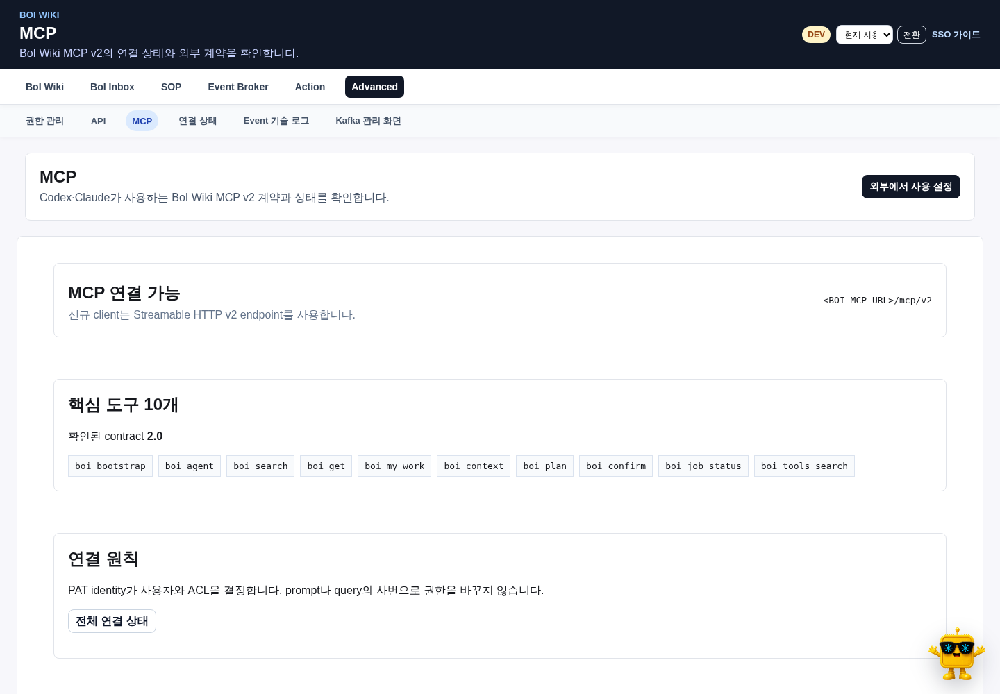

# Summary

BoI Wiki MCP v2는 Web의 BoI Agent와 같은 업무 맥락, 검색 결과, 권한, Harness, WorkRun을 외부 Agent에 제공한다. Codex나 Claude는 많은 개별 API를 외울 필요 없이 10개 도구만 사용하며, 나머지 기능은 `boi_tools_search`로 찾는다.

일반 요청은 `boi_agent`에 자연어로 보낸다. 검색, 관계 탐색, 현재 업무, SOP·Event·Action 초안, 심층 작업 경로는 BoI Wiki가 자동으로 결정한다. 결정적인 외부 자동화에서만 `boi_plan`에 capability를 명시한다.

# Endpoint

| 용도 | 주소 표기 |
|---|---|
| BoI Wiki | `<BOI_BASE_URL>` |
| PAT 발급과 외부 사용 | BoI Agent `⋯` → `외부에서 사용` |
| 사용자 연결 화면 | `<BOI_BASE_URL>/agent/access` |
| 운영 MCP 상태 | Advanced → MCP |
| MCP v2 | `<BOI_MCP_URL>/mcp/v2` |
| 상태 확인 | `<BOI_MCP_URL>/health` |

| 환경 | `<BOI_BASE_URL>` 예시 | `<BOI_MCP_URL>` 예시 |
|---|---|---|
| Local dev | `http://127.0.0.1:8765` | `http://127.0.0.1:8200` |
| Docker local-full | `http://localhost:28000` | `http://localhost:8200` |
| 사내 pilot | 배포 담당자가 제공한 BoI Wiki URL | 배포 담당자가 제공한 MCP URL |

`/mcp/v2`는 브라우저 페이지가 아니라 Streamable HTTP MCP endpoint다. 브라우저에서 직접 열 때 `406`이 나와도 MCP client에서 정상 연결되면 장애가 아니다. `/mcp`는 동결된 구형 호환 경로이며 신규 등록에 사용하지 않는다.

# Authentication

1. Web SSO로 BoI Wiki에 로그인한다.
2. BoI Agent를 펼쳐 `⋯` 메뉴의 `외부에서 사용`에서 개인 연결 키를 만든다.
3. 키는 한 번만 표시되므로 OS keychain, secret manager 또는 저장소 밖의 환경 변수 `BOI_PAT`에 보관한다.
4. MCP 요청에 `Authorization: Bearer <BOI_PAT>`를 보낸다.

기본 scope는 `boi.read`, `boi.draft`다. `boi.execute.low`는 RBAC가 허용한 사용자만 선택할 수 있다. PAT identity가 사번과 권한을 결정하므로 query나 prompt에 `employee_id`를 넣지 않는다. PAT를 Wiki 문서, Git, Skill, prompt, 채팅에 기록하지 않는다.



# Codex와 Claude Desktop 등록

Codex와 Claude Desktop의 MCP 설정에는 다음처럼 등록한다. Cursor처럼 Streamable HTTP MCP를 지원하는 client도 같은 endpoint와 PAT 방식을 사용한다.

```json
{
  "mcpServers": {
    "boi-wiki": {
      "type": "http",
      "url": "<BOI_MCP_URL>/mcp/v2",
      "headers": {
        "Authorization": "Bearer ${BOI_PAT}"
      }
    }
  }
}
```

client가 환경 변수 치환을 지원하지 않으면 client의 secret 설정을 사용한다. 토큰 문자열을 설정 파일에 직접 저장하지 않는다.

Agent Kit을 설치하면 같은 원칙의 Codex·Claude Skill과 Python·TypeScript client를 사용할 수 있다.

```bash
export BOI_BASE_URL='<BOI_BASE_URL>'
export BOI_MCP_URL='<BOI_MCP_URL>'
export BOI_PAT='<issued-token>'
scripts/install_boi_agent_kit.sh --client codex
```

# MCP Tools

| Tool | 역할 |
|---|---|
| `boi_bootstrap` | 현재 연결, 권한과 사용 가능한 기능 확인 |
| `boi_agent` | 자연어 질문과 업무를 같은 WorkSession에서 계속 수행 |
| `boi_search` | 지식 검색과 관계·경로·영향·이해 순서 탐색 |
| `boi_get` | 선택한 문서, 근거 또는 artifact의 정확한 내용 확인 |
| `boi_my_work` | 현재 Inbox와 진행 중 Task 확인 |
| `boi_context` | WorkContextPack의 선별된 업무 맥락 확인 |
| `boi_plan` | 결정적인 private 초안 또는 guarded 작업 계획 생성 |
| `boi_confirm` | 사용자가 검토한 plan을 명시적으로 확인 |
| `boi_job_status` | 심층 작업의 진행, 결과와 blocker 확인 |
| `boi_tools_search` | progressive discovery로 세부 기능 찾기 |

도구 수가 10개보다 많다면 구형 `/mcp`에 연결됐을 가능성이 높다. v2 기본 도구 수를 늘리지 않고 세부 기능은 discovery로 제공한다.

# Knowledge And Graph Search

일반 근거 검색은 `boi_search(view="ranked")`를 사용한다. 관계가 중요한 질문은 같은 도구의 보기를 바꾼다.

| 보기 | 사용자 질문 예시 |
|---|---|
| `neighbors` | “이 지식과 직접 연결된 내용은?” |
| `path` | “이 SOP와 이 Action은 어떻게 이어지나?” |
| `impact` | “이 기준을 바꾸면 어디에 영향이 있나?” |
| `tour` | “이 업무를 이해하려면 어떤 순서로 봐야 하나?” |

현재 페이지는 중요한 해석 기준이지만 검색 범위를 강제로 제한하지 않는다. BoI Wiki는 ACL 안의 OKF Markdown, Dictionary, ontology, pgvector, SOP, Event, Action과 실행 이력을 함께 탐색한다. source ID, citation ID와 graph path는 Web·REST·MCP에서 동일해야 한다.

긴 파일과 로그는 자료 보관함에 두고 summary, profile, sample, checksum, ACL URL만 업무 맥락에 넣는다. 원본 전문을 prompt로 복사하지 않는다.

# WorkRun And Safety

- 후속 요청에서는 `work_session_id`와 `work_run_id`를 유지한다.
- 새 근거, Action 결과, 사람 입력, artifact, 상태 전환 또는 blocker가 있을 때만 WorkRun을 계속한다.
- 같은 검색이나 tool call을 결과 변화 없이 반복하면 중단하고 blocker를 알린다.
- Task 완료는 모델 문장이 아니라 완료 항목, Evidence Ledger, Action 결과와 사람 확인으로 판단한다.
- 초안은 private provisional 결과이며 게시나 실행이 아니다.
- 실제 Action, 공유 정본 변경과 외부 부작용은 Harness, RBAC, Task mode, preview와 confirmation을 다시 통과한다.
- `boi_confirm`은 다른 권한 검사를 우회하지 않는다.

Manual은 사람이 수행하고 Agent가 근거와 기록을 돕는다. Copilot은 Agent 또는 외부 AI가 자료와 초안을 준비하고 사람이 최종 확인한다. Autopilot은 allowlist의 저위험 Action과 system binding으로 검증 가능한 완료 항목만 자동 처리한다.

# Living Knowledge

업무 결과는 자동으로 공유 문서가 되지 않는다. 재사용 가치와 출처가 확인된 결과만 `KnowledgeCandidate`가 될 수 있다. Private 후보는 수정하거나 되돌릴 수 있고, Team/Public 반영은 별도 검토를 거친다.

외부 Agent는 다음 원칙을 지킨다.

1. 기존 지식을 먼저 검색한다.
2. 답변과 초안에 실제 citation을 남긴다.
3. Task 수행 결과와 사람 정정을 Evidence Ledger에 기록한다.
4. 중복 여부를 확인한 뒤 새 문서보다 기존 지식 보강을 우선한다.
5. 검증되지 않은 Agent 답변이나 채팅 전문을 공유 정본으로 승격하지 않는다.

# Verification

사용자 연결 화면의 MCP 탭은 endpoint, PAT 방식과 핵심 도구 10개를 안내한다. Advanced의 MCP 화면은 contract version, 실제 tool count와 최근 확인 시각을 진단한다. 둘의 값이 다르면 사용 안내를 맞추는 대신 runtime contract부터 복구한다.



인터페이스 정합성은 다음 스크립트로 확인한다.

```bash
export BOI_BASE_URL='<BOI_BASE_URL>'
python scripts/check_agent_v2_interface_parity.py \
  --base-url "$BOI_BASE_URL"
```

정상 상태에서는 Web·REST·MCP가 같은 source, citation, WorkRun, graph path와 artifact를 반환한다. 일반 탐색과 검증 중 LM Studio model load/unload 요청은 없어야 한다.

# Troubleshooting

| 증상 | 확인할 내용 |
|---|---|
| 상태 화면이 열리지 않음 | MCP service와 port publish 확인 |
| `/mcp/v2`가 `401` | PAT 누락, 만료 또는 scope 확인 |
| `/mcp/v2`가 `406` | 일반 브라우저 호출인지 확인하고 MCP client로 재검증 |
| 도구가 10개보다 많음 | 구형 `/mcp` 대신 `/mcp/v2` 사용 |
| 현재 업무가 비어 있음 | `boi_my_work` 권한과 실제 active runtime을 확인; seed 이력은 현재 업무가 아님 |
| semantic 검색이 느림 | `/api/v2/system/readiness`의 검색 동기화와 embedding 상태 확인; lexical·ontology는 계속 사용 가능 |
| 초안이나 실행이 unavailable | 모델, worker, RBAC, Task mode와 Harness blocker 확인; 성공처럼 우회하지 않음 |

# Citations

- [MCP BoI Search Action Spec](/docs/boi:public:actions:mcp:boi-search-sample)
- [BoI Wiki 종합 가이드](/docs/boi:public:boi-wiki-manual:guide:final-operator-guide)
- [BoI Agent Guardrail과 ACL](/docs/boi:public:boi-wiki-manual:agent:agent-guardrail-and-acl)
- [Work Learning System](/docs/boi:public:boi-wiki-manual:agent:work-learning-system)
