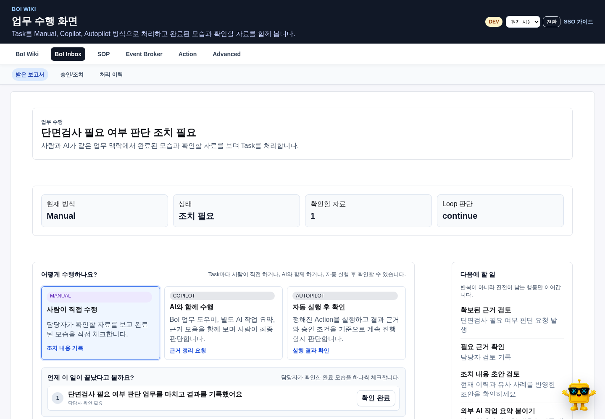

# 목적

화면 캡처는 장식이 아니라 사용자가 실제 단계와 결과를 확인하는 증거다. 설명과 UI가 어긋나지 않도록 canonical 가이드가 가리키는 현재 화면을 재현 가능한 시나리오로 캡처한다.

# Storage Rule

이미지는 `_media/` 아래에만 둔다.

```text
data/boi/public/boi-wiki-manual/_media/browser/{guide-set}/{yyyyMMdd}-{scenario}-{width}x{height}.png
```

사용자가 제공한 원본 SOP 이미지나 업무 문서는 evidence source로 취급한다. 원본은 에이전트가 재생성하지 않고 `_media/source/{source-slug}/...`에 보존한 뒤, OCR/요약/재구성 결과와 분리해 인용한다.

# Manifest Rule

각 `_media` root에는 `media-manifest.yaml`을 둔다.

| 필드 | 의미 |
|---|---|
| `path`, `sha256` | 파일 위치와 무결성 |
| `route_template` | 사번·작업 ID를 제거한 재현 경로 |
| `scenario` | 캡처가 증명하는 사용자 여정 |
| `viewport` | 데스크톱 또는 모바일 크기 |
| `source_revision` | 캡처 당시 Git revision |
| `selector` | 화면 준비 여부를 확인한 기준 요소 |
| `related_doc` | 캡처를 사용하는 canonical BoI |
| `captured_at`, `created_by` | 생성 시각과 주체 |

`captured_url`은 하위 호환을 위해 유지하되 PAT, 사번, private BoI ID, trace와 내부 운영 주소를 넣지 않는다.

# Markdown Rule

문서에는 표준 Markdown image syntax만 쓴다.

이미지는 설명하는 단계 바로 아래에 둔다. 종합 허브에는 기능 전체를 반복하는 캡처 대신 Explorer처럼 시작 위치를 확인하는 대표 화면 한 장만 사용한다.

```markdown

```

# Dedupe Rule

같은 sha256 이미지가 이미 있으면 재사용한다. 같은 hash가 다른 파일명으로 중복 저장되면 strict media lint에서 실패한다.

# 캡처 전 안전 처리

- 사번과 개인 이름은 `현재 사용자`처럼 역할 표현으로 바꾼다.
- PAT, secret, 내부 endpoint와 private 원본 주소를 화면에 남기지 않는다.
- `work_session_id`, artifact, trace와 report ID는 사용자용 표현으로 가린다.
- 안정된 fixture를 우선하고 실제 production 데이터는 캡처하지 않는다.
- 입력 중 transition과 loading skeleton이 끝난 뒤 캡처한다.

# 현재 핵심 시나리오

- Explorer와 BoI Agent Compact·Expanded·모바일
- citation과 근거 기반 Mermaid
- Inbox, 검증 보고서와 Task 수행
- SOP Task 맵과 업무 이벤트 정의
- 자료 보관함, Event와 Action 카탈로그
- 외부 Agent 연결, 연결 상태와 나만의 BoI Agent

기본 viewport는 `1440x1000`이고 모바일 핵심 여정은 `390x844`로 추가한다. 현재 세트는 `scripts/capture_current_manual_screenshots.mjs`로 다시 만들 수 있다.

# 검증

1. manifest의 SHA-256과 실제 파일을 비교한다.
2. strict media/link lint를 통과한다.
3. Mermaid SVG가 nonblank인지 확인한다.
4. 데스크톱·모바일에서 overflow와 글자 가독성을 확인한다.
5. canonical 문서가 최신 세트만 인용하고 6월 PoC 캡처는 역사 문서에서만 쓰는지 확인한다.

```bash
python scripts/okf_lint.py --root data --strict-media --strict-links
export BOI_BASE_URL='<BOI_BASE_URL>'
BOI_BASE_URL="$BOI_BASE_URL" node scripts/check_manual_guides_ui.mjs
```

# Citations

- [BoI Wiki 종합 가이드](/docs/boi:public:boi-wiki-manual:guide:final-operator-guide)
- [운영 Runbook](/docs/boi:public:boi-wiki-manual:operations:operator-runbook)
